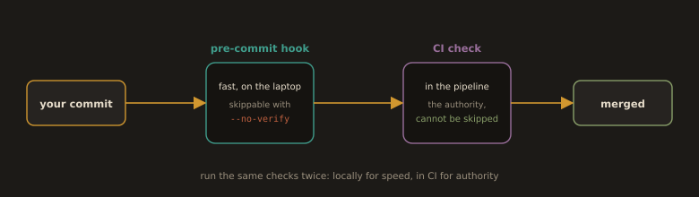

## B5. Pre-Commit Hooks: Catch It on the Laptop, Not in the Pipeline

A CI failure costs you a context switch, a pipeline minute, and a public red cross on the PR. A pre-commit hook costs you two seconds. The cheapest defect is the one that never becomes a commit.

### How hooks actually work

Git looks in `.git/hooks/` for executable scripts named after lifecycle events. That directory is **not versioned and not cloned**, so raw hooks cannot be shared with the team. This is the single most important fact about hooks, and it is why frameworks exist. A framework versions a config file, and each developer runs one install command that writes the actual hook, usually by pointing `core.hooksPath` at a tracked directory.

| Hook | Fires | Typical use |
|------|-------|-------------|
| `pre-commit` | Before the commit message editor opens | Format, lint, secret scan, validate YAML |
| `commit-msg` | After the message is written | Enforce conventional commits with commitlint |
| `pre-push` | Before objects are sent to the remote | Fast test subset, build check |
| `pre-receive`, `update` | On the **server**, before refs are updated | Non bypassable policy. On GitHub this is expressed as rulesets. |

### The three frameworks

* **pre-commit** (`pre-commit.com`), Python based but language agnostic, the de facto standard for polyglot and infrastructure repositories. This is what we use.
* **husky**, Node ecosystem, pairs with `lint-staged` and `commitlint`.
* **lefthook**, Go binary, parallel execution, no runtime dependency, popular in monorepos.

### The correction to the old note

The old notes describe `pre-commit` with the text for `pre-push`. To be precise: `pre-commit` runs on `git commit`, before the message is composed, and aborting it aborts the commit. `pre-push` runs on `git push`.

### The rule you must not forget

**Hooks are advisory. `git commit --no-verify` skips all of them.** A hook is a courtesy to the developer, never a control. Anything that genuinely must not enter the repository has to be enforced server side, in CI and in rulesets. In practice you run the same checks twice: locally for speed, in CI for authority.

**Fig. 17 · Two gates, only one has authority**



*The local commit hook is a courtesy you can bypass; the CI check is the control that actually holds the line.*

```bash
pre-commit run --all-files      # what CI will do
pre-commit autoupdate           # bump pinned hook revisions
```

---
