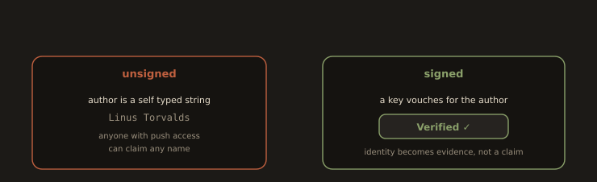
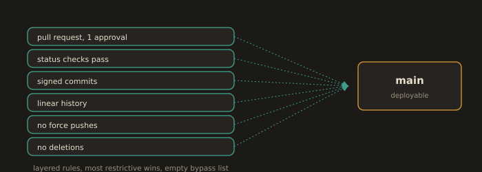

## B6. Signed Commits and Branch Protection as Baseline Hygiene

### Why signing

The author and committer fields on a commit are self asserted strings. Nothing stops anyone with push access from doing this:

```bash
git config user.name "Linus Torvalds"
git config user.email "torvalds@linux-foundation.org"
git commit -m "fix: totally legitimate change"
```

That commit will show Linus in `git log` and, if he has a GitHub account with that email, his avatar next to it. Signing is what converts an assertion into evidence.

**Fig. 18 · Signing turns a claim into evidence**



*Author fields are just strings anyone can set; a signature ties the commit to a key and earns the Verified badge.*

### SSH signing, the modern default

GPG still works, but since Git 2.34 you can sign with an SSH key, which almost every developer already has. It is a two minute setup instead of a twenty minute one.

```bash
ssh-keygen -t ed25519 -C "signing key" -f ~/.ssh/id_signing
```
```bash
git config --global gpg.format ssh
```
```bash
git config --global user.signingkey ~/.ssh/id_signing.pub
```
```bash
git config --global commit.gpgsign true
```
```bash
git config --global tag.gpgsign true
```

Then upload the **public** key to GitHub under Settings, SSH and GPG keys, New SSH key, and set the key type to **Signing key**, not Authentication key. Uploading it as an authentication key will not produce the Verified badge.

For local verification, tell Git which keys you trust:

```bash
mkdir -p ~/.config/git
echo "you@example.com $(cat ~/.ssh/id_signing.pub)" >> ~/.config/git/allowed_signers
git config --global gpg.ssh.allowedSignersFile ~/.config/git/allowed_signers
```
```bash
git log --show-signature -1
git verify-commit HEAD
```

Sigstore's `gitsign` is worth knowing by name: it signs with a short lived certificate tied to an OIDC identity and logs to a transparency log, which removes long lived key management entirely. It appears in supply chain hardened pipelines.

### Branch protection, and the shift to rulesets

Classic branch protection rules (Settings, Branches) still exist and still work. GitHub now steers new configuration toward **repository rulesets** (Settings, Rules, Rulesets), and rulesets are what you should reach for. What they add over the classic rules:

* Definable at organisation level and applied across many repositories.
* Multiple rulesets **layer**, and the most restrictive combination wins, rather than one rule per branch pattern.
* Explicit **bypass lists** per ruleset, with an audit trail, instead of a single "include administrators" checkbox.
* An **evaluate** enforcement status, so you can see what a rule would have blocked before you turn it on.
* Import and export as JSON, so protection is reviewable configuration rather than remembered clicks.
* **Push rulesets**, which can block pushes by file path, block oversized files, and enforce secret push protection.

The baseline for any branch that reaches production:

**Fig. 19 · A ruleset is a stack of gates on main**



*Every rule must pass before code reaches the deployable branch, and on production branches nobody is on the bypass list.*

| Setting | Value | Why |
|---------|-------|-----|
| Require a pull request | On, 1 approval minimum | No unreviewed code on the deployable branch |
| Dismiss stale approvals on new commits | On | Otherwise: get approval, push anything, merge |
| Require status checks to pass | On, and require branches to be up to date | A green check against a stale base proves nothing |
| Require signed commits | On | Identity is evidence, not assertion |
| Require linear history | On, if you squash or rebase merge | Keeps `git bisect` and changelog generation sane |
| Block force pushes | On | See Lab 4B |
| Restrict deletions | On | People delete `main`. It happens. |
| Bypass list | Empty on production branches | A rule that admins can bypass is a suggestion |

---
