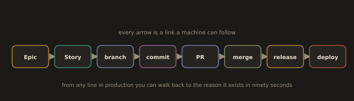
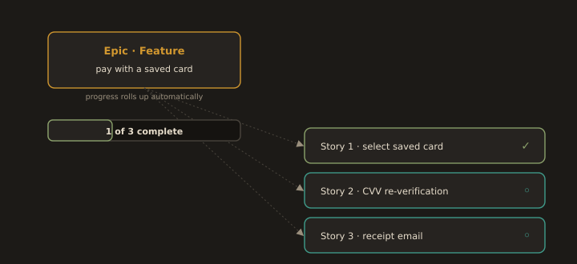

## B7. Issue Tracking and Traceability

The question every audit, every incident review, and every new team member eventually asks is: **why is this line of code here?** A team with traceability answers it in ninety seconds. A team without it never answers it.

The chain you are building is:

```
Epic  ->  Story (issue)  ->  branch  ->  commit  ->  PR  ->  merge  ->  release  ->  deploy
```

Every arrow in that chain must be a link a machine can follow.

**Fig. 20 · The chain from idea to production**



*Epic to story to branch to commit to PR to merge to release to deploy, each step a machine readable link.*

### The vocabulary, without the consultancy

* **Epic**: a body of work too large for one sprint, expressed as an outcome. "Users can pay with a saved card."
* **Story**: a unit of user visible value, small enough to finish in a sprint. Written as: as a `<role>`, I want `<capability>`, so that `<benefit>`. It carries **acceptance criteria**, which are the only part that matters, because they are what makes the story testable and reviewable.
* **Task**: an engineering step with no independent user value. "Add the migration."
* **Bug**: observed behaviour differs from intended behaviour.
* **Spike**: a timeboxed investigation whose deliverable is a decision, not code.
* **Sprint**: a fixed length iteration, usually two weeks, with a committed scope.
* **Backlog**: the ordered list of everything not yet done. Ordered, not a set. If it is not ordered it is a wish list.
* **Board**: the visualisation of state, typically Todo, In Progress, In Review, Done.
* **WIP limit**: a cap on items in a column. This is the single highest leverage practice in Kanban, because throughput is destroyed by parallelism, not by laziness.

### GitHub Issues and Projects

**Fig. 21 · An epic and its child issues**



*One Feature issue holds the stories as child issues, and their progress rolls up on its own as each one closes.*

We use GitHub because it is free, it is already where the code is, and the links between issue, branch, PR, and release are automatic rather than manual. The relevant current capabilities:

* **Issue types** (Bug, Task, Feature, and organisation defined types) classify issues consistently across repositories. Generally available since 2025.
* **Sub-issues** create a real parent and child hierarchy, up to eight levels, with progress rolled up in Projects. This is how you model an epic: one issue with the Feature type, and its stories as sub-issues. Note that the older **tasklist** blocks were retired in April 2025, and any note or tutorial still telling you to write ` ```[tasklist] ` blocks is out of date.
* **Projects** (the current version, not Projects Classic, which has been sunset) is a table, board, and roadmap view over issues and PRs, with custom fields. An **iteration** field is how you express a sprint. Built in workflows auto add items and move them between columns on events.
* **Closing keywords** in a PR description or a commit on the default branch close the issue automatically: `closes #12`, `fixes #12`, `resolves #12`. A bare `#12` links without closing, which is what you want on a commit that is part of a larger story.
* **Milestones** group issues by release or date. **Labels** carry orthogonal metadata such as `area/api` or `good first issue`.

The `gh` CLI now covers this from the terminal, including issue types, sub-issue relationships, and dependencies, so board maintenance does not require a browser.

### Jira, for recognition only

You will meet Jira in industry, so recognise the mapping: Jira **project** is roughly a repository or product, **board** is scrum or kanban, **issue types** are Epic, Story, Task, Sub-task, Bug, **workflow** is a configurable state machine (this is where organisations do their worst damage), **JQL** is the query language, and **smart commits** let a commit message transition an issue with syntax such as `PROJ-123 #close`. Jira integrates with GitHub through an app that links commits and PRs by issue key in the branch name or commit message. You will not be asked to run a Jira instance in this course.

### Traceability in practice

Adopt these conventions and the chain links itself:

* Branch name carries the issue: `feat/142-totp-enrolment`.
* Commit body carries a trailer: `Refs: #142`.
* PR description carries the closing keyword: `Closes #142`.
* Conventional commit type drives the changelog entry that ships in the release notes.

Result: from a line in production, `git blame` gives the commit, the commit gives the PR, the PR gives the issue, the issue gives the epic and the acceptance criteria and the discussion where somebody explained why. Ninety seconds.
---
