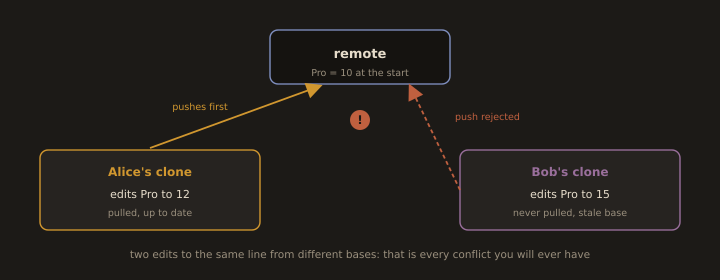
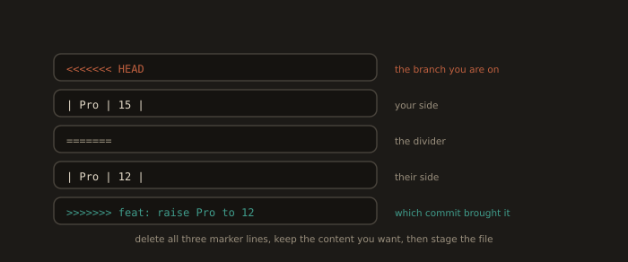

# Part C: Labs

Environment for all labs: Fedora, RHEL, or CentOS Stream with `git` 2.34 or later, a GitHub account, and the GitHub CLI.

```bash
sudo dnf install git -y
```
```bash
sudo dnf install gh -y
```
```bash
gh auth login          # choose SSH, and let gh upload a key for you
```
```bash
git --version && gh --version
```

Set the defaults that make the rest of the labs behave predictably:

```bash
git config --global init.defaultBranch main
```
```bash
git config --global pull.rebase false          # explicit merge on pull, no surprises
```
```bash
git config --global push.autoSetupRemote true  # plain `git push` on a new branch just works
```

---

## Lab 4A. The Full Cycle Across Two Clones, Including a Deliberate Merge Conflict

**Goal:** experience the conflict as the two sided event it actually is, rather than as an error message. You will play two developers on one machine by keeping two clones of the same repository.

**Fig. 22 · Why the conflict happens**



*Both clones edit the same line, but Bob started from a stale copy, so his push collides with Alice's.*

### 1. Create the repository

```bash
gh repo create module4-lab --public --clone --add-readme
```
```bash
cd module4-lab
```
```bash
git log --oneline
```

### 2. Seed a file that both developers will fight over

```bash
cat > pricing.md <<'EOF'
# Pricing

| Plan | Price |
|------|-------|
| Free | 0     |
| Pro  | 10    |
EOF
```
```bash
git add pricing.md
```
```bash
git commit -m "docs: add initial pricing table"
```
```bash
git push
```

### 3. Make the second clone (this is "Bob")

```bash
cd ..
```
```bash
git clone git@github.com:<your-username>/module4-lab.git module4-lab-bob
```
```bash
ls -d module4-lab module4-lab-bob
```

You now have two independent repositories that happen to share a remote. Treat `module4-lab` as Alice and `module4-lab-bob` as Bob. Open two terminals if that helps you keep them straight.

### 4. Alice branches, edits, and merges cleanly

```bash
cd module4-lab
```
```bash
git switch -c feat/alice-pro-price
```
Change the Pro price to 12:
```bash
sed -i 's/| Pro  | 10    |/| Pro  | 12    |/' pricing.md
```
```bash
git diff                                   # inspect before staging, always
```
```bash
git add pricing.md
```
```bash
git commit -m "feat(pricing): raise Pro plan to 12"
```
```bash
git switch main
```
```bash
git merge feat/alice-pro-price             # fast forward, no conflict
```
```bash
git push origin main
```
```bash
git branch -d feat/alice-pro-price
```

### 5. Bob edits the same line, from a stale base

Bob has **not** pulled. His clone still believes Pro costs 10. This is the entire cause of every merge conflict you will ever have: two people editing the same region from different bases.

```bash
cd ../module4-lab-bob
```
```bash
git switch -c feat/bob-pro-price
```
```bash
sed -i 's/| Pro  | 10    |/| Pro  | 15    |/' pricing.md
```
```bash
git commit -am "feat(pricing): raise Pro plan to 15"
```
```bash
git switch main
```
```bash
git merge feat/bob-pro-price
```
```bash
git push origin main
```

The push is rejected:

```
 ! [rejected]        main -> main (fetch first)
error: failed to push some refs to 'github.com:.../module4-lab.git'
hint: Updates were rejected because the remote contains work that you do not
hint: have locally.
```

Read that hint carefully. Git is not refusing because you did something wrong. It is refusing because accepting your push would silently discard Alice's commit. This rejection is the feature.

### 6. Cause the conflict

```bash
git pull origin main
```

```
Auto-merging pricing.md
CONFLICT (content): Merge conflict in pricing.md
Automatic merge failed; fix conflicts and then commit the result.
```

Inspect the state:

```bash
git status
```
```bash
cat pricing.md
```

```
| Free | 0     |
<<<<<<< HEAD
| Pro  | 15    |
=======
| Pro  | 12    |
>>>>>>> 1a2b3c4... feat(pricing): raise Pro plan to 12
```

Read the markers precisely, because people misread them constantly:

* Between `<<<<<<< HEAD` and `=======` is **your** side, the branch you are currently on.
* Between `=======` and `>>>>>>>` is **their** side, what you are merging in.
* The label after `>>>>>>>` tells you exactly which commit brought it.

**Fig. 23 · Reading the conflict markers**



*Between the first marker and the divider is your side; between the divider and the last marker is theirs.*

Useful during a conflict:

```bash
git diff --name-only --diff-filter=U      # list only the conflicted files
```
```bash
git log --merge --oneline -p pricing.md   # show only the commits touching the conflict
```
```bash
git checkout --ours pricing.md            # take your side wholesale
git checkout --theirs pricing.md          # take their side wholesale
git merge --abort                         # bail out entirely, no harm done
```

### 7. Resolve it

Git cannot decide whether Pro costs 12 or 15. Only a human with business context can. That is precisely why Git stops. Edit the file, delete all three marker lines, and leave the resolved content:

```bash
vim pricing.md
```
```
| Free | 0     |
| Pro  | 15    |
```
```bash
git add pricing.md                        # staging the file is how you declare it resolved
```
```bash
git status
```
```bash
git commit                                # accept the prepared merge message, or improve it
```
```bash
git push origin main
```

### 8. Prove what happened

```bash
git log --oneline --graph --decorate --all
```

You should see two lines of development converging into a merge commit with two parents. Confirm the merge commit really has two parents:

```bash
git cat-file -p HEAD | head -5            # two "parent" lines
```

Finally, bring Alice's clone back in sync and confirm both clones agree:

```bash
cd ../module4-lab && git pull
```
```bash
git rev-parse main                        # same SHA in both clones
```

**Deliverables:** the output of `git log --oneline --graph --all` from both clones, the conflicted `pricing.md` before resolution, and a two sentence explanation of why the push was rejected in step 5.

---
