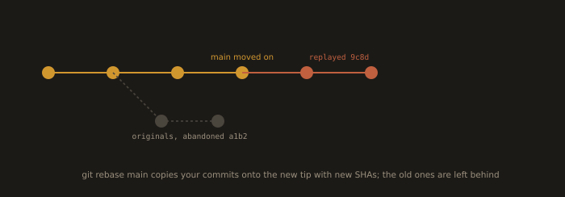
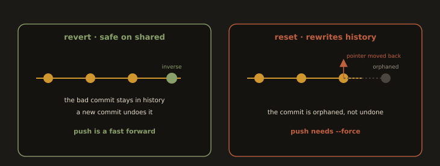

## Lab 4B. log, diff, stash, rebase, revert, reset, and the Difference That Matters

Work in `module4-lab`. Generate some history first:

```bash
for i in 1 2 3; do echo "line $i" >> notes.txt; git add notes.txt; git commit -m "feat(notes): add line $i"; done
```

### log: asking history questions

```bash
git log --oneline --graph --decorate --all
```
```bash
git log -p notes.txt                   # how this file changed, with diffs
```
```bash
git log --author="Alice" --since="2 weeks ago"
```
```bash
git log -S "Pro" --oneline             # commits that added or removed the string "Pro"
```
```bash
git log main..feat/x --oneline         # what is on the branch that is not on main
```
```bash
git blame pricing.md                   # who last touched each line, and in which commit
```

`git log -S` is the one most engineers never learn and then use weekly. It answers "when did this string enter the codebase?"

### diff: comparing the three trees

```bash
git diff                    # working tree vs index    (what you have not staged)
git diff --staged           # index vs HEAD            (what you are about to commit)
git diff HEAD               # working tree vs HEAD     (everything uncommitted)
git diff main..feat/x       # branch tip vs branch tip
git diff main...feat/x      # branch vs their merge base (what the PR actually shows)
```

The two dot versus three dot distinction matters in review. Three dots answers "what did this branch add", which is what a pull request displays. Two dots also includes what `main` moved on to, which is usually not what you meant.

### stash: shelving work you are not ready to commit

```bash
echo "half finished idea" >> notes.txt
```
```bash
git stash push -m "wip: pricing experiment"
```
```bash
git status                  # clean
git stash list
git stash show -p stash@{0}
```
```bash
git stash pop               # reapply and drop
```
```bash
git stash push -u -m "wip: including untracked files"    # -u also stashes untracked files
```

Stash is a stack, not a filing cabinet. Anything you stash for more than a day should have been a commit on a branch. Stashes are invisible to `git log`, do not push, and are the single most common way to lose work.

### rebase: replaying commits onto a new base

**Fig. 24 · Rebase replays onto a new base**



*Your commits are copied on top of the updated main as brand new objects, and the originals are abandoned.*

```bash
git switch -c feat/rebase-demo
```
```bash
echo "feature work" >> notes.txt && git commit -am "feat(notes): feature work"
```
```bash
git switch main && echo "main moved" >> other.txt && git add other.txt && git commit -m "chore: main moves on"
```
```bash
git switch feat/rebase-demo
```
```bash
git log --oneline --graph --all       # note your branch is behind
```
```bash
git rebase main
```
```bash
git log --oneline --graph --all       # your commit now sits on top of main, with a NEW SHA
```

Record the SHA before and after. They differ. That is the whole point, and the whole danger. Rebase does not move commits, it copies them into new commit objects and abandons the originals.

Interactive rebase, for cleaning a branch before review:

```bash
git rebase -i main            # squash, reword, reorder, drop
```

**The golden rule of rebase:** never rebase commits that other people have already pulled. Rebase your own unpushed branch to keep it tidy. Never rebase a shared branch.

### The main event: reset versus revert

**Fig. 25 · Revert adds, reset rewrites**



*Revert records an inverse commit and pushes normally; reset moves the pointer back and needs a force push that hurts everyone.*

Set up something to undo:

```bash
git switch main
```
```bash
echo "DELETE FROM users;" >> migration.sql
```
```bash
git add migration.sql && git commit -m "feat(db): add cleanup migration"
```
```bash
git push origin main
```
```bash
git log --oneline -3
```

Record the SHA of that commit. Call it `$BAD`.

#### revert: safe on a shared branch

```bash
git revert <BAD>
```
```bash
git log --oneline -3
```
```bash
cat migration.sql
```

Observe carefully:

* The bad commit is **still in history**. Nothing was removed.
* A **new** commit exists on top, whose diff is the exact inverse of the bad one.
* The file content is back to the pre-bad state.
* History moved **forward**, so the push is a fast forward:

```bash
git push origin main          # succeeds, no force required
```

Anyone who already pulled the bad commit simply pulls one more commit. Their history stays consistent with yours. Nothing they have is invalidated.

#### reset: rewrites history, destructive on a shared branch

Now do the same undo the wrong way, so you can see the failure mode with your own eyes.

```bash
echo "DROP TABLE users;" >> migration.sql && git commit -am "feat(db): another bad idea"
```
```bash
git push origin main
```
```bash
git rev-parse HEAD            # note this SHA; the remote now has it too
```
```bash
git reset --hard HEAD~1
```
```bash
git log --oneline -3          # the commit is gone from your history
```
```bash
git push origin main
```

The push is **rejected**. Your branch is no longer a descendant of the remote branch, so the push is not a fast forward. To make it land you would have to force:

```bash
git push --force origin main            # DO NOT DO THIS ON A SHARED BRANCH
```

This is the moment to understand what force push does to your colleagues. The remote's `main` now points at a commit that is **not** in their history. Their next `git pull` produces a merge between the old history and the new one, and the commit you "removed" comes straight back, now duplicated, with conflicts. Someone else pushing before they notice can resurrect it permanently. Any CI, any deployment, any tag pointing at the old SHA now dangles.

Recover, because you can:

```bash
git reflog                                    # find the SHA you "lost"
```
```bash
git reset --hard <sha-from-reflog>            # you are back
```
```bash
git reset --hard ORIG_HEAD                    # shorthand: where HEAD was before the last big move
```

#### The comparison, in one table

| | `git revert` | `git reset` |
|---|---|---|
| What it does | Adds a new commit that inverts an old one | Moves the branch pointer to an older commit |
| History | Preserved. The mistake and the fix are both visible | Rewritten. The commits are orphaned |
| Push | Fast forward, ordinary push | Requires `--force`, rewrites the remote |
| Safe on a shared branch | **Yes** | **No** |
| Safe on your own unpushed branch | Yes, but usually unnecessary | **Yes, this is where it belongs** |
| Effect on colleagues | They pull one extra commit | Their history diverges and they must repair it |
| Audit trail | Complete. You can see what was wrong and when it was fixed | The evidence is deleted, which is exactly what an auditor asks about |

**When to use each, stated as a rule you can apply without thinking:**

* The commit has left your machine, or anyone else might have it: **revert**. No exceptions.
* The commit is local, unpushed, and you want to reshape it before anyone sees it: **reset** (or interactive rebase). This is good practice, not a sin.
* You need to undo a merge that has been pushed: `git revert -m 1 <merge-sha>`, and understand that re-merging that branch later needs care.

### What you say to a colleague who just force pushed to main

Not "you idiot." The behaviour is the target, and the process is the actual defendant. Something like this:

> "Heads up, `main` got force pushed about ten minutes ago, so anyone who pulled before that now has a diverged history. Nobody pull or push to main until we sort it. I have the old SHA from my reflog, so I can restore it. Can you tell me what you were trying to undo? If it was that bad migration commit, we should revert it instead, and I will help you do that now."

Structure of that message, and it generalises to every incident you will ever handle:

1. **Contain first.** Tell people to stop pushing before anything else, because every additional push makes recovery harder.
2. **State the effect factually, not the blame.** "History diverged" is a fact. "You broke main" is an accusation, and it makes the next person hide their mistake instead of reporting it.
3. **Say that recovery is possible,** because it almost always is, from any reflog on any clone that had the old commit.
4. **Ask what they were trying to achieve.** Force push is usually the symptom of a legitimate goal reached by the wrong route.
5. **Fix the process, not the person.** The real defect is that `main` accepted a force push at all. That is a missing ruleset, and you fix it in Lab 4C today, not in a retrospective next month.

And one habit that prevents most of this: when you must force push your **own** branch after a rebase, use

```bash
git push --force-with-lease
```

which refuses to overwrite the remote if someone else has pushed since you last fetched. It is the difference between a scalpel and a shotgun. Configure it as a default reflex.

**Deliverables:** terminal transcripts showing (a) the rejected push after `reset`, (b) the successful push after `revert`, (c) `git reflog` output and the recovery, and (d) a `git log --graph` of the final history with your written explanation of which commits are still present in each case and why.

---
