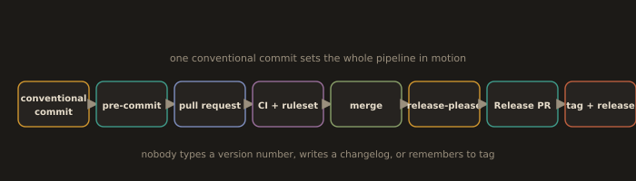

## Lab 4C. A Real Repository: Hooks, Protection, Enforced Commits, Automated Releases

This is the lab that matters. Everything before it was mechanics. This produces a repository that a professional team could actually work in, and the last step is the payoff for all of section B4.

**Fig. 26 · From a commit to a release, hands off**



*A single well formed commit flows through the hooks, review, and merge into an automated version bump, changelog, and tag.*

### 1. Create the repository

```bash
gh repo create module4-release-demo --public --clone --add-readme
```
```bash
cd module4-release-demo
```

### 2. A sane .gitignore

Do not write one from memory. Generate it from the canonical source and then add your own entries.

```bash
curl -L -o .gitignore https://raw.githubusercontent.com/github/gitignore/main/Node.gitignore
```

Or write one deliberately:

```gitignore
# Build output and dependencies
node_modules/
target/
dist/
build/
*.class

# Environment and secrets. If a secret is ever committed, ignoring it later does nothing.
.env
.env.*
*.pem
*.key
credentials.json

# Editor and OS
.idea/
.vscode/
*.iml
.DS_Store
Thumbs.db

# Logs and local state
*.log
*.tfstate
*.tfstate.backup
.terraform/
```

Two rules that people learn the hard way:

* `.gitignore` only affects **untracked** files. A file already tracked stays tracked. To stop tracking it: `git rm --cached <file>` and commit.
* Ignoring a secret does not unpublish it. If it was ever pushed, **rotate the credential**, then purge it from history with `git filter-repo`. Ignoring it afterwards protects nobody.

```bash
git add .gitignore && git commit -m "chore: add gitignore"
```

### 3. Pre-commit hooks: whitespace, YAML validity, secrets

Install the framework:

```bash
sudo dnf install pre-commit -y      # or: pip install --user pre-commit
```
```bash
pre-commit --version
```

Create `.pre-commit-config.yaml`:

```yaml
repos:
  - repo: https://github.com/pre-commit/pre-commit-hooks
    rev: v6.0.0
    hooks:
      - id: trailing-whitespace
      - id: end-of-file-fixer
      - id: check-yaml
      - id: check-json
      - id: check-merge-conflict      # blocks committing "<<<<<<<" markers
      - id: check-added-large-files
        args: ["--maxkb=500"]
      - id: detect-private-key

  - repo: https://github.com/gitleaks/gitleaks
    rev: v8.30.1
    hooks:
      - id: gitleaks
```

Install the hook into this clone. Note that this step is per clone, because `.git/hooks` is not cloned. Every teammate runs it once.

```bash
pre-commit install                     # writes .git/hooks/pre-commit
```
```bash
pre-commit install --hook-type commit-msg
```
```bash
pre-commit run --all-files             # run everything once, now
```
```bash
git add .pre-commit-config.yaml && git commit -m "ci: add pre-commit hooks"
```

**Prove each hook fires.** A hook you have not seen fail is a hook you do not know works.

Trailing whitespace:
```bash
printf 'hello   \n' > demo.txt && git add demo.txt && git commit -m "test: whitespace"
```
The hook fails, **and fixes the file in place**. Re-add and commit again. That is the normal loop for fixer hooks.

Broken YAML:
```bash
printf 'key: [unclosed\n' > bad.yaml && git add bad.yaml && git commit -m "test: yaml"
```

A secret:
```bash
echo 'aws_secret_access_key = "wJalrXUtnFEMI/K7MDENG/bPxRfiCYEXAMPLEKEY"' > creds.txt
git add creds.txt && git commit -m "test: secret"
```
Gitleaks blocks the commit. Delete the file, do not try to make it pass.

Then remind yourself of the limit:
```bash
git commit --no-verify -m "test: bypassed"     # every hook skipped
```
That command is why CI has to run the same checks. Mirror them:

```yaml
# .github/workflows/checks.yml
name: checks
on:
  pull_request:
  push:
    branches: [main]
jobs:
  pre-commit:
    runs-on: ubuntu-latest
    steps:
      - uses: actions/checkout@v4
      - uses: actions/setup-python@v5
        with:
          python-version: "3.12"
      - run: pip install pre-commit
      - run: pre-commit run --all-files
```

### 4. Conventional commits enforced with commitlint

```bash
npm init -y
```
```bash
npm install --save-dev husky @commitlint/cli @commitlint/config-conventional
```
```bash
npx husky init
```
```bash
echo "module.exports = { extends: ['@commitlint/config-conventional'] };" > commitlint.config.js
```
```bash
echo 'npx --no -- commitlint --edit "$1"' > .husky/commit-msg
```
```bash
chmod +x .husky/commit-msg
```

Note for husky v9: `npx husky add` was removed. You write the hook file yourself, as above, and `npx husky init` adds the `"prepare": "husky"` script to `package.json` so that hooks install automatically for everyone who runs `npm install`.

Prove it works:

```bash
git commit --allow-empty -m "updated stuff"
```
```
✖   subject may not be empty [subject-empty]
✖   type may not be empty [type-empty]
✖   found 2 problems, 0 warnings
```
```bash
git commit --allow-empty -m "chore: verify commitlint"     # passes
```
```bash
git add -A && git commit -m "ci: enforce conventional commits with commitlint"
```

If your team squash merges, also lint the PR title, because that title is what becomes the commit on `main`.

### 5. Branch protection with a ruleset

Do it in the UI once so you see the options (Settings, Rules, Rulesets, New branch ruleset), then learn the API call, because in a platform role you will be creating these across dozens of repositories and clicking does not scale.

Required for this lab, targeting `main`:

* Require a pull request before merging, 1 approval.
* Dismiss stale pull request approvals when new commits are pushed.
* Require status checks to pass, select the `pre-commit` check, and require the branch to be up to date.
* Require linear history.
* Block force pushes.
* Restrict deletions.
* Bypass list: empty.

The same thing as code:

```bash
gh api -X POST repos/:owner/:repo/rulesets \
  -f name='main protection' \
  -f target='branch' \
  -f enforcement='active' \
  -f 'conditions[ref_name][include][]=~DEFAULT_BRANCH' \
  -f 'rules[][type]=deletion' \
  -f 'rules[][type]=non_fast_forward' \
  -f 'rules[][type]=required_linear_history' \
  -f 'rules[][type]=pull_request' \
  -F 'rules[][parameters][required_approving_review_count]=1' \
  -F 'rules[][parameters][dismiss_stale_reviews_on_push]=true'
```
```bash
gh api repos/:owner/:repo/rulesets | jq '.[].name'
```

Now prove the protection is real:

```bash
git switch main
```
```bash
git commit --allow-empty -m "chore: try to push straight to main"
```
```bash
git push origin main
```
```
remote: error: GH013: Repository rule violations found for refs/heads/main.
remote: - Changes must be made through a pull request.
```

That rejection is the deliverable. A protection you have not tried to violate is a protection you have not tested.

### 6. Wire up release-please

Create `.github/workflows/release-please.yml`:

```yaml
name: release-please
on:
  push:
    branches: [main]

permissions:
  contents: write
  pull-requests: write

jobs:
  release-please:
    runs-on: ubuntu-latest
    steps:
      - uses: googleapis/release-please-action@v4
        with:
          release-type: node       # or: simple, python, java, terraform-module, and others
```

`release-type: simple` is the right choice if you have no language manifest to bump and you just want a `CHANGELOG.md`, a version file, and a tag.

Commit it through a pull request, because you just made direct pushes to `main` impossible:

```bash
git switch -c ci/release-please
```
```bash
git add .github/workflows/release-please.yml
```
```bash
git commit -m "ci: add release-please"
```
```bash
git push -u origin ci/release-please
```
```bash
gh pr create --fill
```
```bash
gh pr merge --squash --auto        # merges once the checks pass and a review lands
```

### 7. Cash it in

This step is the point of the entire lab. Ship a feature, using a conventional commit, and change nothing else.

```bash
git switch main && git pull
```
```bash
git switch -c feat/greeting
```
```bash
echo 'module.exports = () => "hello";' > index.js
```
```bash
git add index.js
```
```bash
git commit -m "feat: add greeting module"
```
```bash
git push -u origin feat/greeting
```
```bash
gh pr create --fill && gh pr merge --squash --auto
```

Within a minute of that merge, release-please opens a **Release PR** on its own. Look at what it wrote without being asked:

* `CHANGELOG.md`, with a `### Features` heading and your commit under it, linked to the commit and the PR.
* The version bumped from `0.1.0` to `0.2.0`, because `feat:` maps to a minor bump.
* A title such as `chore(main): release 0.2.0`.

Merge the Release PR:

```bash
gh pr list
```
```bash
gh pr merge <release-pr-number> --squash
```
```bash
git pull && git tag --list
```
```bash
gh release list
```

A git tag `v0.2.0` and a GitHub Release with generated notes now exist. Nobody typed a version number. Nobody wrote a changelog. Nobody remembered to tag.

Now prove the mapping in the other direction:

```bash
git switch -c fix/typo && echo '// fix' >> index.js
git commit -am "fix: correct greeting output"
```
Merge that, and the Release PR proposes **0.2.1**, a patch.

```bash
git switch -c feat/breaking
git commit --allow-empty -m "feat!: rename greeting export

BREAKING CHANGE: consumers must import { greet } instead of the default export."
```
Merge that, and the Release PR proposes **1.0.0**, a major.

**That is the payoff.** The commit format was never bureaucracy. It was the input to a machine that now does version management, changelog writing, tagging, and release notes for free, forever, and never forgets.

**Deliverables:** the repository URL, a screenshot of the failed direct push to `main`, a screenshot of gitleaks blocking a commit, a screenshot of commitlint rejecting a bad message, the auto generated `CHANGELOG.md`, and the release list showing 0.2.0, 0.2.1, and 1.0.0.

---
