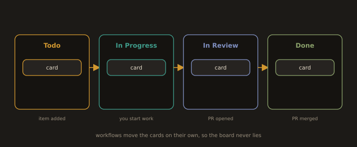

## Lab 4D. One Feature from Backlog to Production

**Goal:** build the traceability chain from section B7 and then verify every link in it.

### 1. Create a project board

```bash
gh project create --owner "@me" --title "Module 4 Sprint Board"
```
```bash
gh project list --owner "@me"
```

In the browser, open the project and configure it as a working board rather than a decorative one:

* Add a **Status** field with Todo, In Progress, In Review, Done.
* Add an **Iteration** field named Sprint, two week duration. This is your sprint.
* Add an **Estimate** number field.
* Switch to the Board layout, grouped by Status.
* Under Workflows, enable **Item added to project** set to Todo, **Item closed** set to Done, and **Pull request merged** set to Done. Now the board maintains itself, which is the only kind of board that stays accurate.

**Fig. 27 · A board that maintains itself**



*Adding an item, opening a PR, and merging it move the card between columns automatically.*

### 2. Write the epic

Create an issue with the Feature issue type (Issues, New issue, then set Type):

**Title:** Users can check out with a saved payment card

**Body:**
```markdown
## Outcome
A returning user completes a purchase without re-entering card details.

## Why
Card re-entry is the largest drop-off step in the funnel.

## Scope
In: saved card selection, CVV re-verification, receipt email.
Out: new payment providers, refunds, subscriptions.

## Done when
All sub-issues are closed and a user can complete a purchase in staging
using a saved card, with the receipt delivered.
```

### 3. Break it into stories as sub-issues

Open the epic, find the **Sub-issues** section, and create three. Do not use the old tasklist syntax, it was retired in April 2025 and will render as plain text.

Story 1:
```markdown
As a returning user, I want to select a saved card at checkout,
so that I do not re-enter my card number.

## Acceptance criteria
- [ ] Saved cards are listed, showing brand and last four digits only.
- [ ] Selecting a card populates the payment step.
- [ ] A user with no saved cards sees the existing manual entry form.
- [ ] No full PAN is ever sent to the client or written to a log.
```

Story 2: CVV re-verification on a saved card.
Story 3: Receipt email after a saved card purchase.

The epic now shows a progress bar, 0 of 3, and it rolls up automatically as the children close. Add all four issues to the project board, put the three stories into the current Sprint iteration, and estimate them.

From the terminal, if you prefer:

```bash
gh issue create --title "Select a saved card at checkout" --body-file story1.md --label enhancement
```
```bash
gh issue list
```
```bash
gh project item-add <project-number> --owner "@me" --url <issue-url>
```

### 4. Start the sprint and take a story

Move story 1 to In Progress. Assign it to yourself. Note its number, say `#4`.

Now build the chain. Every link is deliberate.

**Link one, the branch carries the issue number:**
```bash
git switch main && git pull
```
```bash
git switch -c feat/4-saved-card-selection
```

**Link two, the commit references the issue:**
```bash
echo "// saved card selector" > checkout.js
```
```bash
git add checkout.js
```
```bash
git commit -m "feat(checkout): list saved cards at payment step

Shows brand and last four digits only. Full PAN never leaves the vault.

Refs: #4"
```
```bash
git push -u origin feat/4-saved-card-selection
```

Open the issue in the browser. The commit already appears in the issue timeline, because Git referenced it. No manual linking.

**Link three, the pull request closes the issue:**
```bash
gh pr create --title "feat(checkout): list saved cards at payment step" \
  --body "Implements the saved card selector.

Closes #4"
```

The keyword `Closes #4` matters. A bare `#4` links but does not close. Open the PR and confirm the sidebar now reads **Linked issues: #4**, and the board card for the PR appeared in In Review if you configured that workflow.

### 5. Review, merge, and watch the chain complete

```bash
gh pr view --web
```

Get a review (a classmate, or a second account, since a ruleset requiring one approval means you cannot approve your own PR, which is exactly the point). Then:

```bash
gh pr merge --squash
```

Now verify, one link at a time. This verification **is** the lab. Anyone can build the chain, an engineer proves it.

| Link | How you verify it |
|---|---|
| Issue closed automatically | Open issue #4. It is Closed, and the timeline says the PR closed it. Nobody clicked Close. |
| Board updated automatically | The card for #4 moved to Done. Nobody dragged it. |
| Epic progress rolled up | The epic now reads 1 of 3 complete. |
| Commit points to the issue | `git log --oneline` on main, then open the commit. The `Refs: #4` links back. |
| Issue points to the commit | The issue timeline lists the commit and the PR. |
| Release notes point to both | Merge the release-please Release PR from Lab 4C. The changelog entry for this feature links to the PR, which links to the issue, which links to the epic and its acceptance criteria. |

### 6. The point of all of it

Six months from now, a production incident traces back to one line in `checkout.js`. You run:

```bash
git blame checkout.js
```
```bash
gh pr list --search <commit-sha>
```

Commit, then PR, then issue, then acceptance criteria, then the discussion where somebody explained why the CVV is re-verified. Ninety seconds, no archaeology, no interviewing people who have left the company.

That is the deliverable of this entire module, and it is the difference between a repository and an engineering organisation.

**Deliverables:** the project board URL, the epic showing 1 of 3 sub-issues complete, the closed issue with the auto-close event visible in the timeline, the merged PR, and the changelog entry that links back to it.

---
