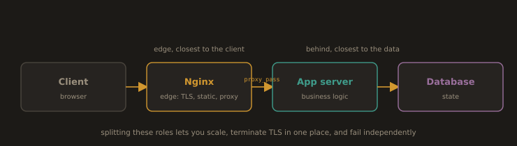

# Section 5.1: Web and Application Servers

## 1. Web Servers vs. Application Servers

A **web server** handles HTTP and HTTPS requests. Its primary job is serving static content (HTML, CSS, JavaScript, images) and, optionally, forwarding dynamic requests to backend processes. Examples: Nginx, Apache HTTP Server.

An **application server** executes application code to generate responses. It handles business logic, database queries, and session management. Examples: Apache Tomcat (Java), Gunicorn (Python), Node.js.

In practice these roles overlap and are commonly combined. A typical architecture is: **Nginx as the front layer** receiving all traffic, serving static files directly, and proxying dynamic requests to an application server running behind it.

```
Client → Nginx (reverse proxy / TLS termination / static files)
               ↓ proxy_pass
         Application Server (Tomcat / Gunicorn / Node)
               ↓
         Database (PostgreSQL / MySQL / MongoDB)
```

---
**Where each sits, and why it matters ?** 

The web server sits at the *edge*, closest to the client; the application server sits *behind* it, closest to the data. This separation is important in DevOps because it lets you scale the two independently, terminate TLS in one well understood place, serve static assets without waking application code, and isolate failures. The same separation reappears in Section 5.2, where the application is deliberately built to be a small, stateless unit that any edge server can sit in front of.

---
**Fig. 1 · Where each server sits in the request path**



*The web server takes the edge, the application server sits behind it, and the database sits behind that.*

---
