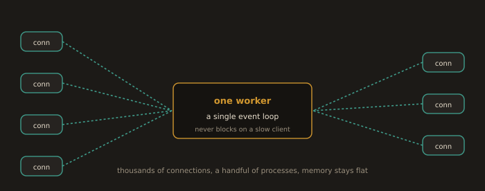
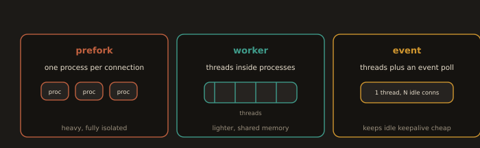

## 2. Process Models of the Two Dominant Web Servers

The two web servers that dominate the market are Nginx and Apache HTTP Server. They differ most fundamentally in their **process model** how they turn incoming connections into work. Understanding the process model is what lets you predict behaviour under load.

### 2.1 Nginx: Event Driven

**Fig. 2 · Nginx handles many connections in a loop**

*A few worker processes each run an event loop, so idle or slow connections cost almost nothing.*

Nginx was released in 2004 to solve the C10K problem the challenge of handling 10,000 simultaneous connections that caused thread based servers to exhaust memory.

Nginx uses an **event driven, asynchronous, non blocking** model:

- A **master process** reads configuration and manages worker processes.

- **Worker processes** (one per CPU core by default) each run a single threaded event loop.

- A single worker can handle thousands of connections simultaneously. When waiting for a network response or disk read, it does not block it registers a callback and handles other connections in the meantime.

- No new thread or process is created per connection, so memory usage stays low and predictable under high load.

### 2.2 Apache HTTP Server: Multi Processing Modules

**Fig. 3 · Apache's three process models**

*prefork isolates each request in a process, worker uses threads, and event frees a thread while a keepalive connection idles.*

Apache uses interchangeable **Multi Processing Modules (MPMs)**. Only one is active at a time.

| MPM | Model | Best For |
|---|---|---|
| `mpm_prefork` | One process per connection, no threads | Legacy non-thread-safe modules (old `mod_php`) |
| `mpm_worker` | Multiple processes, each with multiple threads | Better memory efficiency than prefork |
| `mpm_event` | Worker model with async keep-alive handling | Default on modern systems; best performance |

`mpm_event` is the default on Apache 2.4+ installations. It separates keep alive connection management from request processing: a dedicated listener thread monitors idle keep alive connections and only hands them to a worker thread when a new request arrives.

---
> Compare Nginx's event loop to Apache's `mpm_prefork`: one process per connection. Under 5,000 simultaneous connections, that is 5,000 processes each consuming RAM and requiring context switches. Nginx handles the same 5,000 connections inside a handful of worker processes. This is why Nginx is the default at the edge and Apache remains common deeper in the stack, particularly for legacy, `.htaccess`-dependent, or PHP applications.

---
