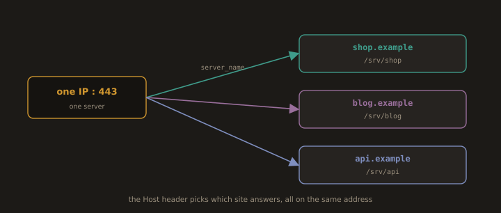

## 3. Virtual Hosts

**Fig. 4 · One address, many sites**

*The requested hostname in the Host header decides which site's document root answers.*

A **virtual host** lets one server serve multiple websites, distinguished by the `Host:` HTTP header the client sends. Both dominant servers support it:

- **Name based virtual hosts**: 

Many sites share one IP address; the server routes by hostname. This is the common case.

- **IP based virtual hosts**: 

Each site has its own IP address. Used when a site needs a dedicated certificate on its own IP, or protocol level isolation.

In Nginx a virtual host is a `server {}` block keyed on `server_name`. In Apache it is a `<VirtualHost>` block keyed on `ServerName`/`ServerAlias`. The labs in this section configure both.

---
