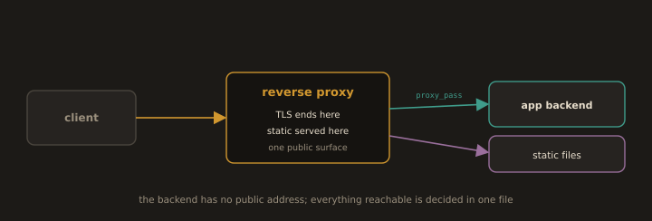

## 4. Reverse Proxying

**Fig. 5 · A reverse proxy is the only public door**

*The proxy terminates TLS, serves static assets, and forwards dynamic requests to a backend that clients never touch directly.*

A **reverse proxy** accepts client requests at the edge and forwards them to one or more backend servers. The client communicates only with the proxy; the backends are invisible from outside the network. A reverse proxy enables:

- **TLS termination** in one place (Section 5).

- **Load balancing** across multiple backends.

- **Centralised logging and access control.**

- **Static/dynamic split** the proxy serves static files itself and forwards only dynamic requests.

Both servers can reverse proxy: Nginx with `proxy_pass`, Apache with `mod_proxy`. In greenfield deployments Nginx is the usual choice at the edge; Apache's `mod_proxy` is chosen mainly when a team is already invested in Apache for the application itself.

---
