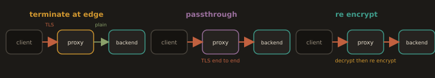

## 5. TLS Termination and Where to Terminate

**TLS termination** is the point at which encrypted client traffic is decrypted. Choosing *where* to terminate is a genuine engineering decision, not a default, because it trades off performance, security, and operational simplicity.

### 5.1 The Three Patterns

**Fig. 6 · Three places TLS can end**

*Terminate at the edge for simple internal traffic, pass it through untouched, or decrypt and re encrypt when the backend must also be private.*

- **Terminate at the edge (most common).** The reverse proxy or load balancer holds the certificate, decrypts, and forwards **plaintext HTTP** to backends over a trusted private network.

  - *Pros:* certificates live in one place; backends do no crypto; the edge can inspect, route, cache, and add security headers.

  - *Cons:* traffic between edge and backend is unencrypted, so the internal network must be trusted.

- **TLS passthrough.** The edge forwards the encrypted stream untouched; the **backend** terminates TLS.

  - *Pros:* end to end encryption; the edge never sees plaintext.

  - *Cons:* the edge cannot inspect, route on URL, or cache; every backend must manage certificates.

- **Re-encryption (TLS bridging).** The edge terminates TLS, inspects/routes, then opens a **second** TLS connection to the backend.

  - *Pros:* end to end encryption **and** edge inspection.

  - *Cons:* two handshakes and double the crypto cost; most operationally complex.

### 5.2 The Decision

The default for most web and application stacks is **terminate at the edge**: it centralises certificate management and keeps application servers simple. Move to **re-encryption** when a compliance regime (for example, handling regulated health or payment data) forbids plaintext even on internal links. Choose **passthrough** only when the backend must own the certificate for example, a service that performs client certificate (mTLS) authentication itself.

This is exactly why, throughout this module, **Nginx terminates TLS at the edge and forwards plaintext to Tomcat, Gunicorn, or PHP-FPM**: it is the simplest correct default, and it keeps the reference application in Section 5.2 free of any TLS concerns of its own.

---
