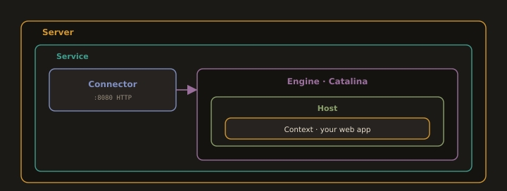

## 6. Apache Tomcat (an Application Server)

Apache Tomcat is a Java application server that implements the Jakarta Servlet and JavaServer Pages (JSP) specifications. It runs Java web applications packaged as `.war` (Web Application Archive) files.

Tomcat is not a general web server and is not a replacement for Nginx or Apache HTTP Server. In production, Tomcat typically sits **behind Nginx**, which handles TLS termination and static files while Tomcat handles Java application requests the edge termination pattern from Section 5.

### Version and JDK Compatibility

This is the most common source of Tomcat installation failures. The versions must match:

| Tomcat Version | Required Java | Jakarta EE Spec |
|---|---|---|
| 9.0.x | Java 8 or later | Servlet 4.0 / JSP 2.3 |
| 10.1.x | Java 11 or later | Servlet 6.0 / JSP 3.1 |
| 11.0.x | Java 17 or later | Servlet 6.1 / JSP 4.0 |

Always verify your Java version before installing Tomcat. If the JDK is too old, Tomcat fails to start with a cryptic JVM error rather than a clear message about incompatibility.

### Key Tomcat Concepts

**Fig. 7 · How Tomcat is put together**

*A connector accepts requests and the Catalina engine routes them through a host to the context that holds your application.*

- **`CATALINA_HOME`:** The Tomcat installation directory (e.g., `/opt/tomcat`).

- **`webapps/`:** Drop `.war` files here; Tomcat auto-deploys them on startup.

- **`conf/server.xml`:** Main configuration ports, connectors, virtual hosts.

- **`conf/tomcat-users.xml`:** User credentials for the Manager web interface.

- **`logs/catalina.out`:** Main log file; always check this first when troubleshooting.

- **Manager App:** Web GUI at `http://server:8080/manager/html` for deploying and managing applications.

---
> Run Tomcat as a non root user. Create a dedicated `tomcat` system account with no login shell. Never run Tomcat as root a vulnerability in a Java application could give an attacker root access to the entire server.

---
