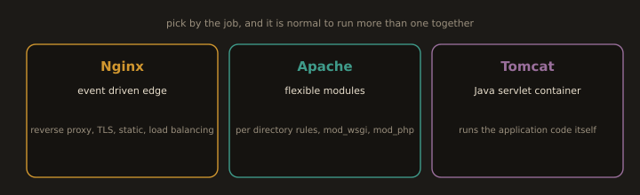

## 7. Web Server Comparison

**Fig. 8 · Three servers, three jobs**

*Nginx owns the edge, Apache brings module flexibility, and Tomcat runs Java applications; real stacks combine them.*

| Feature | Nginx | Apache HTTP Server | Tomcat |
|---|---|---|---|
| Type | Web server / reverse proxy | Web server / proxy | Java application server |
| Architecture | Event driven, async, non blocking | Process/thread MPM | JVM based, multi threaded |
| Static files | Excellent | Good | Not designed for this |
| Dynamic content | Via FastCGI/proxy | Via modules or proxy | Java Servlets / JSP natively |
| Per-directory config | No `.htaccess` equivalent | `.htaccess` supported | `web.xml` per app |
| TLS | Built-in | `mod_ssl` | Via connector (but terminate at Nginx) |
| Configuration style | `server {}` and `location {}` blocks | Directives and `<VirtualHost>` blocks | XML (`server.xml`, `web.xml`) |
| Best for | Reverse proxy, edge, microservices frontend | Legacy apps, `.htaccess`-dependent apps | Java EE applications |
| DevOps role | Front of every architecture | Common in LAMP stacks | Java application hosting |

In a full pipeline you will typically use all three: **Nginx** as the public facing edge, **Apache** for PHP based applications, and **Tomcat** for Java based applications. The Tomcat lab in this section builds the exact deployment target that the CI/CD pipeline in **Section 5.4** delivers into.

---
> Nginx is the most widely deployed web server and reverse proxy. Per W3Techs (April 2026): **Nginx 32.7%, Cloudflare Server 27.7%, Apache 23.7%** of all websites with a known server. These figures move month to month; treat them as an ordering (Nginx ahead of Apache, with Cloudflare's edge proxies now a close second) rather than fixed constants.

---
