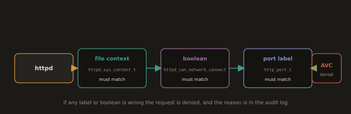

# SELinux Reference for Web Servers

**Fig. 9 · SELinux checks the labels before the file**



*The content label, the right boolean, and the port label all have to line up, or the access becomes an AVC denial.*

Most web server failures on RHEL/CentOS trace to one of three causes: wrong file context, missing boolean, or unlabeled port.

## 1. File Context

**`ls -Z PATH`**: View label. Web content should show `httpd_sys_content_t`; `default_t` or `user_home_t` indicates the problem.

```bash
ls -Z /var/www/mysite/
```

**`chcon -R -t TYPE PATH`**: Temporary fix, lost on relabel.
```bash
sudo chcon -R -t httpd_sys_content_t /var/www/mysite
```

**`restorecon -R -v PATH`**: Reset from policy (persistent). Add `-n` for dry run.
```bash
sudo restorecon -Rv /var/www/mysite
```

**`semanage fcontext -a -t TYPE "PATH_REGEX"`**: For paths outside `/var/www`, register the type permanently, then run `restorecon`.
```bash
sudo semanage fcontext -a -t httpd_sys_content_t "/srv/mysite(/.*)?"
sudo restorecon -Rv /srv/mysite
```
