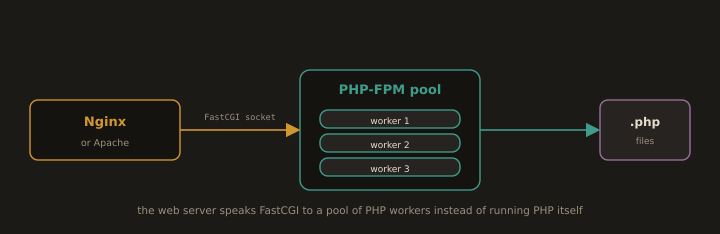
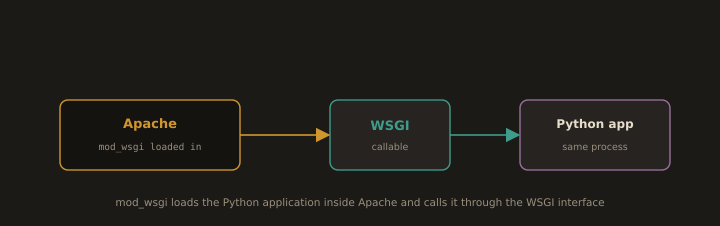

# Lab Exercises

## Lab 5.1.A: Apache HTTP Server: Installation, Virtual Hosts, and HTTPS

### Part 1: Install and Start Apache

```bash
rpm -q httpd
```
```bash
sudo dnf install httpd -y
```
```bash
sudo systemctl enable httpd --now
```
```bash
sudo systemctl status httpd
```
```bash
httpd -v
```

Open Firewall Ports:

```bash
sudo firewall-cmd --permanent --add-service=http
```

```bash
sudo firewall-cmd --reload
sudo firewall-cmd --list-all
```

**Verify:**

- In the Server: Open `http://127.0.0.1` in a browser or run `curl -I http://127.0.0.1`


> To verify from the Host Computer, you must use the Server's IP address.

You should see the Apache test page:


---
Major configuration files:

```bash
cat /etc/httpd/conf/httpd.conf       # Main configuration
```
```bash
ls /etc/httpd/conf.d/                # Virtual host and module configs
```

Three directives to understand in `httpd.conf`:

```
ServerRoot "/etc/httpd"            # Base directory for all Apache config files
DocumentRoot "/var/www/html"       # Where website files are served from by default
Listen 80                          # Port Apache listens on
```

Always test configuration syntax before restarting:

```bash
sudo apachectl configtest
```

---
# Part 2: Serve a Static Website

```bash
sudo mkdir -p /var/www/html/Tickets
```
```bash
sudo chown -R apache:apache /var/www/html
sudo chmod -R 755 /var/www/html
```
```bash
ls -ld /var/www/html/
```

Create the homepage:

```bash
sudo vim /var/www/html/index.html
```
[Source Code: Click Here](<Source Code/Part 2 Serve a Static Website: index.html>)

Create the `tickets.html` Page:

```bash
sudo vim /var/www/html/Tickets/tickets.html
```
[Source Code: Click Here](<Source Code/Part 2 Serve a Static Website: tickets.html>)

```bash
sudo apachectl configtest
sudo systemctl restart httpd
```

Test in the browser: 

```bash
http:IP_Address_of_Your_Server
```


---


---
# Part 3: Name Based Virtual Hosts

A virtual host allows one Apache server to serve multiple websites on one IP, distinguished by the `Host:` HTTP header sent by the client.

```bash
sudo mkdir -p /var/www/registrar.local
```
```bash
sudo chown -R apache:apache /var/www/registrar.local
```
```bash
sudo chmod -R 755 /var/www/registrar.local
```

- Create a homepage:
```bash
sudo vim /var/www/registrar.local/index.html
```

[Source Code: Click Here](<Source Code/Part 3 Name Based Virtual Hosts: index.html>)


- Create the virtual host configuration:

```bash
sudo vi /etc/httpd/conf.d/registrar.local.conf
```

```apache
<VirtualHost *:80>
    ServerName registrar.local
    ServerAlias www.registrar.local
    DocumentRoot /var/www/registrar.local
    ServerAdmin admin@registrar.local

    ErrorLog /var/log/httpd/registrar.local_error.log
    CustomLog /var/log/httpd/registrar.local_access.log combined

    <Directory "/var/www/registrar.local">
        Options -Indexes +FollowSymLinks
        AllowOverride All
        Require all granted
    </Directory>
</VirtualHost>
```
---
> `Options -Indexes` prevents Apache from listing directory contents when no index file exists. Always set this in production exposing directory listings reveals your file structure to anyone on the internet.
---
```bash
sudo apachectl configtest
```
```bash
sudo httpd -S                    # Show all configured virtual hosts
```
```bash
sudo systemctl restart httpd
```
---
- If you want to access it from the host (Linux/macOS) browser:
```bash
sudo sh -c 'echo "<Your_Server_IP>  registrar.local  www.registrar.local" >> /etc/hosts'
```

---
- If you want to access it from the host (Windows) browser:
- Open Notepad as Administrator
- Notepad > File > Open > File name: `C:\Windows\System32\drivers\etc\hosts`

> Change the file type filter from "Text Documents" to "All Files" so Notepad shows it, since it has no extension.

- Append:
```text
<Your_Server_IP>  registrar.local  www.registrar.local
```

Test on the browser: 

`http://registrar.local/`


---
> To host more sites, repeat the pattern: each site gets its own directory and its own `.conf` file in `/etc/httpd/conf.d/`.

---
# Part 4: HTTPS with a Self-Signed Certificate

HTTPS encrypts traffic between client and server using TLS. This lab terminates TLS **at Apache** for a single server setup; in the multi tier pattern of Section 5.1 §5 you would instead terminate at Nginx. Certificate options:

- **Let's Encrypt:** 

Free, automated, 90 day certificates via `certbot`. Requires a publicly routable domain. Standard for production.

- **Commercial CA:** 

Paid certificates (DigiCert, Sectigo). Used when extended validation is required.

- **Self signed:** 

Generated locally, not trusted by browsers. Use only in lab or internal environments.

- Install `mod_ssl`

```bash
sudo dnf install mod_ssl openssl -y
```
- Generate a self-signed certificate
  - Syntax:
```bash
sudo openssl req -x509 -nodes -days <DAYS> -newkey rsa:<KEY_SIZE> \
    -keyout <PATH_TO_KEY> \
    -out <PATH_TO_CERT> \
    -subj "/C=<COUNTRY_CODE>/ST=<STATE>/L=<CITY>/O=<ORGANIZATION>/CN=<COMMON_NAME>"
```
Flags: 
  - `-x509` self-signed certificate
  - `-nodes` no passphrase on the key
  - `-days 365` one year validity
  - `-newkey rsa:2048` new 2048-bit RSA key pair
  - `-subj` subject fields without an interactive prompt.

- Delete a key
```bash
sudo rm /etc/pki/tls/private/<key_name>.key \
        /etc/pki/tls/certs/<certificate_name>.crt
```

---
**Complete Example: Cafe App**

```bash
sudo mkdir -p /var/www/brewhousecafe
sudo chown -R apache:apache /var/www/brewhousecafe
sudo chmod -R 755 /var/www/brewhousecafe
```

- Create a homepage:
```bash
sudo vim /var/www/brewhousecafe/index.html
```

- Generate the self-signed certificate for the cafe app
```bash
sudo openssl req -x509 -nodes -days 365 -newkey rsa:2048 \
    -keyout /etc/pki/tls/private/brewhousecafe.key \
    -out /etc/pki/tls/certs/brewhousecafe.crt \
    -subj "/C=NP/ST=Bagmati/L=Kathmandu/O=Brew House Cafe/CN=brewhousecafe.com.np" \
    -addext "subjectAltName=DNS:brewhousecafe.com.np"
```

- Create the HTTPS virtual host
```bash
sudo vi /etc/httpd/conf.d/brewhousecafe.local-ssl.conf
```
[Source Code: Click Here](<Source Code/Part 4 HTTPS with a Self-Signed Certificate: index.html>)

```apache
# HTTPS virtual host
<VirtualHost *:443>
    ServerName brewhousecafe.com.np
    DocumentRoot /var/www/brewhousecafe
    ServerAdmin admin@brewhousecafe.com.np

    SSLEngine on
    SSLCertificateFile /etc/pki/tls/certs/brewhousecafe.crt
    SSLCertificateKeyFile /etc/pki/tls/private/brewhousecafe.key

    # Disable deprecated protocols; allow TLS 1.2 and 1.3 only
    SSLProtocol all -SSLv3 -TLSv1 -TLSv1.1

    # Security headers
    Header always set Strict-Transport-Security "max-age=63072000; includeSubDomains"
    Header always set X-Content-Type-Options "nosniff"
    Header always set X-Frame-Options "DENY"

    <Directory "/var/www/brewhousecafe">
        Options -Indexes +FollowSymLinks
        AllowOverride All
        Require all granted
    </Directory>

    ErrorLog /var/log/httpd/brewhousecafe.com.np_ssl_error.log
    CustomLog /var/log/httpd/brewhousecafe.com.np_ssl_access.log combined
</VirtualHost>

# Redirect all HTTP to HTTPS
<VirtualHost *:80>
    ServerName brewhousecafe.com.np
    Redirect permanent / https://brewhousecafe.com.np/
</VirtualHost>
```

- Add `https` service in the firewall
```bash
sudo firewall-cmd --add-service=https --permanent
sudo firewall-cmd --reload
```
- Check syntax and restart the service
```bash
sudo apachectl configtest
sudo systemctl restart httpd
```

```bash
echo "<Your_Server_IP> brewhousecafe.com.np" | sudo tee -a /etc/hosts
```

Test: `https://brewhousecafe.com.np`

The browser warns because the cert is self-signed; proceed past it and confirm the padlock shows TLS is active.


---
**Let's Encrypt for production (Production domain required):**

- Syntax:

```bash
sudo dnf install certbot python3-certbot-<PLUGIN> -y
```
```bash
sudo certbot --<PLUGIN> -d <DOMAIN> -d <SUBDOMAIN>
```
```bash
sudo certbot renew --dry-run
```

* **`<PLUGIN>`** 

Configures the web server automatically (for example, `apache` or `nginx`).

* **`-d <DOMAIN>`** 

Adds a domain to the certificate. Repeat `-d` for multiple domains.

* **`certbot renew --dry-run`** 

Tests automatic certificate renewal without issuing a new certificate.
---
- **Example: Brew House Cafe (Production Domain)**
```bash
sudo dnf install certbot python3-certbot-apache -y
```
```bash
sudo certbot --apache -d brewhousecafe.com.np -d www.brewhousecafe.com.np
```
```bash
sudo certbot renew --dry-run                              # Test auto-renewal
```
>Note this only works with brewhousecafe.com.np being a real, publicly routable domain with DNS pointed at this server's public IP.

---
# Part 5: PHP Website with PHP-FPM

**Fig. 10 · PHP runs in its own worker pool**



*The web server forwards dynamic requests over a FastCGI socket to a pool of PHP workers that execute the code.*

Apache serves PHP through **PHP-FPM** (FastCGI Process Manager), the current standard. PHP runs as a separate process pool; Apache proxies PHP requests to it. This is more efficient and more secure than in-process modules, and supports multiple PHP versions per server.

```bash
sudo dnf install php php-fpm php-mysqlnd php-json php-xml php-mbstring -y
```
```bash
sudo systemctl enable --now php-fpm
sudo systemctl status php-fpm
```
```bash
php -v
```
- Create a project Directory:
```bash
sudo mkdir -p /var/www/attendance
sudo mkdir -p /var/www/attendance/records
```
```bash
sudo chown -R apache:apache /var/www/attendance
sudo chmod -R 755 /var/www/attendance
```
- Create the PHP application
```bash
sudo vi /var/www/attendance/index.php
```
[Source Code: Click Here](<Source Code/Part 5 PHP Website with PHP-FPM: index.php>)

- Create virtual host configuration
```bash
sudo vi /etc/httpd/conf.d/attendance.conf
```
```apache
<VirtualHost *:80>
    ServerName attendance.kalikaschool.local
    DocumentRoot /var/www/attendance
    ServerAdmin admin@kalikaschool.local

    <FilesMatch \.php$>
        SetHandler "proxy:unix:/run/php-fpm/www.sock|fcgi://localhost"
    </FilesMatch>

    <Directory "/var/www/attendance">
        Options -Indexes +FollowSymLinks
        AllowOverride All
        Require all granted
    </Directory>

    <Directory "/var/www/attendance/records">
        Require all denied
    </Directory>

    ErrorLog /var/log/httpd/attendance_error.log
    CustomLog /var/log/httpd/attendance_access.log combined
</VirtualHost>
```

```bash
sudo apachectl configtest
```
```bash
sudo systemctl restart php-fpm
sudo systemctl restart httpd
```
```bash
echo "<Your_Server_IP> mytestwebphp" | sudo tee -a /etc/hosts
```

Test: `http://attendance.kalikaschool.local`


---
# Part 6: Python Website with mod_wsgi

**Fig. 11 · mod_wsgi runs Python inside Apache**



*Apache loads the module and calls the Python application through the WSGI interface, in the same process.*

`mod_wsgi` bridges Apache and Python web applications. WSGI (Web Server Gateway Interface) is the standard Python interface between web servers and Python frameworks: Django, Flask, and most others implement it.

**Two deployment modes:**

- **Embedded mode:** 

Python runs inside Apache processes. Simple but less isolated.

- **Daemon mode (recommended):** 

Python runs in separate processes. Better isolation, graceful restarts without restarting Apache, and different Python environments per application.

```bash
sudo dnf install httpd python3 python3-mod_wsgi -y
```
```bash
sudo httpd -M | grep wsgi     # Verify the module loaded
```

- Create the directory layout. The WSGI script lives **outside** the document root so it can never be served as static source, even if `mod_wsgi` fails to intercept.

```bash
sudo mkdir -p /var/www/examsite/wsgi
```
```bash
sudo mkdir -p /var/www/examsite/public
```
```bash
sudo vim /var/www/examsite/wsgi/app.py
```

[Source Code: Click Here](<Source Code/Part 6: Python Website with mod_wsgi: app.py>)

- Create the virtual host

```bash
sudo vi /etc/httpd/conf.d/examsite.conf
```
```apache
<VirtualHost *:80>
    ServerName examcell.himalpoly.test
    DocumentRoot /var/www/examsite/public
    ServerAdmin admin@himalpoly.edu.np

    # Daemon mode: Python runs in separate processes, not inside Apache workers
    WSGIDaemonProcess examcell-app user=apache group=apache \
        processes=2 threads=15 python-path=/var/www/examsite/wsgi

    WSGIScriptAlias / /var/www/examsite/wsgi/app.py

    <Directory /var/www/examsite/wsgi>
        WSGIProcessGroup examcell-app
        WSGIApplicationGroup %{GLOBAL}
        Require all granted
    </Directory>

    <Directory /var/www/examsite/public>
        Options -Indexes
        AllowOverride None
        Require all granted
    </Directory>

    ErrorLog /var/log/httpd/examsite_error.log
    CustomLog /var/log/httpd/examsite_access.log combined
    LogLevel warn
</VirtualHost>
```

- Set permissions and SELinux context:
```bash
sudo chown -R apache:apache /var/www/examsite
sudo chmod -R 755 /var/www/examsite
```
```bash
sudo chcon -R -t httpd_sys_content_t /var/www/examsite
```
```bash
sudo apachectl configtest
sudo systemctl restart httpd
```

- Resolve host locally (replace `<Your_Server_IP>` with the actual IP):
```bash
echo "<Your_Server_IP>  examcell.himalpoly.test" | sudo tee -a /etc/hosts
```

- Test: `http://examcell.himalpoly.test/`


---
>A 403 Forbidden is almost always a wrong SELinux context or wrong ownership.

---
# Part 7: Apache Log Management

Apache writes an access log and an error log; reading them is essential when troubleshooting.

| File | Purpose |
|---|---|
| `/var/log/httpd/access_log` | All HTTP requests to the default virtual host |
| `/var/log/httpd/error_log` | Apache errors, module messages, application stderr |
| Virtual host logs | Defined per `<VirtualHost>` in `.conf` files |

```bash
sudo tail -f /var/log/httpd/access_log           # Follow access log in real time
```
```bash
sudo tail -f /var/log/httpd/error_log            # Follow error log in real time
```
```bash
sudo grep " 404 " /var/log/httpd/access_log      # Find 404 errors
```
```bash
sudo grep " 500 " /var/log/httpd/access_log      # Find 500 server errors
```
```bash
# HTTP status code distribution
sudo awk '{print $9}' /var/log/httpd/access_log | sort | uniq -c | sort -rn | head -10
```

---
**Combined Log Format**: 

One line, then its fields:
```
192.168.1.10 - alice [25/Jun/2026:09:15:23 +0545] "GET /index.php HTTP/1.1" 200 4823 "-" "Mozilla/5.0"
```

Fields: client IP, identity (usually `-`), auth user, timestamp, request line, status code, response bytes, referrer, user agent.

---
> Apache and Nginx can coexist on the same server, but they cannot listen on the same IP address and port simultaneously. Running both requires different ports, different IP addresses, or a reverse proxy configuration.

```bash
sudo systemctl disable httpd.service --now
```
---