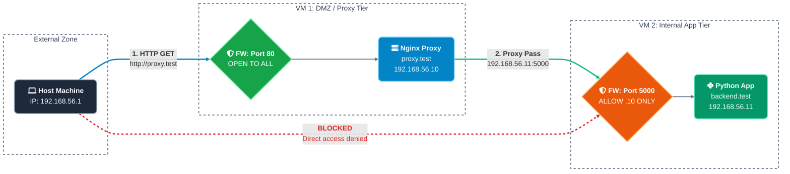

## Lab 5.1.B: Nginx - Static Site, Reverse Proxy, and Load Balancer

### Part 1: Install and Start Nginx

```bash
sudo dnf install nginx -y
```
```bash
sudo systemctl enable --now nginx
```
```bash
sudo systemctl status nginx
```
```bash
nginx -v
```
```bash
sudo firewall-cmd --permanent --add-service=http
```
```bash
sudo firewall-cmd --reload
```

Test: `http://<Your_Server_IP>`

---

---
Major Commands:

```bash
sudo nginx -t                 # Test configuration syntax
```
```bash
sudo nginx -T                 # Test and dump the full config
```
```bash
sudo systemctl reload nginx   # Apply changes without dropping connections
```
```bash
sudo systemctl restart nginx  # Full restart (drops active connections briefly)
```

Always run `nginx -t` before reloading or restarting. A config error prevents Nginx from starting, taking the server offline.

---
### Part 2: Serve a Static Site

```bash
sudo mkdir -p /var/www/nginx-static
```
```bash
sudo vim /var/www/nginx-static/index.html
```

[Source Code:](<Source Code/franzkafkaindex.html>)

```bash
sudo chown -R nginx:nginx /var/www/nginx-static
```

```bash
sudo chcon -R -t httpd_sys_content_t /var/www/nginx-static
```

- Create the server block `
```bash
sudo vi /etc/nginx/conf.d/static-site.conf
```
```nginx
server {
    listen 80;
    server_name franzkafka.com;

    root /var/www/nginx-static;
    index index.html;

    # Deny access to hidden files (dot files like .env, .git)
    location ~ /\. {
        deny all;
    }

    access_log /var/log/nginx/static.local_access.log;
    error_log  /var/log/nginx/static.local_error.log;
}
```

```bash
sudo nginx -t
```
```bash
sudo systemctl reload nginx
```

```bash
echo "<Your_Server_IP>  franzkafka.com" | sudo tee -a /etc/hosts
```

Test: `http://franzkafka.com`

---

---

---

---
### Part 3: Nginx as a Reverse Proxy

A reverse proxy accepts client requests and forwards them to a backend on a different machine. The client talks only to Nginx. The backend is invisible from the client network. 

This lab builds that topology with two virtual machines and then proves every hop of the request path with observable evidence.

- The client reaches the application only through Nginx. Direct access to the backend fails at the network layer.

- Nginx originates a second, separate TCP connection to the backend. Two hops exist, and both are observable.

- The backend sees the proxy as its TCP peer, while receiving the real client address through headers that Nginx added.

- The response returns through Nginx, not directly from the backend.

- The failure surfaces are distinct: backend down produces 502 from Nginx, proxy down produces connection refused on the client.

**Architecture and Address Plan**:


| Machine | Name | Address | Listens on | Reachable from host |
|---|---|---|---|---|
| host | (your machine) | 192.168.10.1 | n/a | n/a |
| VM 1 | proxy.test | 192.168.10.223 | 0.0.0.0:80 | yes, port 80 only |
| VM 2 | backend.test | 192.168.10.224 | 0.0.0.0:5000 | no, port 5000 blocked |

```
┌────────────────┐         ┌──────────────────────────┐         ┌──────────────────────────┐
│  host machine  │         │  VM 1   proxy.test       │         │  VM 2   backend.test     │
│  192.168.10.1  │  HTTP   │  nginx                   │  HTTP   │  python monitoring app   │
│  browser, curl │ :80 ──▶ │  listen 0.0.0.0:80       │ :5000 ▶ │  listen 0.0.0.0:5000     │
│                │ ◀─────  │  firewall: http open     │ ◀─────  │  firewall: 5000 allowed  │
│                │ response│                          │ response│  from 192.168.10.223 only│
└────────────────┘         └──────────────────────────┘         └──────────────────────────┘
       │                                                                    ▲
       └──────────────  direct connection to 192.168.10.224:5000  ──────────┘
                        must FAIL (blocked by the VM 2 firewall)
```

What happens on one request:

What happens on one request:

1. The browser resolves `proxy.test` to `192.168.10.223` and opens a TCP connection to port 80 on VM 1.

2. Nginx accepts it, builds a new request, and opens a second TCP connection from VM 1 to `192.168.10.224:5000` on VM 2. It adds the forwarding headers during this step.

3. The backend answers Nginx. In its logs the TCP peer is `192.168.10.223`, never the real client.

4. Nginx relays the response back to the browser. The response carries `Server: nginx`, proving which machine terminated the client connection.

5. When the browser opens the dashboard's `/events` stream, Nginx holds that second connection open and relays one event per second, unbuffered, for as long as the page is open.

The client never opens a socket to VM 2. The firewall on VM 2 makes that a
network rule, not a convention.

---
**Prerequisites**:

- VirtualBox (or an equivalent hypervisor) with a network on the `192.168.10.0/24` subnet. The host sits on the same network, conventionally at `192.168.10.1`.

- Two RHEL family guests (Fedora, Rocky, or Alma), 1 CPU and 1 GB RAM each.

- Each VM gets two adapters:
  - Adapter 1: Bridge 
  - Adapter 2: Bridge

- `sudo` on both VMs.

- Administrator rights on the host to edit its hosts file.

- `curl` on the host (present on Linux, macOS, and current Windows).

Every command block below starts with a `# run on:` comment stating where it
executes: `host`, `vm1`, or `vm2`.

---
**Prepare Both VMs**:

- Find the connection name bound to the host only adapter

- Run on: vm1 and vm2
```bash
route -n
```
```bash
nmcli -f NAME,DEVICE,TYPE con show
```
```bash
ip -4 addr show
```

Output:


---


---
**Static IP addresses:**

Set the static address:
    - Replace `CON`, `gateway`, `dns` with the connection name from the previous output.
    
---
Example:


---

- Run on: vm1

```bash
sudo nmcli con mod "CON" ipv4.method manual ipv4.addresses X.X.X.X/24 ipv4.gateway "" ipv4.dns ""
```
```bash
sudo nmcli con up "CON"
```
```bash
sudo hostnamectl set-hostname proxy.test
```
---
- Run on: vm2

```bash
sudo nmcli con mod "CON" ipv4.method manual ipv4.addresses X.X.X.X/24 ipv4.gateway "" ipv4.dns ""
```
```bash
sudo nmcli con up "CON"
```
```bash
sudo hostnamectl set-hostname backend.test
```
---
**Name resolution inside the lab**:

- Run on: vm1
```bash
printf '127.0.0.1 proxy.test\n192.168.10.224 backend.test\n' | sudo tee -a /etc/hosts
```
---
- Run on: vm2
```bash
printf '127.0.0.1 backend.test\n192.168.10.223 proxy.test\n' | sudo tee -a /etc/hosts
```
---
**Verify the network:**

- Run on: vm1

```bash
ip -4 addr show | grep 192.168.10
```
```bash
ping -c3 192.168.10.224
```

---
- Run on: vm2
```bash
ip -4 addr show | grep 192.168.10
```
```bash
ping -c4 192.168.10.223
```

> Both pings must succeed. If they fail, stop here. Nothing later in the lab can work until the VMs reach each other.
---
**VM 2: The Backend Server**

**Install and write the application**

```bash
sudo dnf install -y python3
```
```bash
sudo mkdir -p /opt/demo-backend
```
```bash
sudo vim /opt/demo-backend/app.py
```

[Source Code:](<Source Code/app.py>)

---
The application deliberately carries two kinds of evidence in every response, in the `request` object:

- **TCP peer**: the address that opened the connection. Through the proxy this is always `192.168.10.223`. Directly, it is whoever connected.

- **Headers**: the values Nginx injected. Direct access shows `not set`.

The code contains no hardcoded lab addresses: every value it displays is read from the live socket and request at runtime, so the same file works unchanged on any addressing plan.

---
Confirm the file compiles before running it. Mixed tabs and spaces from an editor break indentation silently:

- run on: vm2
```bash
sudo python3 -c "import py_compile; py_compile.compile('/opt/demo-backend/app.py')"
```


> A clean run prints nothing. An `IndentationError` means rewrite the file, do not patch it.

---
**Foreground Smoke Test**

- run on: vm2
```bash
python3 /opt/demo-backend/app.py
```

From a second terminal on VM 2:

```bash
curl -s http://127.0.0.1:5000/api/metrics
```

>Expected: a JSON document containing `"peer": "127.0.0.1"`,`"socket": "127.0.0.1:5000"`, `"X-Real-IP": "not set"`, and a `metrics` object with CPU, memory, disk, load, network, uptime, and process count.

---

---
Stop the process with `Ctrl+c`.

---
**Run Under Systemd**

- run on: vm2
```bash
sudo useradd --system --no-create-home --shell /sbin/nologin appuser
```
```bash
sudo chown -R appuser:appuser /opt/demo-backend
```
```bash
sudo vim /etc/systemd/system/demo-backend.service
```

```ini
[Unit]
Description=Demo backend behind Nginx
After=network.target

[Service]
Type=simple
User=appuser
ExecStart=/usr/bin/python3 /opt/demo-backend/app.py
Restart=on-failure
RestartSec=2

# The app never needs the filesystem, only its listening socket
NoNewPrivileges=true
PrivateTmp=true
ProtectSystem=strict
ProtectHome=true

[Install]
WantedBy=multi-user.target
```

- run on: vm2
```bash
sudo systemctl daemon-reload
```
```bash
sudo systemctl enable --now demo-backend
```
```bash
sudo systemctl status demo-backend --no-pager
```
```bash
ss -tlnp | grep 5000
```

Trust the status output, not the commands. Required results:

- `systemctl status` reports `Active: active (running)`.

- `ss` shows `0.0.0.0:5000`. If it shows `127.0.0.1:5000`, the file was not saved correctly and VM 1 will never connect. Fix the `LISTEN` line.

---

If the unit is `inactive (dead)` or flapping:

- run on: vm2
```bash
sudo systemctl restart demo-backend
```
```bash
sudo journalctl -u demo-backend -n 30 --no-pager
```

---
**Enforce isolation with the firewall**

This rule replaces the loopback binding from the single VM version. It is the mechanism that makes "clients cannot reach the backend" a fact of the network.

- run on: vm2
```bash
sudo firewall-cmd --get-active-zones
```
```bash
sudo firewall-cmd --permanent --add-rich-rule='rule family="ipv4" source address="192.168.10.223" port protocol="tcp" port="5000" accept'
```
```bash
sudo firewall-cmd --reload
sudo firewall-cmd --list-all
```
---

---
The rich rule must land in the zone that owns the host only interface (usually `public`). If `--get-active-zones` shows the interface under a different zone, repeat the rule with `--zone=<name>`.

Every other source is rejected by the zone default. Only `192.168.10.223` may speak to port 5000.

---
**Test Isolation**:

- run on: vm1
```bash
curl -s -o /dev/null -w "%{http_code}\n" http://192.168.10.224:5000/
```
> Expected: `200`. The proxy machine is allowed through.

- run on: vm1
```bash
curl -s http://192.168.10.224:5000/api/metrics
```
> Note the output: `"peer": "192.168.10.223"` and `"X-Real-IP": "not set"`. Remember this. After the proxy is in place, the same backend will show the real client address in that header.

- run on: host
```bash
curl --max-time 5 http://192.168.10.224:5000/
```
> Expected: failure. Connection refused, no route to host, or timeout are all acceptable proof. Success is the only wrong answer. Save this output; it is evidence item E1.

- run on: host
```bash
ping -c5 192.168.10.224
```
> Expected: replies. The host can reach VM 2 at layer 3 but is refused at layer 4. That contrast is exactly what a firewall policy looks like.

---
**VM 1: the Nginx Reverse Proxy**

**Install and permit outbound connections**

- run on: vm1
```bash
sudo dnf install -y nginx
```
```bash
sudo setsebool -P httpd_can_network_connect 1
```
```bash
getsebool httpd_can_network_connect
```

- Expected: `httpd_can_network_connect --> on`.

On RHEL family systems SELinux blocks Nginx from opening upstream connections by default. Skipping this boolean is the most common cause of 502 Bad Gateway on an otherwise correct configuration.

---
**The proxy configuration**

- run on: vm1
```bash
sudo vim /etc/nginx/conf.d/reverse-proxy.conf
```
```nginx
upstream demo_backend {
    server 192.168.10.224:5000;
    keepalive 16;
}

# Log format that records both hops of every request.
# This is the primary evidence that proxying occurred.
log_format proxy_trace '$remote_addr -> $upstream_addr [$time_local] '
                       '"$request" status=$status upstream_status=$upstream_status '
                       'request_time=$request_time upstream_time=$upstream_response_time';

server {
    listen 80;
    server_name proxy.test;

    location / {
        proxy_pass http://demo_backend;

        # Carry the original request context to the backend
        proxy_set_header Host              $host;
        proxy_set_header X-Real-IP         $remote_addr;
        proxy_set_header X-Forwarded-For   $proxy_add_x_forwarded_for;
        proxy_set_header X-Forwarded-Proto $scheme;
        proxy_set_header Via               "1.1 proxy.test";

        proxy_connect_timeout 10s;
        proxy_read_timeout    30s;
        proxy_send_timeout    30s;

        # HTTP/1.1 keepalive to the upstream
        proxy_http_version 1.1;
        proxy_set_header Connection "";
    }

    # Server-Sent Events: a long-lived streaming connection.
    # Exact match wins over "location /" for /events.
    location = /events {
        proxy_pass http://demo_backend;

        proxy_set_header Host              $host;
        proxy_set_header X-Real-IP         $remote_addr;
        proxy_set_header X-Forwarded-For   $proxy_add_x_forwarded_for;
        proxy_set_header X-Forwarded-Proto $scheme;
        proxy_set_header Via               "1.1 proxy.test";

        proxy_http_version 1.1;
        proxy_set_header Connection "";

        proxy_buffering off;    # deliver each event as it arrives
        proxy_read_timeout 1h;  # the stream is long-lived by design
    }

    # Answered by Nginx itself. Never touches the backend.
    location = /healthz {
        access_log off;
        default_type text/plain;
        return 200 "nginx ok\n";
    }

    location ~ /\. {
        deny all;
    }

    access_log /var/log/nginx/proxy.test_access.log proxy_trace;
    error_log  /var/log/nginx/proxy.test_error.log;
}
```
---
**Why each header exists:**

- `Host $host`: without it the backend receives `demo_backend` as the hostname, which breaks absolute URLs, redirects, and name based routing on the backend.

- `X-Real-IP` and `X-Forwarded-For`: the backend otherwise sees `192.168.10.223` for every client. These headers carry the real client address across the proxy hop.

- `X-Forwarded-Proto`: tells the backend whether the client spoke HTTP or HTTPS. This is how the backend learns TLS was terminated at the edge when you add TLS later.

- `Via`: the standard header by which a proxy announces itself.

- `proxy_http_version 1.1` with `Connection ""`: allows connection reuse to the backend. The empty `Connection` header stops Nginx from sending `Connection: close` upstream and defeating the keepalive pool.

- `listen 80;` binds every interface on VM 1. Do not narrow it to `127.0.0.1`, or the host can never reach the proxy.

**Why the `/events` block exists:**

- SSE responses never end. With default `proxy_buffering on`, Nginx would accumulate events and flush them in bursts; the dashboard would stutter instead of ticking once per second. `proxy_buffering off` relays each event as it arrives.

- `proxy_read_timeout 1h` stops Nginx from closing the stream after 60 idle-looking seconds.

- The backend also sends `X-Accel-Buffering: no`, which disables buffering even without this block. Removing the block and watching the dashboard stutter is itself a good experiment.

---
**Validate and start**

- run on: vm1
```bash
sudo nginx -t
```
```bash
sudo systemctl enable --now nginx
```
```bash
sudo systemctl status nginx --no-pager
```
```bash
ss -tlnp | grep :80
```

Required results: `nginx -t` reports success, the unit is active, and `ss` shows `0.0.0.0:80`.

Confirm the file is actually loaded and see what else claims port 80:

- run on: vm1
```bash
grep -n "include /etc/nginx/conf.d" /etc/nginx/nginx.conf
```
```bash
sudo nginx -T | grep -n "listen\|server_name"
```

The stock configuration ships a default server block on port 80. It only answers requests whose `Host` header does not match `proxy.test`. This is name based virtual hosting: one port, different answers per name. Requests
for `proxy.test` go to your block; requests to the bare IP get the default block. Both behaviors are correct and you will observe this in testing.

---

**Open the firewall on VM 1**

- run on: vm1
```bash
sudo firewall-cmd --get-active-zones
```
```bash
sudo firewall-cmd --permanent --add-service=http
```
```bash
sudo firewall-cmd --reload
sudo firewall-cmd --list-all
```

Port 80 only. Nothing else on VM 1 needs exposure.

---
**Test the full path from inside VM 1**

- run on: vm1
```bash
curl -s http://proxy.test/healthz
```
```bash
curl -s http://proxy.test/api/metrics
```
```bash
sudo tail -n 3 /var/log/nginx/proxy.test_access.log
```

Expected:

- `nginx ok`

- The JSON shows `"peer": "192.168.10.223"` and `"X-Real-IP": "127.0.0.1"` (the curl came from VM 1 itself, so that is the correct client address here), plus `"Via": "1.1 proxy.test"`.

- The access log line contains both addresses, client and upstream:

```
127.0.0.1 -> 192.168.10.224:5000 [...] "GET /api/metrics HTTP/1.1" status=200 upstream_status=200 request_time=0.012 upstream_time=0.011
```

The `->` between two different machines in a single log line is the proxy
hop made visible.

---
**Host Configuration**

Map the proxy name on the host:

- Linux or macOS: `sudo vim /etc/hosts`

- Windows: run Notepad as Administrator, open
  `C:\Windows\System32\drivers\etc\hosts`

```
192.168.10.223   proxy.test
```

> Deliberately do **not** add any entry for `backend.test` on the host. The host has no legitimate reason to resolve or reach the backend. The lab's isolation tests depend on this.

- run on: host
```bash
ping -c6 proxy.test
```
---

---
> Expected: replies from `192.168.10.223`. If the name does not resolve, the hosts file edit did not take effect; fix that before continuing.

---


---

---

---
**Verification**:

Run every test. Each produces one piece of evidence. Together they prove the flow `Client > Nginx > Backend > Nginx > Client` and nothing else.


**T1: Host reaches the proxy**

- run on: host
```bash
ping -c2 192.168.10.223
```
> Expected: replies. Proves basic reachability of VM 1.


**T2: Host cannot reach the backend directly**

- run on: host
```bash
curl --max-time 5 http://192.168.10.224:5000/
```
---


---
> Expected: failure (refused, no route to host, or timeout). Proves the only usable path to the application goes through VM 1. This is the single most important test in the lab. If it succeeds, the rich rule from 6.4 is missing or in the wrong zone, and the lab is not yet demonstrating a reverse proxy.

**T3: The proxy machine can reach the backend**

- run on: vm1
```bash
curl -s -o /dev/null -w "%{http_code}\n" http://192.168.10.224:5000/
```

> Expected: `200`. Proves the firewall policy is selective: the proxy address is allowed, everything else is not.


**T4: Nginx answers its own health endpoint**

- run on: host
```bash
curl -s http://proxy.test/healthz
```

> Expected: `nginx ok`. Then check the backend journal on VM 2:

- run on: vm2
```bash
sudo journalctl -u demo-backend -n 5 --no-pager
```

> Expected: no new request line. Proves Nginx can answer at the edge without involving the backend at all.


**T5: The full proxied request**

- run on: host
```bash
curl -s http://proxy.test/api/metrics
```

Expected, in the returned JSON:

- `"socket": "192.168.10.224:5000"` and `"hostname": "backend.test"`: the response content originates on VM 2.

- `"peer": "192.168.10.223"`: the backend's connection came from the proxy, not from you.

- `"X-Real-IP": "192.168.10.1"` and `"X-Forwarded-For": "192.168.10.1"`: the real client address crossed the proxy hop inside headers.

- `"Via": "1.1 proxy.test"`: the proxy identified itself.

- A `metrics` object with live CPU, memory, disk, load, network, uptime, and process values.

Also open `http://proxy.test/` in a browser. The dashboard's evidence panel shows the same values, updating once per second, above the live metric cards and CPU chart.

Then confirm the stream itself flows through the proxy unbuffered:

- run on: host
```bash
curl -sN --max-time 6 http://proxy.test/events
```

> Expected: roughly one `data: {...}` event per second, not a single burst at the end. This proves Nginx is streaming, not buffering.

One endpoint now contains both proofs at once: the backend is the origin of the content, and Nginx is the origin of the connection.


**T6: The response returns through Nginx**

- run on: host
```bash
curl -s -D - -o /dev/null http://proxy.test/
```

> Expected in the response headers: `Server: nginx/...`. The body came from the Python application, yet the response was emitted by Nginx. That combination proves the return path `Backend > Nginx > Client`.


**T7: Correlate the logs on both machines**

Open two terminals:

- run on: vm1
```bash
sudo tail -f /var/log/nginx/proxy.test_access.log
```

- run on: vm2
```bash
sudo journalctl -u demo-backend -f
```

Then from the host:

- run on: host
```bash
curl -s http://proxy.test/api/metrics > /dev/null
```

Within one second you must see:

- On VM 1: `192.168.10.1 -> 192.168.10.224:5000 ... "GET /api/metrics HTTP/1.1" status=200 upstream_status=200 ...`

- On VM 2: `[backend] peer=192.168.10.223 "GET /api/metrics HTTP/1.1" 200 -`

Match the timestamps. One client request, two log lines, two machines, and the addresses in each line describe exactly the hop that machine handled. This is the complete request flow written down by the systems themselves.

With the dashboard open in a browser you will also see, once per page load:

- On VM 2: `[backend] peer=192.168.10.223 stream opened`, and `stream closed` when the page is closed or refreshed.


**T8: Failure drill, backend down**

Keep the dashboard open in a browser, then:

- run on: vm2
```bash
sudo systemctl stop demo-backend
```

Watch the browser: within about a second the status dot next to the title turns red and stays red. The EventSource stream dropped the moment the backend died. This is the failure drill made visible in real time.

- run on: host
```bash
curl -s -o /dev/null -w "%{http_code}\n" http://proxy.test/
```

Expected: `502`. Check why on VM 1:

- run on: vm1
```bash
sudo tail -n 3 /var/log/nginx/proxy.test_error.log
```

> Expected: `connect() failed (111: Connection refused) while connecting to upstream`. Nginx is alive and speaking; the upstream is gone. Restart the backend:

- run on: vm2
```bash
sudo systemctl start demo-backend
```

Watch the browser again: the dot turns green on its own and the metrics resume. EventSource reconnects automatically, so recovery is visible too.


**T9: Failure drill, proxy down**

- run on: vm1
```bash
sudo systemctl stop nginx
```

- run on: host
```bash
curl --max-time 5 http://proxy.test/
```

> Expected: immediate connection refused. The application is still running on VM 2, yet the client has no way to reach it. This is the functional definition of a reverse proxy: it is the only door. Restart Nginx:

- run on: vm1
```bash
sudo systemctl start nginx
```

Compare the two drills: T8 produced a proxied error page (Nginx speaking), T9 produced no HTTP at all (nobody speaking). Learning to tell these apart is a core operational skill.

**T10: Header experiment, remove the forwarding headers**

On VM 1, comment out the five `proxy_set_header` lines inside `location /` and inside `location = /events` (keep the `Connection ""` lines), then:

- run on: vm1
```bash
sudo nginx -t && sudo systemctl reload nginx
```

- run on: host
```bash
curl -s http://proxy.test/api/metrics
```

> Expected: `"Host": "demo_backend"`, and `"X-Real-IP"`,
`"X-Forwarded-For"`, and `"Via"` all `"not set"`. The `"peer"` is still `192.168.10.223`. The proxying still works, but the backend has lost all knowledge of the real client. That is the exact problem those headers solve, seen by removing them. With the dashboard open, the evidence panel flips to `not set` live on the next tick.

---
**Restore the configuration and reload:**

- run on: vm1
```bash
sudo nginx -t && sudo systemctl reload nginx
```

Repeat the curl. The headers are back. Proxy restored and observable.

---
**Header Reference**:

| Header | Direction | Set by | What it proves in this lab |
|---|---|---|---|
| `Host` | client to backend | preserved by Nginx | Name based routing survives the proxy |
| `X-Real-IP` | Nginx to backend | Nginx | Backend learns the true client address |
| `X-Forwarded-For` | Nginx to backend | Nginx | Proxy chain is recorded; first entry is the client |
| `X-Forwarded-Proto` | Nginx to backend | Nginx | Backend learns the original scheme; foundation for TLS termination |
| `Via` | Nginx to backend | Nginx | The proxy announces itself by standard |
| `Server` | response to client | Nginx | The response was emitted by the proxy, not the backend |
| `X-Accel-Buffering` | backend to Nginx | backend app | Asks Nginx not to buffer the `/events` stream; consumed by Nginx, never reaches the client |

| Internal value | Where seen | Meaning |
|---|---|---|
| TCP peer `192.168.10.223` | `/api/metrics` JSON, dashboard panel, backend journal | The connection to the backend came from the proxy |
| `$upstream_addr` | VM 1 access log | Which backend Nginx chose for this request |
| `upstream_status` | VM 1 access log | The backend's own status, distinct from what Nginx returned |

---
**Troubleshooting:**

Host to VM problems first, since they disguise themselves as Nginx problems:

| Symptom on the host | Cause | Fix |
|---|---|---|
| Browser hangs, then times out | VM 1 firewall closed, or rule in the wrong zone | `firewall-cmd --get-active-zones`; confirm the interface's zone has `http` |
| Connection refused immediately | Nginx down, or wrong IP in the hosts file | `systemctl status nginx` on VM 1; `ping proxy.test` must answer with `192.168.10.223` |
| Name does not resolve | hosts file not edited, or edited without admin rights | Re-edit with admin rights; flush the browser DNS cache |
| Worked before, dead after VM reboot | Static address not applied to the right connection | `ip -4 addr show` on both VMs; reapply the nmcli steps |
| Fedora test page instead of the dashboard | Request reached the default server block, not yours | Check the `Host` header; test with `curl -H "Host: proxy.test" http://192.168.10.223/` |
| Dashboard loads but values never update, status dot red | `/events` not reaching the backend, or blocked | `curl -sN --max-time 6 http://proxy.test/events` on the host; check the `location = /events` block exists and `nginx -t` passed |
| Dashboard updates in bursts instead of once per second | Response buffering not disabled for the stream | Confirm `proxy_buffering off;` inside `location = /events`; the backend's `X-Accel-Buffering: no` header should already prevent this, so its absence means you removed the block and something else is buffering |
| Stream dies after ~60 seconds | Default `proxy_read_timeout` | Confirm `proxy_read_timeout 1h;` inside `location = /events` |

---
**Then the proxy path itself:**

| Symptom | Cause | Fix |
|---|---|---|
| 502 Bad Gateway | Backend down, SELinux blocking, wrong upstream address, or rich rule blocking VM 1 | `systemctl status demo-backend` on VM 2; `getsebool httpd_can_network_connect` on VM 1; confirm `192.168.10.224:5000` in `nginx -T`; recheck 6.4 |
| 504 Gateway Time-out | Backend accepted but answered slowly | Raise `proxy_read_timeout`, or fix the slow endpoint |
| `/api/metrics` shows `not set` for every header | Request bypassed the proxy, or T10 state was left in place | Test through `proxy.test`; restore the `proxy_set_header` lines |
| JSON shows `"Host": "demo_backend"` | `Host` header not forwarded | `proxy_set_header Host $host;` |
| Host CAN open `192.168.10.224:5000` directly | Rich rule missing on VM 2 | Repeat 6.4 in the correct zone. Until this fails, the lab proves nothing. |
| `nginx: [emerg] host not found in upstream` | A name was used in `server` inside the upstream and does not resolve at boot | Use the IP address, as this lab does |

Split test when you cannot tell which side is at fault:

- run on: vm1
```bash
curl -s -o /dev/null -w "%{http_code}\n" -H "Host: proxy.test" http://127.0.0.1/
```

- run on: host
```bash
curl -s -o /dev/null -w "%{http_code}\n" -H "Host: proxy.test" http://192.168.10.223/
```

If the first works and the second does not, the problem is VM 1's firewall or virtual networking, not the Nginx configuration.

---
**Diagnostic Order**:

For any 502, timeout, or refusal, work top to bottom. Each step rules out one hop between browser and backend:

1. `ping 192.168.10.223` from the host: VM 1 is reachable.

2. `ss -tlnp | grep :80` on VM 1: Nginx is listening.

3. `curl -H "Host: proxy.test" http://127.0.0.1/` on VM 1: the correct server block answers, independent of DNS.

4. `curl http://192.168.10.224:5000/api/metrics` from VM 1: the upstream path is open and the application is alive.

5. `getsebool httpd_can_network_connect` on VM 1: SELinux permits the proxy hop.

6. `curl -sN --max-time 6 http://127.0.0.1:5000/events` on VM 2: the stream itself ticks once per second at the source. If it does, but `http://proxy.test/events` does not, the fault is in the `/events` proxy block, not the application.

This order prevents chasing Nginx config when the real fault is DNS, and chasing SELinux when the application never started.

---
**Optional Extensions**

Both natural next steps are edits to VM 1 alone, which is itself the lesson of this architecture:

- TLS termination: add `listen 443 ssl;` and certificates on VM 1. The backend learns about HTTPS purely through `X-Forwarded-Proto`.

- Load distribution: add a second `server` line to `upstream demo_backend` pointing at another backend VM, and watch `$upstream_addr` alternate in the access log — and watch the dashboard's `served by` / `socket` fields flip between backends as the browser's requests are distributed.

**A third extension is specific to the dashboard:**

- Buffering experiment: remove `proxy_buffering off` from `location = /events` and strip the `X-Accel-Buffering` header with `proxy_hide_header` on the way in (or comment it out in the app). Watch the dashboard degrade from a one-second tick to bursts. Restore. You have now seen, live, why streaming endpoints need explicit proxy configuration.

The application on VM 2 never learns that any of these changes happened.

---
# Part 4: Nginx as a Load Balancer

A load balancer accepts client requests and spreads them across a pool of backends. The client talks only to Nginx; which node answered is invisible from outside. This gives fault tolerance, horizontal scale, and rolling deploys without changing the application.

**Fig. 12 · One front door, a pool behind it**


*Nginx spreads requests across the backends and quietly stops sending traffic to a node that stops answering.*

```
HOST machine                    │  Lab network 10.10.0.0/24
                                │
                                │              ┌──80──▶ node1  10.10.0.7
browser ──80──▶ 10.10.0.6 ──────┼──▶ nginx ────┤        (nginx, static page)
   ▲                            │   10.10.0.6  │
   │                            │  round robin └──80──▶ node2  10.10.0.8
   └── /etc/hosts maps          │                       (nginx, static page)
       lb.test → 10.10.0.6      │
                                │  the browser never learns which node answered
```

Three VMs. Every command is marked with the machine it runs on. Substitute your own addresses throughout.

| Role | Hostname | IPv4 |
| :--- | :--- | :--- |
| Load balancer | `loadbalancer` | `10.10.X.X` |
| Node 1 | `node1` | `10.10.X.X` |
| Node 2 | `node2` | `10.10.X.X` |


Set the hostnames, one per machine:
```bash
sudo hostnamectl set-hostname loadbalancer
sudo hostnamectl set-hostname node1
sudo hostnamectl set-hostname node2
```

Build the nodes first. A load balancer pointed at backends that do not exist yet returns 502 and tells you nothing about whether your config is right.

---
- Build the backend nodes

Everything in this section runs on **node1 and node2**, identically, except the one line that differs.

```bash
sudo dnf install nginx -y    
```
```bash
sudo systemctl enable --now nginx
sudo systemctl status nginx --no-pager
```

Open port 80 to the load balancer only. The nodes have no reason to answer anyone else:

```bash
sudo firewall-cmd --permanent --add-rich-rule='rule family="ipv4" source address="10.10.X.X" port port="80" protocol="tcp" accept'
sudo firewall-cmd --reload
sudo firewall-cmd --list-all
```

>If you would rather keep it simple while learning, `sudo firewall-cmd --permanent --add-service=http` works too, it just leaves the nodes publicly reachable, which defeats half the point of putting a proxy in front of them.

Give each node a page that names itself:

- On **node1**:
```bash
sudo mkdir -p /usr/share/nginx/html/devops
```
```bash
sudo vim /usr/share/nginx/html/devops/index.html
```
```html
<!DOCTYPE html>
<html lang="en">
<head>
<meta charset="utf-8">
<meta name="viewport" content="width=device-width,initial-scale=1">
<title>Backend Server — node1</title>
<style>
/* per-backend block: color, glow (color+40 alpha), numeral */
:root{--node:#ff4d2e;--glow:#ff4d2e55;--id:"01"}
*{margin:0;box-sizing:border-box}
body{min-height:100vh;padding:6vmin;display:flex;flex-direction:column;justify-content:space-between;
  background:#0d0d0f;overflow:hidden;color:#f4f4f5;letter-spacing:.02em;
  background-image:radial-gradient(115vmin 85vmin at 85% 112%,var(--glow),transparent 68%);
  font:500 clamp(13px,1.4vw,16px)/1.5 ui-monospace,"SF Mono",Menlo,monospace}
h1{font-size:inherit;font-weight:500;text-transform:uppercase;letter-spacing:.35em;color:#a1a1aa}
h2{font-size:clamp(1.6rem,6vw,4rem);font-weight:600;max-width:12ch;line-height:1.05;letter-spacing:-.02em}
b{color:var(--node);font-weight:600}
p{text-transform:uppercase;letter-spacing:.22em;color:#a1a1aa}
p::after{content:var(--id);float:right;color:var(--node)}
i{width:.55em;height:.55em;border-radius:50%;background:var(--node);display:inline-block;
  margin-right:.7em;animation:pulse 2s infinite}
@keyframes pulse{0%{box-shadow:0 0 0 0 var(--node)}70%,100%{box-shadow:0 0 0 .9em transparent}}
.mark{position:fixed;right:-.07em;bottom:-.3em;font-size:70vmin;line-height:.8;font-weight:700;
  color:var(--node);opacity:.34;pointer-events:none;user-select:none}
</style>
</head>
<body>
  <h1>Backend Server</h1>
  <h2>This is a <b>load balancer</b> test page</h2>
  <p><i></i>Served by node1</p>
  <div class="mark">01</div>
</body>
</html>
```

- On **node2**
```bash
sudo mkdir -p /usr/share/nginx/html/devops
```
```bash
sudo vim /usr/share/nginx/html/devops/index.html
```
```html
<!DOCTYPE html>
<html lang="en">
<head>
<meta charset="utf-8">
<meta name="viewport" content="width=device-width,initial-scale=1">
<title>Backend Server — node2</title>
<style>
/* per-backend block: color, glow (color+40 alpha), numeral */
:root{--node:#00d492;--glow:#00d49255;--id:"02"}
*{margin:0;box-sizing:border-box}
body{min-height:100vh;padding:6vmin;display:flex;flex-direction:column;justify-content:space-between;
  background:#0d0d0f;overflow:hidden;color:#f4f4f5;letter-spacing:.02em;
  background-image:radial-gradient(115vmin 85vmin at 85% 112%,var(--glow),transparent 68%);
  font:500 clamp(13px,1.4vw,16px)/1.5 ui-monospace,"SF Mono",Menlo,monospace}
h1{font-size:inherit;font-weight:500;text-transform:uppercase;letter-spacing:.35em;color:#a1a1aa}
h2{font-size:clamp(1.6rem,6vw,4rem);font-weight:600;max-width:12ch;line-height:1.05;letter-spacing:-.02em}
b{color:var(--node);font-weight:600}
p{text-transform:uppercase;letter-spacing:.22em;color:#a1a1aa}
p::after{content:var(--id);float:right;color:var(--node)}
i{width:.55em;height:.55em;border-radius:50%;background:var(--node);display:inline-block;
  margin-right:.7em;animation:pulse 2s infinite}
@keyframes pulse{0%{box-shadow:0 0 0 0 var(--node)}70%,100%{box-shadow:0 0 0 .9em transparent}}
.mark{position:fixed;right:-.07em;bottom:-.3em;font-size:70vmin;line-height:.8;font-weight:700;
  color:var(--node);opacity:.34;pointer-events:none;user-select:none}
</style>
</head>
<body>
  <h1>Backend Server</h1>
  <h2>This is a <b>load balancer</b> test page</h2>
  <p><i></i>Served by node2</p>
  <div class="mark">02</div>
</body>
</html>
```

- The **node1** and **node2** server block, identical on both:
```bash
sudo vim /etc/nginx/conf.d/backend.conf
```
```nginx
server {
    listen 80 default_server;
    server_name _;                 # match any Host header, see below

    root /usr/share/nginx/html/devops;
    index index.html;

    location / {
        try_files $uri $uri/ =404;
    }

    # For a single-page app, serve the shell instead of 404:
    # try_files $uri $uri/ /index.html;

    location /health {
        access_log off;
        default_type text/plain;
        return 200 "healthy\n";
    }

    access_log /var/log/nginx/backend_access.log;
    error_log  /var/log/nginx/backend_error.log;
}
```

`server_name _;` matters more than it looks. The load balancer forwards `proxy_set_header Host $host`, so the request that reaches node1 carries the *load balancer's* hostname, not `10.10.X.X`. A server block named after the node's own IP never matches it, the request falls through to whatever is default, and you end up debugging a page you did not write. Match anything and the node stops caring what the front end calls itself.

```bash
sudo nginx -t
sudo systemctl reload nginx
```

Leave `root` out of `nginx.conf` entirely. The document root belongs in `backend.conf` and nowhere else set in two places, it drifts.

Prove each node on its own, before the load balancer exists:

```bash
curl -s http://10.10.X.X/health              # healthy
curl -s http://10.10.X.X/ | grep "Served by" # Served by node1.
```
```bash
curl -s http://10.10.X.X/health              # healthy
curl -s http://10.10.X.X/ | grep "Served by" # Served by node2.
```

If either fails, stop. Nothing downstream will work.

---
- Install Nginx on the load balancer

On the **load balancer**:

```bash
sudo dnf install nginx -y
```
```bash
sudo systemctl enable --now nginx
```

This is the only machine the outside world reaches, so it gets the public ports:

```bash
sudo firewall-cmd --permanent --add-service=http
sudo firewall-cmd --permanent --add-service=https
```
```bash
sudo firewall-cmd --reload
sudo firewall-cmd --list-all
```

443 is opened for TLS termination later. Nothing listens on it yet.

---
- Let Nginx open outbound connections (SELinux)

On RHEL family systems SELinux blocks nginx from connecting to anything by default. Skipping this step is the single most common cause of 502 Bad Gateway on a config that is otherwise correct. On the **load balancer**:

```bash
getenforce                                      # Enforcing
sudo setsebool -P httpd_can_network_connect 1
getsebool httpd_can_network_connect             # httpd_can_network_connect --> on
```

If it still fails, the denial is in the audit log and names the exact operation:

```bash
sudo ausearch -m avc -ts recent
sudo grep nginx /var/log/audit/audit.log
```

> Three modes exist: `Enforcing` blocks and logs, `Permissive` logs only, `Disabled` does neither. Permissive is a diagnostic, not a fix.

---
- The load balancer server block, On the **load balancer**:

```bash
sudo vim /etc/nginx/conf.d/loadbalancer.conf
```

```nginx
upstream backend_servers {
    # Round robin is the default; no directive needed.
    #
    # max_fails=3      three failures inside fail_timeout...
    # fail_timeout=30s ...takes the node out for 30s, then probes it again
    server 10.10.x.x:80 max_fails=3 fail_timeout=30s;
    server 10.10.x.x:80 max_fails=3 fail_timeout=30s;

    keepalive 32;                 # pool of idle connections to reuse
}

# $upstream_addr is the whole reason for a custom format: it names the node
log_format upstreamlog '$remote_addr -> $upstream_addr "$request" $status '
                       'upstream=$upstream_status rt=$request_time urt=$upstream_response_time';

server {
    listen 80;
    server_name lb.test 10.10.0.6;

    location / {
        proxy_pass http://backend_servers;

        # Pass original request context to the backend
        proxy_set_header Host              $host;
        proxy_set_header X-Real-IP         $remote_addr;
        proxy_set_header X-Forwarded-For   $proxy_add_x_forwarded_for;
        proxy_set_header X-Forwarded-Proto $scheme;

        # HTTP/1.1 keepalive to the upstream
        proxy_http_version 1.1;
        proxy_set_header Connection "";

        # One dead node should be invisible to the client
        proxy_next_upstream         error timeout http_502 http_503 http_504;
        proxy_next_upstream_tries   2;
        proxy_next_upstream_timeout 15s;

        proxy_connect_timeout 30s;
        proxy_send_timeout    30s;
        proxy_read_timeout    30s;
    }

    # Answered by Nginx itself. Says nothing about backend health.
    location = /lb-health {
        access_log off;
        default_type text/plain;
        return 200 "lb ok\n";
    }

    # Connection counters for this Nginx, trusted network only
    location = /nginx_status {
        stub_status on;
        access_log off;
        allow 10.10.0.0/24;
        deny all;
    }

    location ~ /\. {
        deny all;
    }

    access_log /var/log/nginx/lb_access.log upstreamlog;
    error_log  /var/log/nginx/lb_error.log;
}
```

Comment out the stock default server block here too, then:

```bash
sudo nginx -t
sudo systemctl reload nginx
```

Reload, not restart. Reload lets the old workers finish the requests they are holding before retiring; restart drops every open connection. On the one machine every client is talking to, that distinction is the difference between an invisible config change and an outage.

- Map the name(IP of Load balancer) on your host machine so `lb.test` resolves the same way it does on the lab network:

  - Linux or macOS: `sudo vim /etc/hosts`
  - Windows: open Notepad as Administrator, then `C:\Windows\System32\drivers\etc\hosts`

```
10.10.X.X   lb.test
```

- Test

From the **load balancer**, or any client on the network. If this fails, nothing from the host will work:

```bash
curl -s  http://lb.test/lb-health          # lb ok, balancer alive
```
```bash
curl -sI http://lb.test/ | head -3         # 200, Server: nginx
```

- Then from the host browser: `http://lb.test/`, and reload. The page alternates between node1 and node2.


---


---
- Watch the routing decision as it happens:

```bash
sudo tail -f /var/log/nginx/lb_access.log.    # 10.10.x.x -> 10.10.x.x:80 "GET / HTTP/1.1" 200 upstream=200 rt=0.003 urt=0.003
```
- Watch both ends at once:
```bash
sudo tail -f /var/log/nginx/lb_access.log     # on the load balancer
```
```bash
sudo tail -f /var/log/nginx/backend_access.log # on each node
```

- Test the failover

This is the part worth doing slowly. On **node1**:

```bash
sudo systemctl stop nginx
```

- From the client:
```bash
for i in $(seq 1 20); do curl -s http://lb.test/ | grep -o "node[12]"; done | sort | uniq -c
#   20 node2
```

> Not one request failed. The first attempt after the stop hit node1, was refused, and `proxy_next_upstream error` retried on node2 before the client saw anything. `max_fails=3` then pulled node1 out of rotation for `fail_timeout`. The error log holds what the browser never showed:

```bash
sudo tail -3 /var/log/nginx/lb_error.log
# connect() failed (111: Connection refused) while connecting to upstream
```

Start node1 again. Rotation resumes on its own once `fail_timeout` expires; there is no command to run on the load balancer.

```bash
sudo systemctl start nginx
sleep 31
for i in $(seq 1 6); do curl -s http://lb.test/ | grep -o "node[12]"; done
```

Passive health checks are all open source Nginx has: a node is discovered to be sick only when a real request to it fails, so somebody eats the retry. Active checks — `health_check`, probing on a schedule regardless of traffic — are Nginx Plus. In the meantime, tighten `max_fails=1 fail_timeout=5s` if you want the pool to react faster, and keep `/health` on the nodes for whatever monitors them from outside.

---
**Changing the method**

The method is the first line inside `upstream`. Change it, `nginx -t`, reload, then re-run the 200-request counter from section 5 and watch the numbers move.

- Round robin: the default no directive. Sequential rotation. Right for uniform, stateless nodes:

```nginx
upstream backend {
    server 10.10.0.7:80;
    server 10.10.0.8:80;
}
```

- Least connections: Sends each request to the node holding the fewest. Right when request durations vary — uploads, reports, long polls:

```nginx
upstream backend {
    least_conn;
    server 10.10.0.7:80;
    server 10.10.0.8:80;
}
```

- Weighted: A share per node, combines with any method. Right when the machines are not the same size:

```nginx
upstream backend {
    server 10.10.0.7:80 weight=3;    # ~60% of traffic
    server 10.10.0.8:80 weight=2;    # ~40%
}
```

- IP hash: Pins a client to a node so in-memory sessions survive. For IPv4 the key is the first three octets, so a whole /24 lands on one node which is why an office behind one NAT becomes one node's problem:

```nginx
upstream backend {
    ip_hash;
    server 10.10.0.7:80;
    server 10.10.0.8:80;
}
```

- Generic hash: Route on any variable. `$request_uri` gives cache affinity each node caches a distinct slice and `consistent` limits how many keys reshuffle when a node joins or leaves:

```nginx
upstream backend {
    hash $request_uri consistent;
    server 10.10.0.7:80;
    server 10.10.0.8:80;
}
```

- Random with two choices: Since 1.15.1. Picks two at random, then the emptier of the two. Right for large pools, or when several load balancers front one pool and a shared `least_conn` view would herd:

```nginx
upstream backend {
    random two least_conn;
    server 10.10.0.7:80;
    server 10.10.0.8:80;
}
```

Least response time (`least_time header` or `least_time last_byte`) is Nginx Plus. In open source, `nginx -t` rejects it with `unknown directive "least_time"`.

Two server flags worth knowing. `down` drains a node for maintenance while keeping it in the config, and `backup` holds a node in reserve until every primary is gone the latter is not accepted with `hash`, `ip_hash`, or `random`:

```nginx
upstream backend {
    server 10.10.0.7:80;
    server 10.10.0.8:80 down;      # drained, deliberately
    server 10.10.0.9:80 backup;    # only if every primary is down
}
```

Each worker keeps its own view of which node is failing, so with four workers a dead node is discovered up to four times. `zone` puts that state in shared memory:

```nginx
upstream backend {
    zone backend 64k;
    least_conn;
    server 10.10.0.7:80 max_fails=3 fail_timeout=30s;
    server 10.10.0.8:80 max_fails=3 fail_timeout=30s;
}
```

---
**Beyond the lab**

The pool is two static IPs in a file. Production replaces each part of that sentence.

**Service discovery.** Consul, etcd, or the Kubernetes API rewrite the upstream block as nodes come and go; the Nginx Ingress Controller watches endpoints directly. DNS names work too, with a caveat:

```nginx
upstream backend {
    server backend-service.internal.com;

    resolver 10.0.0.2 valid=30s;
    resolver_timeout 5s;
}
```

Open source resolves that name once, at startup or reload, and refuses to start if it fails. Continuous re-resolution is the `resolve` parameter, which is Nginx Plus. Consul Template covers the gap by regenerating the file and reloading:

```nginx
upstream backend {
    {{ range service "web" }}
    server {{ .Address }}:{{ .Port }};
    {{ end }}
}
```

**Blue/green.** Both environments in the pool, one held with `down`. The cutover is moving that one word, then `nginx -t && systemctl reload nginx`. Without `down` you have not staged a release, you have split traffic:

```nginx
upstream backend {
    server blue-environment:80;         # live
    server green-environment:80 down;   # staged, idle
}
```

**Canary.** Weights shift the share gradually while you watch the metrics; consistent hashing on a cookie keeps a given user on one version for the duration:

```nginx
upstream backend {
    server stable-version:80 weight=90;
    server canary-version:80 weight=10;
}

upstream backend_sticky {
    hash $cookie_canary consistent;
    server stable-version:80;
    server canary-version:80;
}
```

Argo Rollouts and Flagger automate the promotion and the rollback; Kubernetes labels and selectors do the routing.

**Rate limiting.** Zones live in the `http` context, the limits in `location`:

```nginx
limit_req_zone  $binary_remote_addr zone=api:10m rate=10r/s;
limit_conn_zone $binary_remote_addr zone=addr:10m;

location /api/ {
    limit_req  zone=api burst=20 nodelay;   # queue up to 20, no artificial delay
    limit_conn addr 10;                     # 10 concurrent connections per IP
    limit_req_status 429;                   # instead of the default 503
    proxy_pass http://backend_servers;
}
```

`rate` is the sustained ceiling (`r/s` or `r/m`), `burst` the queue depth above it, `nodelay` processes that queue immediately rather than smoothing it. Exempt the internal network by mapping it to an empty key, which disables the limit:

```nginx
geo $limited_region {
    default      0;
    10.10.0.0/24 1;
}

map $limited_region $limit_key {
    0 $binary_remote_addr;
    1 "";
}

limit_req_zone $limit_key zone=geo_aware:10m rate=5r/s;
```

**Tracing.** Propagate the header and the request is followable across the whole path in Jaeger, Zipkin, or Datadog:

```nginx
proxy_set_header traceparent $http_traceparent;
```

**Global.** 

GeoDNS (Route 53, Traffic Manager, Cloud DNS) resolves one name to the nearest regional load balancer; Anycast does it at the IP layer. Each region runs the config above and fails over to another region.

**Cloud.** 

AWS ELB/ALB/NLB, Azure Load Balancer or Application Gateway, and GCP Cloud Load Balancing all terminate in front of Nginx in hybrid designs, or replace it entirely. In Kubernetes, a service annotation maps the Ingress to the cloud load balancer.

Worth carrying into any of them: monitor with the Prometheus Nginx exporter and Grafana, keep `$upstream_addr` in the log format, terminate TLS at the edge and forward `X-Forwarded-Proto`, manage the config with Ansible or Terraform, and gate every deploy on `nginx -t` before the reload.


> Note: The nodes never learned any of this happened. They serve one static file to whoever connects, exactly as they did in section 1, and the entire behaviour a client experiences which node, how many retries, at what rate, over which protocol is decided in one file on one machine. Adding a third node is one `server` line and a reload. That is the reason the pool is worth building this way, and it is the same reason TLS, caching, and rate limiting all belong here rather than in the application.

---
**Passive health checks.** 

Open-source Nginx observes real traffic: when it sees a backend fail, it stops sending to it and spreads requests across the healthy ones. `max_fails=2 fail_timeout=10s` means: if a backend fails twice within 10 seconds, mark it unavailable for 10 seconds, then send one probe; if that succeeds, it returns to rotation.

```bash
echo "127.0.0.1  lb.local" | sudo tee -a /etc/hosts
sudo nginx -t
sudo systemctl reload nginx

# Observe distribution and failover
for i in {1..6}; do curl -s http://lb.local/ >/dev/null && echo "request $i served"; done
kill $(lsof -t -i:5002)     # Kill one backend; requests now go to 5001 and 5003
curl -s http://lb.local/
```

---
### Part 5: Nginx Log Management

```bash
sudo tail -f /var/log/nginx/access.log            # Default access log
sudo tail -f /var/log/nginx/error.log             # Default error log

sudo grep " 502 " /var/log/nginx/access.log       # Bad gateway (upstream down)
sudo grep " 504 " /var/log/nginx/access.log       # Gateway timeout (upstream too slow)
sudo grep "connect() failed" /var/log/nginx/error.log   # Backend connection failures
```

A custom log format that records the upstream address is invaluable for load-balancer debugging; add to the `http` block of `nginx.conf`:

```nginx
log_format upstream '$remote_addr - $host [$time_local] '
                    '"$request" $status $body_bytes_sent '
                    '$upstream_addr $upstream_status';
```

---
### Part 6: Clean Up Nginx Test Processes

```bash
kill $(lsof -t -i:5000) $(lsof -t -i:5001) $(lsof -t -i:5002) $(lsof -t -i:5003) 2>/dev/null || true
```

---
