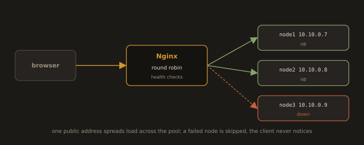

## Lab 5.1.B: Nginx - Static Site, Reverse Proxy, and Load Balancer

### Part 1: Install and Start Nginx

```bash
sudo dnf install nginx -y
```
```bash
sudo systemctl enable --now nginx
sudo systemctl status nginx
```
```bash
nginx -v
```
```bash
sudo firewall-cmd --permanent --add-service=http
sudo firewall-cmd --permanent --add-service=https
sudo firewall-cmd --reload
```

Test: `http://<Your_Server_IP>`

>You should see the Nginx welcome page.

Major commands:

```bash
sudo nginx -t                 # Test configuration syntax
```
```bash
sudo nginx -T                 # Test and dump the full config
```
```bash
sudo systemctl reload nginx   # Apply changes without dropping connections
sudo systemctl restart nginx  # Full restart (drops active connections briefly)
```

Always run `nginx -t` before reloading or restarting. A config error prevents Nginx from starting, taking the server offline.

---
### Part 2: Serve a Static Site

```bash
sudo mkdir -p /var/www/nginx-static
sudo vim /var/www/nginx-static/index.html
```

```html
<!DOCTYPE html>
<html lang="en">
<head>
<meta charset="UTF-8">
<meta name="viewport" content="width=device-width, initial-scale=1.0">
<title>Nginx Static Site</title>
<link href="https://fonts.googleapis.com/css2?family=Space+Mono:wght@400;700&family=Inter:wght@400;500;600&display=swap" rel="stylesheet">
<style>
  *{box-sizing:border-box;margin:0}
  body{background:#0e0e12;color:#d8dae0;font-family:Inter,sans-serif;display:flex;align-items:center;justify-content:center;min-height:100vh;padding:24px}
  .card{max-width:520px;width:100%;background:#18181f;border:1px solid #2a2a35;border-radius:12px;overflow:hidden}
  .bar{display:flex;justify-content:space-between;padding:10px 20px;border-bottom:1px solid #2a2a35;font:12px "Space Mono",monospace;color:#6b6e7a}
  .body{padding:32px 24px 24px}
  .label{font:11px/1 "Space Mono",monospace;letter-spacing:.12em;text-transform:uppercase;color:#b08d57;margin-bottom:12px}
  h1{font:600 26px/1.3 Inter,sans-serif;margin-bottom:16px}
  .pill{display:inline-flex;align-items:center;gap:8px;background:rgba(72,199,118,.12);border:1px solid rgba(72,199,118,.3);color:#48c776;font:13px "Space Mono",monospace;padding:6px 12px;border-radius:99px;margin-bottom:24px}
  .pill i{width:7px;height:7px;border-radius:50%;background:#48c776;animation:p 2s ease-out infinite}
  @keyframes p{0%{box-shadow:0 0 0 0 rgba(72,199,118,.5)}70%{box-shadow:0 0 0 8px transparent}to{box-shadow:0 0 0 0 transparent}}
  .info{background:#111116;border:1px solid #2a2a35;border-radius:8px;padding:14px 16px;margin-bottom:20px;font:13px "Space Mono",monospace}
  .row{display:flex;justify-content:space-between;padding:4px 0;color:#6b6e7a}
  .row span:last-child{color:#d8dae0}
  .note{font-size:14px;line-height:1.6;color:#6b6e7a}
  .note code{font-family:"Space Mono",monospace;background:#111116;border:1px solid #2a2a35;border-radius:4px;padding:1px 5px;color:#d8dae0;font-size:12px}
  .foot{display:flex;justify-content:space-between;padding:12px 24px;font:11px "Space Mono",monospace;color:#6b6e7a}
  @media(prefers-reduced-motion:reduce){.pill i{animation:none}}
</style>
</head>
<body>
  <div class="card">
    <div class="bar"><span>nginx</span><span>worker active</span></div>
    <div class="body">
      <p class="label">Server response</p>
      <h1>This box is answering requests. Nginx is running correctly.</h1>
      <div class="pill"><i></i>Online and serving</div>
      <div class="info">
        <div class="row"><span>Root</span><span>/var/www/nginx static</span></div>
        <div class="row"><span>Handler</span><span>nginx</span></div>
        <div class="row"><span>Loaded</span><span id="t">...</span></div>
      </div>
      <p class="note">Drop an <code>index.html</code> into the document root and it will replace this page on the next request.</p>
    </div>
    <div class="foot"><span>200</span><span id="c">...</span></div>
  </div>
  <script>
    const o={hour:'2-digit',minute:'2-digit',second:'2-digit'};
    document.getElementById('t').textContent=new Date().toLocaleTimeString(undefined,o);
    setInterval(()=>document.getElementById('c').textContent=new Date().toLocaleTimeString(undefined,o),1000);
  </script>
</body>
</html>
```

```bash
sudo chown -R nginx:nginx /var/www/nginx-static
```

```bash
sudo chcon -R -t httpd_sys_content_t /var/www/nginx-static
```

- Create the server block `
```bash
sudo vi /etc/nginx/conf.d/static-site.conf
```
```nginx
server {
    listen 80;
    server_name mysite.test;

    root /var/www/nginx-static;
    index index.html;

    # Deny access to hidden files (dot files like .env, .git)
    location ~ /\. {
        deny all;
    }

    access_log /var/log/nginx/static.local_access.log;
    error_log  /var/log/nginx/static.local_error.log;
}
```

```bash
sudo nginx -t
sudo systemctl reload nginx
```

```bash
echo "<Your_Server_IP>  mysite.test" | sudo tee -a /etc/hosts
```

Test: `http://mysite.test`


---
### Part 3: Nginx as a Reverse Proxy

A reverse proxy accepts client requests and forwards them to a backend. The client talks only to Nginx; the backend is invisible from outside. This enables TLS termination, centralised logging, access control, and load distribution without changing the application.

```
HOST machine                    │  VM (guest)
                                │
browser ──80──▶ 192.168.56.10 ──┼──▶ nginx (proxy.test) ──5000──▶ backend app
   ▲                            │                                  (127.0.0.1 only)
   └── /etc/hosts maps          │
       proxy.test → VM IP       │  port 5000 is not reachable from the host
```

Every step runs inside the VM unless it is marked on the host.

- Configuration Syntax:

```nginx
upstream <UPSTREAM_NAME> {
    [<LB_METHOD>;]                          # least_conn | ip_hash | random | hash <key>
    server <ADDRESS>[:<PORT>] [weight=<N>] [max_fails=<N>] [fail_timeout=<TIME>] [backup] [down];
    keepalive <N>;
}

server {
    listen <PORT>;
    server_name <DOMAIN>;

    location <PATH_PREFIX> {
        proxy_pass <SCHEME>://<UPSTREAM_NAME>;

        proxy_set_header Host              $host;
        proxy_set_header X-Real-IP         $remote_addr;
        proxy_set_header X-Forwarded-For   $proxy_add_x_forwarded_for;
        proxy_set_header X-Forwarded-Proto $scheme;
        proxy_set_header <HEADER_FIELD>    <VALUE>;

        proxy_connect_timeout <TIME>;
        proxy_read_timeout    <TIME>;
        proxy_send_timeout    <TIME>;

        proxy_http_version <1.0|1.1>;
        proxy_set_header Connection "";
    }

    location = <EXACT_URI> {
        access_log <off|PATH>;
        return <CODE> ["<TEXT>" | <URL>];
        add_header <HEADER_FIELD> <VALUE> [always];
    }

    location ~ <REGEX> {
        deny <all | ADDRESS | CIDR>;
        [allow <all | ADDRESS | CIDR>;]
    }

    access_log <PATH> [<FORMAT>];
    error_log  <PATH> [<LEVEL>];
}
```

| Directive | Syntax | Context | Notes |
|---|---|---|---|
| `upstream` | `upstream name { ... }` | `http` | Name is referenced as a host in `proxy_pass` |
| `server` (upstream) | `server address [parameters];` | `upstream` | Address may be host:port, IP:port, or `unix:` socket |
| `keepalive` | `keepalive connections;` | `upstream` | Idle connections cached **per worker**, not a total cap |
| `proxy_send_timeout` | `proxy_send_timeout time;` | `http`, `server`, `location` | Between two successive writes to upstream |
| `return` | `return code [text \| URL];` or `return URL;` | `server`, `location`, `if` | Text body allowed only with a non-redirect code |
| `add_header` | `add_header field value [always];` | `http`, `server`, `location`, `if in location` | Inherited only if the current level defines **no** `add_header` of its own |
| `deny` / `allow` | `deny address \| CIDR \| unix: \| all;` | `http`, `server`, `location`, `limit_except` | Rules evaluated in order; first match wins |
| `access_log off` | `access_log off;` | any log context | Disables, doesn't merely redirect |

- In the `/healthz` block, `add_header` after `return` still applies `add_header` isn't sequential, it's applied at response emit time. But `add_header` is skipped for most 4xx/5xx unless you append `always`.

- `location = /healthz` (exact match) is evaluated before any prefix or regex location, so it short circuits `location /` regardless of file order. The `~ /\.` regex location, by contrast, beats `location /` only because regex outranks a plain prefix match.


- **Complete Example: Nginx as a Reverse Proxy Server**

- Build the backend
```bash
sudo mkdir -p /opt/demo-backend
sudo vim /opt/demo-backend/app.py
```

```python
#!/usr/bin/env python3
from http.server import BaseHTTPRequestHandler, ThreadingHTTPServer
from datetime import datetime
import html
import re
import socket

LISTEN = ("127.0.0.1", 5000)          # loopback only: unreachable from outside
SHOW = ("Host", "X-Real-IP", "X-Forwarded-For", "X-Forwarded-Proto",
        "X-Server-Addr", "Connection", "User-Agent")

PAGE = """<!DOCTYPE html>
<html lang="en">
<head>
<meta charset="UTF-8">
<meta name="viewport" content="width=device-width, initial-scale=1.0">
<title>Request waybill &mdash; backend behind Nginx</title>
<style>
  :root{
    --desk:#2B2D26; --paper:#E4E2D7; --ink:#23241E;
    --rule:#B7B5A6; --faint:#6E6D60; --stamp:#5A3E9B;
    --mono:ui-monospace,SFMono-Regular,Menlo,Consolas,"Liberation Mono",monospace;
    --cond:"Arial Narrow","Helvetica Neue Condensed",Impact,system-ui,sans-serif;
  }
  *{box-sizing:border-box;margin:0}
  body{background:var(--desk);color:var(--ink);font-family:var(--mono);
       padding:40px 16px 64px;display:flex;justify-content:center}
  .sheet{position:relative;width:100%;max-width:680px;background:var(--paper);
         box-shadow:0 18px 40px rgba(0,0,0,.45)}
  .sheet::before{content:"";position:absolute;left:0;right:0;top:-9px;height:9px;
    background:radial-gradient(circle at 6px 9px,var(--desk) 4.5px,var(--paper) 5px) 0 0/12px 9px repeat-x}
  .masthead{display:flex;justify-content:space-between;align-items:flex-end;gap:16px;
            padding:26px 26px 14px;border-bottom:2px solid var(--ink)}
  .issuer{font-size:10px;letter-spacing:.22em;text-transform:uppercase;color:var(--faint)}
  h1{font-family:var(--cond);font-weight:700;font-size:34px;line-height:.95;
     letter-spacing:.04em;text-transform:uppercase}
  .serial{font-size:11px;letter-spacing:.12em;color:var(--faint);text-align:right;white-space:nowrap}
  .route{display:flex;flex-wrap:wrap;align-items:baseline;gap:6px 10px;
         padding:14px 26px;border-bottom:1px solid var(--rule);font-size:12px}
  .route i{font-style:normal;color:var(--faint)}
  .route b{font-weight:500}
  .route .last{color:var(--stamp)}
  .note{padding:22px 26px 6px;font-size:12.5px;line-height:1.75;color:#3E4038;max-width:56ch}
  .note em{font-style:normal;background:rgba(90,62,155,.12);padding:0 3px}
  .cap{padding:24px 26px 0;font-family:var(--cond);font-size:13px;font-weight:700;
       letter-spacing:.2em;text-transform:uppercase}
  .fields{padding:8px 26px 26px}
  .f{display:grid;grid-template-columns:minmax(0,15rem) 1fr;align-items:baseline;
     column-gap:12px;padding:9px 0;border-bottom:1px dotted var(--rule)}
  .k{font-size:10.5px;letter-spacing:.14em;text-transform:uppercase;color:var(--faint)}
  .v{font-size:13px;word-break:break-all}
  .v.off{color:#9C9A8C}
  .v.off::before{content:"\2014 ";color:var(--rule)}
  .stamp{position:absolute;right:22px;bottom:74px;transform:rotate(-7deg);
    padding:8px 14px 7px;border:2px solid var(--stamp);outline:1px solid var(--stamp);
    outline-offset:2px;color:var(--stamp);opacity:.82;mix-blend-mode:multiply;
    font-family:var(--cond);text-transform:uppercase;text-align:center;pointer-events:none}
  .stamp b{display:block;font-size:17px;font-weight:700;letter-spacing:.13em}
  .stamp span{display:block;font-family:var(--mono);font-size:9.5px;letter-spacing:.1em;margin-top:3px}
  .foot{display:flex;flex-wrap:wrap;gap:4px 28px;padding:12px 26px;
        border-top:2px solid var(--ink);font-size:10.5px;letter-spacing:.1em;
        text-transform:uppercase;color:var(--faint)}
  .foot b{font-weight:500;color:var(--ink);text-transform:none;letter-spacing:.04em}
  @media(max-width:560px){
    h1{font-size:26px}
    .masthead{flex-direction:column;align-items:flex-start;gap:8px}
    .serial{text-align:left}
    .f{grid-template-columns:1fr;gap:2px}
    .stamp{position:static;transform:rotate(-2deg);display:block;margin:0 26px 22px}
  }
</style>
</head>
<body>
  <div class="sheet">
    <div class="masthead">
      <div>
        <div class="issuer">Issued by nginx &middot; upstream copy</div>
        <h1>Request<br>waybill</h1>
      </div>
      <div class="serial">delivered {{TIME}}<br>{{HOSTNAME}}</div>
    </div>
    <div class="route">
      <i>from</i> <b>{{CLIENT}}</b>
      <i>via</i> <b>{{EDGE}}</b>
      <i>to</i> <b class="last">127.0.0.1:{{PORT}}</b>
    </div>
    <p class="note">Your browser never opened a socket to this process. It is bound to
      <em>127.0.0.1:{{PORT}}</em> and answers nothing else. Everything below is what actually
      arrived at the application &mdash; Nginx either carried it along or wrote it itself.</p>
    <p class="cap">Headers received</p>
    <div class="fields">
      {{ROWS}}
    </div>
    <div class="stamp"><b>Received<br>via proxy</b><span>port {{PORT}}</span></div>
    <div class="foot">
      <span>status <b>200</b></span>
      <span>path <b>{{PATH}}</b></span>
      <span>sheet 03 / proxied</span>
    </div>
  </div>
</body>
</html>"""

# render pipeline
# Values that never change are baked in once, at import time.
PAGE = (PAGE.replace("{{PORT}}", str(LISTEN[1]))
            .replace("{{HOSTNAME}}", html.escape(socket.gethostname())))

# The rest is split once into literal chunks and placeholder names, so each
# request is a single str.join instead of a chain of full-string copies.
_PARTS = re.split(r"\{\{(\w+)\}\}", PAGE)   # even = literal, odd = key


def render(values):
    out = _PARTS[:]
    for i in range(1, len(out), 2):
        out[i] = values[out[i]]
    return "".join(out)


# Header names and row numbers are static, so pre-build everything around
# the value: only the value itself is escaped per request.
_ROW_HEAD = tuple(
    '<div class="f"><span class="k">%s</span><span class="v' % html.escape(name)
    for name in SHOW
)


class Handler(BaseHTTPRequestHandler):
    server_version = "demo-backend/1.0"
    protocol_version = "HTTP/1.1"      # required for upstream keepalive
    disable_nagle_algorithm = True

    def _page(self):
        get = self.headers.get
        rows = []
        for head, name in zip(_ROW_HEAD, SHOW):
            value = get(name)
            if value:
                rows.append('%s">%s</span></div>' % (head, html.escape(value)))
            else:
                rows.append('%s off">not set</span></div>' % head)

        return render({
            "ROWS": "".join(rows),
            "CLIENT": html.escape(get("X-Real-IP") or self.client_address[0]),
            "EDGE": html.escape(get("X-Server-Addr") or "direct, no proxy"),
            "PATH": html.escape(self.path),
            "TIME": datetime.now().strftime("%H:%M:%S"),
        }).encode("utf-8")

    def _respond(self, payload, body=True):
        self.send_response(200)
        self.send_header("Content-Type", "text/html; charset=utf-8")
        self.send_header("Content-Length", str(len(payload)))
        self.end_headers()
        if body:
            self.wfile.write(payload)

    def do_GET(self):
        if self.path == "/favicon.ico":
            self.send_response(204)
            self.send_header("Content-Length", "0")
            self.end_headers()
            return
        self._respond(self._page())

    def do_HEAD(self):
        self._respond(self._page(), body=False)

    def log_message(self, fmt, *args):
        print("[backend] " + fmt % args, flush=True)


class Server(ThreadingHTTPServer):
    daemon_threads = True
    allow_reuse_address = True


if __name__ == "__main__":
    server = Server(LISTEN, Handler)
    print("listening on %s:%d" % LISTEN, flush=True)
    try:
        server.serve_forever()
    except KeyboardInterrupt:
        print("\nshutting down", flush=True)
    finally:
        server.server_close()
```

> Note: if you rewrite this file more than once with `nano` or `vim`, mixed tabs and spaces can silently break indentation. Before running it, confirm the file compiles clean:
```bash
sudo python3 -c "import py_compile; py_compile.compile('/opt/demo-backend/app.py')"
```
> A clean run produces no output. An `IndentationError` here means the file needs to be rewritten, not patched.

Run it in the foreground once to confirm it works:

```bash
python3 /opt/demo-backend/app.py
```

- From a second terminal:

```bash
curl -s http://127.0.0.1:5000/ | grep -o "<h1>.*</h1>"
```


Stop it with `Ctrl+c`. systemd takes over next.


- Keep the backend running
```bash
sudo useradd --system --no-create-home --shell /sbin/nologin appuser
```
```bash
sudo chown -R appuser:appuser /opt/demo-backend
```
```bash
sudo vim /etc/systemd/system/demo-backend.service
```

```ini
[Unit]
Description=Demo backend behind Nginx
After=network.target

[Service]
Type=simple
User=appuser
ExecStart=/usr/bin/python3 /opt/demo-backend/app.py
Restart=on-failure
RestartSec=2

# The app never needs the filesystem or a public socket
NoNewPrivileges=true
PrivateTmp=true
ProtectSystem=strict
ProtectHome=true

[Install]
WantedBy=multi-user.target
```

```bash
sudo systemctl daemon-reload
```
```bash
sudo systemctl enable --now demo-backend
```
```bash
sudo systemctl status demo-backend --no-pager
```
```bash
ss -tlnp | grep 5000
```

> Verification step: `enable --now` can silently fail to start the unit if the previous command in your terminal history got mangled or double-pasted. Don't trust the command, trust the status output. If `systemctl status` reports `Active: inactive (dead)`, the service never actually started:
```bash
  sudo systemctl restart demo-backend
  sudo journalctl -u demo-backend -n 30 --no-pager
```

- Let Nginx open outbound connections (SELinux)

On RHEL family systems SELinux blocks nginx from connecting to anything by default. Skipping this step is the single most common cause of 502 Bad Gateway on a config that is otherwise correct.

```bash
sudo setsebool -P httpd_can_network_connect 1
getsebool httpd_can_network_connect        # httpd_can_network_connect --> on
```

- The proxy server block

```bash
sudo vim /etc/nginx/conf.d/reverse-proxy.conf
```

```nginx
upstream demo_backend {
    server 127.0.0.1:5000;
    keepalive 16;
}

server {
    listen 80;
    server_name proxy.test;

    location / {
        proxy_pass http://demo_backend;

        # Pass original request context to the backend
        proxy_set_header Host              $host;
        proxy_set_header X-Real-IP         $remote_addr;
        proxy_set_header X-Forwarded-For   $proxy_add_x_forwarded_for;
        proxy_set_header X-Forwarded-Proto $scheme;

        # Which address of this VM the client actually dialled
        proxy_set_header X-Server-Addr     $server_addr:$server_port;

        proxy_connect_timeout 10s;
        proxy_read_timeout    30s;
        proxy_send_timeout    30s;

        # HTTP/1.1 keepalive to the upstream
        proxy_http_version 1.1;
        proxy_set_header Connection "";
    }

    # Health endpoint answered by Nginx itself. Never touches the backend.
    location = /healthz {
        access_log off;
        return 200 "nginx ok\n";
        add_header Content-Type text/plain;
    }

    location ~ /\. {
        deny all;
    }

    access_log /var/log/nginx/proxy.test_access.log;
    error_log  /var/log/nginx/proxy.test_error.log;
}
```

**Why these headers matter:**

- `X-Real-IP` and `X-Forwarded-For`: your logs and analytics need the real client IP, not Nginx's. Without them, every entry shows 127.0.0.1.
- `X-Forwarded-Proto`: tells the backend whether the original request was HTTP or HTTPS. This is exactly how the backend learns TLS was terminated at the edge. Flask's `request.is_secure`, Django's `SECURE_PROXY_SSL_HEADER`, and most frameworks read it.
- `Host $host`: without it the backend receives `demo_backend` as its hostname, which breaks absolute URLs, redirects, and virtual host routing.
- `proxy_http_version 1.1` with `Connection ""`: reuses TCP connections to the backend instead of opening a new one per request. The empty `Connection` header is what stops Nginx from sending `Connection: close` upstream and defeating the keepalive pool.
- `X-Server-Addr`: not a standard header, added here purely so the page can show which address of the VM the request landed on. Real deployments rarely need it.
- `listen 80;` with no address binds every interface in the VM, which is what lets the host reach it. Keep it that way. Do not narrow it to `127.0.0.1`.

```bash
sudo nginx -t
```
```bash
sudo systemctl reload nginx
```

> Config loading check: confirm this file is actually included, and that no leftover default site is competing for the same `listen 80`:
```bash
grep -n "include /etc/nginx/conf.d" /etc/nginx/nginx.conf
sudo nginx -T | grep -B3 "listen 80"
```
> If a stray `default.conf` or similar is still present and serving the stock Fedora test page instead of your block, disable it:
```bash
sudo mv /etc/nginx/conf.d/default.conf /etc/nginx/conf.d/default.conf.disabled
sudo nginx -t && sudo systemctl reload nginx
```

- Reach the VM from your host:

Open the firewall, inside the VM. Port 80 only, never 5000:

```bash
sudo firewall-cmd --permanent --add-service=http
sudo firewall-cmd --reload
sudo firewall-cmd --list-all
```

> Zone check: adding the service only helps if it lands in the zone actually bound to your network interface. Confirm before assuming the rule applies:
```bash
sudo firewall-cmd --get-active-zones
```
> The interface shown against your active zone (for example `enp0s3`) must be the same zone `http` was added to. If it's a different zone, add the service there instead.

- Find the VM's address, inside the VM:

```bash
hostname -I
ip -4 addr show | grep -v 127.0.0.1 | grep inet
```

Map the name on the host, so `proxy.test` resolves there the same way it does in the VM:

- Linux or macOS: `sudo vim /etc/hosts`
- Windows: open Notepad as Administrator, then open file: `C:\Windows\System32\drivers\etc\hosts`

```
192.168.56.10   proxy.test
```

Use the VM's actual IP here, not the example above. If the VM's address changes (a new `vagrant up`, a DHCP renewal), this line goes stale and every request silently goes to the wrong place.

> The VM also needs to resolve its own name. The "test inside the VM first" step below requires `proxy.test` to resolve locally, and nothing sets that up automatically:
```bash
echo "127.0.0.1 proxy.test" | sudo tee -a /etc/hosts
```
> Skipping this makes the in-VM curl tests hang on DNS resolution rather than fail with a clear error, which is easy to misread as a proxy problem.

- Test

Inside the VM first. If this fails, nothing on the host will work:

```bash
curl -s http://proxy.test/healthz          # nginx ok, proxy alive
curl -sI http://proxy.test/ | head -3      # 200, Server: nginx
curl -s http://proxy.test/ | grep -A1 X-Real-IP
```

A useful variant that bypasses DNS entirely and isolates virtual host matching from networking:

```bash
curl -s http://127.0.0.1/ -H "Host: proxy.test" | grep -o "<title>.*</title>"
```

Then browser test, from the host:

`http://proxy.test/healthz`


---
`http://proxy.test/`


---
`http://<VM_IP>:5000/`


The proof that the proxy is doing its job: on the page you get from the host, `X-Real-IP` shows your host's address rather than `127.0.0.1`. That value crossed two hops, host to Nginx to backend, because of the `proxy_set_header` lines.

- Watch both sides at once:

```bash
sudo tail -f /var/log/nginx/proxy.test_access.log & sudo journalctl -u demo-backend -f
```


- When it breaks

Host to VM problems first, since they look like Nginx problems and are not:

| Symptom on the host | Cause | Fix |
|---|---|---|
| Browser hangs, then times out | VM firewall closed, wrong firewalld zone, or NAT with no forwarding rule | `firewall-cmd --get-active-zones` to confirm the interface's zone has `http` added; for NAT add the `--natpf1` rule |
| Connection refused immediately | Nothing listening on that host port, wrong port or wrong mode | `ss -tlnp \| grep :80` in the VM, then recheck the network mode table |
| Name does not resolve | The host `/etc/hosts` was not edited, or was edited without admin rights | `ping proxy.test` must answer with the VM IP; flush the DNS cache |
| Worked yesterday, dead today | DHCP gave the VM a new IP | `hostname -I` in the VM, update the host file, or move to a private adapter |
| Works in the VM, not from the host | A server block says `listen 127.0.0.1:80` | Use plain `listen 80;` |
| In-VM curl hangs with no output | The VM itself has no `/etc/hosts` entry for `proxy.test` | `echo "127.0.0.1 proxy.test" \| sudo tee -a /etc/hosts` |

Then the proxy itself:

| Symptom | Cause | Fix |
|---|---|---|
| Loads, but shows the Fedora/nginx default test page | A default server block is answering before your `server_name proxy.test` block | `nginx -T \| grep -B3 "listen 80"`; disable or rename the competing default config |
| 502 Bad Gateway | Backend down, or SELinux blocking the connect | `systemctl status demo-backend`; `setsebool -P httpd_can_network_connect 1`; check `sudo ausearch -m avc -ts recent` |
| 504 Gateway Time-out | Backend accepted but answered slowly | Raise `proxy_read_timeout`, or fix the slow endpoint |
| Backend logs show 127.0.0.1 for every client | `X-Real-IP` and `X-Forwarded-For` not set, or the app is not reading them | Add the `proxy_set_header` lines, then configure the app's proxy middleware |
| Redirects send users to `demo_backend` | The `Host` header was not forwarded | `proxy_set_header Host $host;` |
| Connection count climbing on the backend | Keepalive was never negotiated | `proxy_http_version 1.1;` and `proxy_set_header Connection "";` |
| `nginx: [emerg] host not found in upstream` | The backend name will not resolve at boot | Use an IP, or add `resolver` for dynamic names |

A useful split test when you cannot tell which side is at fault:

```bash
curl -sI http://127.0.0.1/ -H "Host: proxy.test"   # in the VM:  Nginx is fine
```
```bash
curl -sI http://<VM_IP>/   -H "Host: proxy.test"   # on the host: the path is fine
```

If the first works and the second does not, the problem is the firewall or VM networking, not your config.

**Diagnostic order, top to bottom, for any 502 or timeout:**

1. `ping <VM_IP>`: Confirms basic reachability.
2. `ss -tlnp | grep :80`: Confirms nginx is listening.
3. `curl -H "Host: proxy.test"` against `127.0.0.1` :Confirms the right server block answers, independent of DNS.
4. `systemctl status <backend>`: Confirms the app itself is alive.
5. `getsebool httpd_can_network_connect`: Confirms SELinux isn't blocking the proxy hop.

Each layer rules out one hop between browser and backend. Working top to bottom avoids chasing nginx config when the real problem is DNS, and avoids chasing SELinux when the real problem is the app never started.

> Note: the backend now has no public surface at all. Everything a client can reach is decided in one file, which is why the next steps (TLS termination, rate limiting, caching, and adding a second server line to the upstream block for load balancing) are edits to Nginx alone. The application never learns that any of it happened.

---
# Part 4: Nginx as a Load Balancer

A load balancer accepts client requests and spreads them across a pool of backends. The client talks only to Nginx; which node answered is invisible from outside. This gives fault tolerance, horizontal scale, and rolling deploys without changing the application.

**Fig. 12 · One front door, a pool behind it**



*Nginx spreads requests across the backends and quietly stops sending traffic to a node that stops answering.*

```
HOST machine                    │  Lab network 10.10.0.0/24
                                │
                                │              ┌──80──▶ node1  10.10.0.7
browser ──80──▶ 10.10.0.6 ──────┼──▶ nginx ────┤        (nginx, static page)
   ▲                            │   10.10.0.6  │
   │                            │  round robin └──80──▶ node2  10.10.0.8
   └── /etc/hosts maps          │                       (nginx, static page)
       lb.test → 10.10.0.6      │
                                │  the browser never learns which node answered
```

Three VMs. Every command is marked with the machine it runs on. Substitute your own addresses throughout.

| Role | Hostname | IPv4 |
| :--- | :--- | :--- |
| Load balancer | `loadbalancer` | `10.10.X.X` |
| Node 1 | `node1` | `10.10.X.X` |
| Node 2 | `node2` | `10.10.X.X` |


Set the hostnames, one per machine:
```bash
sudo hostnamectl set-hostname loadbalancer
sudo hostnamectl set-hostname node1
sudo hostnamectl set-hostname node2
```

Build the nodes first. A load balancer pointed at backends that do not exist yet returns 502 and tells you nothing about whether your config is right.

---
- Build the backend nodes

Everything in this section runs on **node1 and node2**, identically, except the one line that differs.

```bash
sudo dnf install nginx -y    
```
```bash
sudo systemctl enable --now nginx
sudo systemctl status nginx --no-pager
```

Open port 80 to the load balancer only. The nodes have no reason to answer anyone else:

```bash
sudo firewall-cmd --permanent --add-rich-rule='rule family="ipv4" source address="10.10.X.X" port port="80" protocol="tcp" accept'
sudo firewall-cmd --reload
sudo firewall-cmd --list-all
```

>If you would rather keep it simple while learning, `sudo firewall-cmd --permanent --add-service=http` works too, it just leaves the nodes publicly reachable, which defeats half the point of putting a proxy in front of them.

Give each node a page that names itself:

- On **node1**:
```bash
sudo mkdir -p /usr/share/nginx/html/devops
```
```bash
sudo vim /usr/share/nginx/html/devops/index.html
```
```html
<!DOCTYPE html>
<html lang="en">
<head>
<meta charset="utf-8">
<meta name="viewport" content="width=device-width,initial-scale=1">
<title>Backend Server — node1</title>
<style>
/* per-backend block: color, glow (color+40 alpha), numeral */
:root{--node:#ff4d2e;--glow:#ff4d2e55;--id:"01"}
*{margin:0;box-sizing:border-box}
body{min-height:100vh;padding:6vmin;display:flex;flex-direction:column;justify-content:space-between;
  background:#0d0d0f;overflow:hidden;color:#f4f4f5;letter-spacing:.02em;
  background-image:radial-gradient(115vmin 85vmin at 85% 112%,var(--glow),transparent 68%);
  font:500 clamp(13px,1.4vw,16px)/1.5 ui-monospace,"SF Mono",Menlo,monospace}
h1{font-size:inherit;font-weight:500;text-transform:uppercase;letter-spacing:.35em;color:#a1a1aa}
h2{font-size:clamp(1.6rem,6vw,4rem);font-weight:600;max-width:12ch;line-height:1.05;letter-spacing:-.02em}
b{color:var(--node);font-weight:600}
p{text-transform:uppercase;letter-spacing:.22em;color:#a1a1aa}
p::after{content:var(--id);float:right;color:var(--node)}
i{width:.55em;height:.55em;border-radius:50%;background:var(--node);display:inline-block;
  margin-right:.7em;animation:pulse 2s infinite}
@keyframes pulse{0%{box-shadow:0 0 0 0 var(--node)}70%,100%{box-shadow:0 0 0 .9em transparent}}
.mark{position:fixed;right:-.07em;bottom:-.3em;font-size:70vmin;line-height:.8;font-weight:700;
  color:var(--node);opacity:.34;pointer-events:none;user-select:none}
</style>
</head>
<body>
  <h1>Backend Server</h1>
  <h2>This is a <b>load balancer</b> test page</h2>
  <p><i></i>Served by node1</p>
  <div class="mark">01</div>
</body>
</html>
```

- On **node2**
```bash
sudo mkdir -p /usr/share/nginx/html/devops
```
```bash
sudo vim /usr/share/nginx/html/devops/index.html
```
```html
<!DOCTYPE html>
<html lang="en">
<head>
<meta charset="utf-8">
<meta name="viewport" content="width=device-width,initial-scale=1">
<title>Backend Server — node2</title>
<style>
/* per-backend block: color, glow (color+40 alpha), numeral */
:root{--node:#00d492;--glow:#00d49255;--id:"02"}
*{margin:0;box-sizing:border-box}
body{min-height:100vh;padding:6vmin;display:flex;flex-direction:column;justify-content:space-between;
  background:#0d0d0f;overflow:hidden;color:#f4f4f5;letter-spacing:.02em;
  background-image:radial-gradient(115vmin 85vmin at 85% 112%,var(--glow),transparent 68%);
  font:500 clamp(13px,1.4vw,16px)/1.5 ui-monospace,"SF Mono",Menlo,monospace}
h1{font-size:inherit;font-weight:500;text-transform:uppercase;letter-spacing:.35em;color:#a1a1aa}
h2{font-size:clamp(1.6rem,6vw,4rem);font-weight:600;max-width:12ch;line-height:1.05;letter-spacing:-.02em}
b{color:var(--node);font-weight:600}
p{text-transform:uppercase;letter-spacing:.22em;color:#a1a1aa}
p::after{content:var(--id);float:right;color:var(--node)}
i{width:.55em;height:.55em;border-radius:50%;background:var(--node);display:inline-block;
  margin-right:.7em;animation:pulse 2s infinite}
@keyframes pulse{0%{box-shadow:0 0 0 0 var(--node)}70%,100%{box-shadow:0 0 0 .9em transparent}}
.mark{position:fixed;right:-.07em;bottom:-.3em;font-size:70vmin;line-height:.8;font-weight:700;
  color:var(--node);opacity:.34;pointer-events:none;user-select:none}
</style>
</head>
<body>
  <h1>Backend Server</h1>
  <h2>This is a <b>load balancer</b> test page</h2>
  <p><i></i>Served by node2</p>
  <div class="mark">02</div>
</body>
</html>
```

- The **node1** and **node2** server block, identical on both:
```bash
sudo vim /etc/nginx/conf.d/backend.conf
```
```nginx
server {
    listen 80 default_server;
    server_name _;                 # match any Host header, see below

    root /usr/share/nginx/html/devops;
    index index.html;

    location / {
        try_files $uri $uri/ =404;
    }

    # For a single-page app, serve the shell instead of 404:
    # try_files $uri $uri/ /index.html;

    location /health {
        access_log off;
        default_type text/plain;
        return 200 "healthy\n";
    }

    access_log /var/log/nginx/backend_access.log;
    error_log  /var/log/nginx/backend_error.log;
}
```

`server_name _;` matters more than it looks. The load balancer forwards `proxy_set_header Host $host`, so the request that reaches node1 carries the *load balancer's* hostname, not `10.10.X.X`. A server block named after the node's own IP never matches it, the request falls through to whatever is default, and you end up debugging a page you did not write. Match anything and the node stops caring what the front end calls itself.

```bash
sudo nginx -t
sudo systemctl reload nginx
```

Leave `root` out of `nginx.conf` entirely. The document root belongs in `backend.conf` and nowhere else set in two places, it drifts.

Prove each node on its own, before the load balancer exists:

```bash
curl -s http://10.10.X.X/health              # healthy
curl -s http://10.10.X.X/ | grep "Served by" # Served by node1.
```
```bash
curl -s http://10.10.X.X/health              # healthy
curl -s http://10.10.X.X/ | grep "Served by" # Served by node2.
```

If either fails, stop. Nothing downstream will work.

---
- Install Nginx on the load balancer

On the **load balancer**:

```bash
sudo dnf install nginx -y
```
```bash
sudo systemctl enable --now nginx
```

This is the only machine the outside world reaches, so it gets the public ports:

```bash
sudo firewall-cmd --permanent --add-service=http
sudo firewall-cmd --permanent --add-service=https
```
```bash
sudo firewall-cmd --reload
sudo firewall-cmd --list-all
```

443 is opened for TLS termination later. Nothing listens on it yet.

---
- Let Nginx open outbound connections (SELinux)

On RHEL family systems SELinux blocks nginx from connecting to anything by default. Skipping this step is the single most common cause of 502 Bad Gateway on a config that is otherwise correct. On the **load balancer**:

```bash
getenforce                                      # Enforcing
sudo setsebool -P httpd_can_network_connect 1
getsebool httpd_can_network_connect             # httpd_can_network_connect --> on
```

If it still fails, the denial is in the audit log and names the exact operation:

```bash
sudo ausearch -m avc -ts recent
sudo grep nginx /var/log/audit/audit.log
```

> Three modes exist: `Enforcing` blocks and logs, `Permissive` logs only, `Disabled` does neither. Permissive is a diagnostic, not a fix.

---
- The load balancer server block, On the **load balancer**:

```bash
sudo vim /etc/nginx/conf.d/loadbalancer.conf
```

```nginx
upstream backend_servers {
    # Round robin is the default; no directive needed.
    #
    # max_fails=3      three failures inside fail_timeout...
    # fail_timeout=30s ...takes the node out for 30s, then probes it again
    server 10.10.x.x:80 max_fails=3 fail_timeout=30s;
    server 10.10.x.x:80 max_fails=3 fail_timeout=30s;

    keepalive 32;                 # pool of idle connections to reuse
}

# $upstream_addr is the whole reason for a custom format: it names the node
log_format upstreamlog '$remote_addr -> $upstream_addr "$request" $status '
                       'upstream=$upstream_status rt=$request_time urt=$upstream_response_time';

server {
    listen 80;
    server_name lb.test 10.10.0.6;

    location / {
        proxy_pass http://backend_servers;

        # Pass original request context to the backend
        proxy_set_header Host              $host;
        proxy_set_header X-Real-IP         $remote_addr;
        proxy_set_header X-Forwarded-For   $proxy_add_x_forwarded_for;
        proxy_set_header X-Forwarded-Proto $scheme;

        # HTTP/1.1 keepalive to the upstream
        proxy_http_version 1.1;
        proxy_set_header Connection "";

        # One dead node should be invisible to the client
        proxy_next_upstream         error timeout http_502 http_503 http_504;
        proxy_next_upstream_tries   2;
        proxy_next_upstream_timeout 15s;

        proxy_connect_timeout 30s;
        proxy_send_timeout    30s;
        proxy_read_timeout    30s;
    }

    # Answered by Nginx itself. Says nothing about backend health.
    location = /lb-health {
        access_log off;
        default_type text/plain;
        return 200 "lb ok\n";
    }

    # Connection counters for this Nginx, trusted network only
    location = /nginx_status {
        stub_status on;
        access_log off;
        allow 10.10.0.0/24;
        deny all;
    }

    location ~ /\. {
        deny all;
    }

    access_log /var/log/nginx/lb_access.log upstreamlog;
    error_log  /var/log/nginx/lb_error.log;
}
```

Comment out the stock default server block here too, then:

```bash
sudo nginx -t
sudo systemctl reload nginx
```

Reload, not restart. Reload lets the old workers finish the requests they are holding before retiring; restart drops every open connection. On the one machine every client is talking to, that distinction is the difference between an invisible config change and an outage.

- Map the name(IP of Load balancer) on your host machine so `lb.test` resolves the same way it does on the lab network:

  - Linux or macOS: `sudo vim /etc/hosts`
  - Windows: open Notepad as Administrator, then `C:\Windows\System32\drivers\etc\hosts`

```
10.10.X.X   lb.test
```

- Test

From the **load balancer**, or any client on the network. If this fails, nothing from the host will work:

```bash
curl -s  http://lb.test/lb-health          # lb ok, balancer alive
```
```bash
curl -sI http://lb.test/ | head -3         # 200, Server: nginx
```

- Then from the host browser: `http://lb.test/`, and reload. The page alternates between node1 and node2.


---


---
- Watch the routing decision as it happens:

```bash
sudo tail -f /var/log/nginx/lb_access.log.    # 10.10.x.x -> 10.10.x.x:80 "GET / HTTP/1.1" 200 upstream=200 rt=0.003 urt=0.003
```
- Watch both ends at once:
```bash
sudo tail -f /var/log/nginx/lb_access.log     # on the load balancer
```
```bash
sudo tail -f /var/log/nginx/backend_access.log # on each node
```

- Test the failover

This is the part worth doing slowly. On **node1**:

```bash
sudo systemctl stop nginx
```

- From the client:
```bash
for i in $(seq 1 20); do curl -s http://lb.test/ | grep -o "node[12]"; done | sort | uniq -c
#   20 node2
```

> Not one request failed. The first attempt after the stop hit node1, was refused, and `proxy_next_upstream error` retried on node2 before the client saw anything. `max_fails=3` then pulled node1 out of rotation for `fail_timeout`. The error log holds what the browser never showed:

```bash
sudo tail -3 /var/log/nginx/lb_error.log
# connect() failed (111: Connection refused) while connecting to upstream
```

Start node1 again. Rotation resumes on its own once `fail_timeout` expires; there is no command to run on the load balancer.

```bash
sudo systemctl start nginx
sleep 31
for i in $(seq 1 6); do curl -s http://lb.test/ | grep -o "node[12]"; done
```

Passive health checks are all open source Nginx has: a node is discovered to be sick only when a real request to it fails, so somebody eats the retry. Active checks — `health_check`, probing on a schedule regardless of traffic — are Nginx Plus. In the meantime, tighten `max_fails=1 fail_timeout=5s` if you want the pool to react faster, and keep `/health` on the nodes for whatever monitors them from outside.

---
**Changing the method**

The method is the first line inside `upstream`. Change it, `nginx -t`, reload, then re-run the 200-request counter from section 5 and watch the numbers move.

- Round robin: the default no directive. Sequential rotation. Right for uniform, stateless nodes:

```nginx
upstream backend {
    server 10.10.0.7:80;
    server 10.10.0.8:80;
}
```

- Least connections: Sends each request to the node holding the fewest. Right when request durations vary — uploads, reports, long polls:

```nginx
upstream backend {
    least_conn;
    server 10.10.0.7:80;
    server 10.10.0.8:80;
}
```

- Weighted: A share per node, combines with any method. Right when the machines are not the same size:

```nginx
upstream backend {
    server 10.10.0.7:80 weight=3;    # ~60% of traffic
    server 10.10.0.8:80 weight=2;    # ~40%
}
```

- IP hash: Pins a client to a node so in-memory sessions survive. For IPv4 the key is the first three octets, so a whole /24 lands on one node which is why an office behind one NAT becomes one node's problem:

```nginx
upstream backend {
    ip_hash;
    server 10.10.0.7:80;
    server 10.10.0.8:80;
}
```

- Generic hash: Route on any variable. `$request_uri` gives cache affinity each node caches a distinct slice and `consistent` limits how many keys reshuffle when a node joins or leaves:

```nginx
upstream backend {
    hash $request_uri consistent;
    server 10.10.0.7:80;
    server 10.10.0.8:80;
}
```

- Random with two choices: Since 1.15.1. Picks two at random, then the emptier of the two. Right for large pools, or when several load balancers front one pool and a shared `least_conn` view would herd:

```nginx
upstream backend {
    random two least_conn;
    server 10.10.0.7:80;
    server 10.10.0.8:80;
}
```

Least response time (`least_time header` or `least_time last_byte`) is Nginx Plus. In open source, `nginx -t` rejects it with `unknown directive "least_time"`.

Two server flags worth knowing. `down` drains a node for maintenance while keeping it in the config, and `backup` holds a node in reserve until every primary is gone the latter is not accepted with `hash`, `ip_hash`, or `random`:

```nginx
upstream backend {
    server 10.10.0.7:80;
    server 10.10.0.8:80 down;      # drained, deliberately
    server 10.10.0.9:80 backup;    # only if every primary is down
}
```

Each worker keeps its own view of which node is failing, so with four workers a dead node is discovered up to four times. `zone` puts that state in shared memory:

```nginx
upstream backend {
    zone backend 64k;
    least_conn;
    server 10.10.0.7:80 max_fails=3 fail_timeout=30s;
    server 10.10.0.8:80 max_fails=3 fail_timeout=30s;
}
```

---
**Beyond the lab**

The pool is two static IPs in a file. Production replaces each part of that sentence.

**Service discovery.** Consul, etcd, or the Kubernetes API rewrite the upstream block as nodes come and go; the Nginx Ingress Controller watches endpoints directly. DNS names work too, with a caveat:

```nginx
upstream backend {
    server backend-service.internal.com;

    resolver 10.0.0.2 valid=30s;
    resolver_timeout 5s;
}
```

Open source resolves that name once, at startup or reload, and refuses to start if it fails. Continuous re-resolution is the `resolve` parameter, which is Nginx Plus. Consul Template covers the gap by regenerating the file and reloading:

```nginx
upstream backend {
    {{ range service "web" }}
    server {{ .Address }}:{{ .Port }};
    {{ end }}
}
```

**Blue/green.** Both environments in the pool, one held with `down`. The cutover is moving that one word, then `nginx -t && systemctl reload nginx`. Without `down` you have not staged a release, you have split traffic:

```nginx
upstream backend {
    server blue-environment:80;         # live
    server green-environment:80 down;   # staged, idle
}
```

**Canary.** Weights shift the share gradually while you watch the metrics; consistent hashing on a cookie keeps a given user on one version for the duration:

```nginx
upstream backend {
    server stable-version:80 weight=90;
    server canary-version:80 weight=10;
}

upstream backend_sticky {
    hash $cookie_canary consistent;
    server stable-version:80;
    server canary-version:80;
}
```

Argo Rollouts and Flagger automate the promotion and the rollback; Kubernetes labels and selectors do the routing.

**Rate limiting.** Zones live in the `http` context, the limits in `location`:

```nginx
limit_req_zone  $binary_remote_addr zone=api:10m rate=10r/s;
limit_conn_zone $binary_remote_addr zone=addr:10m;

location /api/ {
    limit_req  zone=api burst=20 nodelay;   # queue up to 20, no artificial delay
    limit_conn addr 10;                     # 10 concurrent connections per IP
    limit_req_status 429;                   # instead of the default 503
    proxy_pass http://backend_servers;
}
```

`rate` is the sustained ceiling (`r/s` or `r/m`), `burst` the queue depth above it, `nodelay` processes that queue immediately rather than smoothing it. Exempt the internal network by mapping it to an empty key, which disables the limit:

```nginx
geo $limited_region {
    default      0;
    10.10.0.0/24 1;
}

map $limited_region $limit_key {
    0 $binary_remote_addr;
    1 "";
}

limit_req_zone $limit_key zone=geo_aware:10m rate=5r/s;
```

**Tracing.** Propagate the header and the request is followable across the whole path in Jaeger, Zipkin, or Datadog:

```nginx
proxy_set_header traceparent $http_traceparent;
```

**Global.** 

GeoDNS (Route 53, Traffic Manager, Cloud DNS) resolves one name to the nearest regional load balancer; Anycast does it at the IP layer. Each region runs the config above and fails over to another region.

**Cloud.** 

AWS ELB/ALB/NLB, Azure Load Balancer or Application Gateway, and GCP Cloud Load Balancing all terminate in front of Nginx in hybrid designs, or replace it entirely. In Kubernetes, a service annotation maps the Ingress to the cloud load balancer.

Worth carrying into any of them: monitor with the Prometheus Nginx exporter and Grafana, keep `$upstream_addr` in the log format, terminate TLS at the edge and forward `X-Forwarded-Proto`, manage the config with Ansible or Terraform, and gate every deploy on `nginx -t` before the reload.


> Note: The nodes never learned any of this happened. They serve one static file to whoever connects, exactly as they did in section 1, and the entire behaviour a client experiences which node, how many retries, at what rate, over which protocol is decided in one file on one machine. Adding a third node is one `server` line and a reload. That is the reason the pool is worth building this way, and it is the same reason TLS, caching, and rate limiting all belong here rather than in the application.

---
**Passive health checks.** 

Open-source Nginx observes real traffic: when it sees a backend fail, it stops sending to it and spreads requests across the healthy ones. `max_fails=2 fail_timeout=10s` means: if a backend fails twice within 10 seconds, mark it unavailable for 10 seconds, then send one probe; if that succeeds, it returns to rotation.

```bash
echo "127.0.0.1  lb.local" | sudo tee -a /etc/hosts
sudo nginx -t
sudo systemctl reload nginx

# Observe distribution and failover
for i in {1..6}; do curl -s http://lb.local/ >/dev/null && echo "request $i served"; done
kill $(lsof -t -i:5002)     # Kill one backend; requests now go to 5001 and 5003
curl -s http://lb.local/
```

---
### Part 5: Nginx Log Management

```bash
sudo tail -f /var/log/nginx/access.log            # Default access log
sudo tail -f /var/log/nginx/error.log             # Default error log

sudo grep " 502 " /var/log/nginx/access.log       # Bad gateway (upstream down)
sudo grep " 504 " /var/log/nginx/access.log       # Gateway timeout (upstream too slow)
sudo grep "connect() failed" /var/log/nginx/error.log   # Backend connection failures
```

A custom log format that records the upstream address is invaluable for load-balancer debugging; add to the `http` block of `nginx.conf`:

```nginx
log_format upstream '$remote_addr - $host [$time_local] '
                    '"$request" $status $body_bytes_sent '
                    '$upstream_addr $upstream_status';
```

---
### Part 6: Clean Up Nginx Test Processes

```bash
kill $(lsof -t -i:5000) $(lsof -t -i:5001) $(lsof -t -i:5002) $(lsof -t -i:5003) 2>/dev/null || true
```

---
