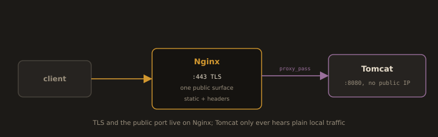

## Lab 5.1.C: Apache Tomcat - Java Application Server

Tomcat is the deployment target for the Java `.war` produced by the CI/CD pipeline in **Section 5.4**. This lab installs Tomcat, runs it as a systemd service, deploys a test WAR, and puts Nginx in front of it.


- Install Java (OpenJDK)

Tomcat 10.1.x requires Java 11 or later. We use Tomcat 10.1.x in this course; OpenJDK 17 (current LTS) is recommended.

```bash
sudo dnf install java-latest-openjdk java-latest-openjdk-devel -y
```
```bash
java -version
```
```bash
dirname $(dirname $(readlink -f $(which java)))
```
> Note this `JAVA_HOME` path

- Create a Dedicated Tomcat User:
> System user, no login shell, home at /opt/tomcat
```bash
sudo useradd -r -m -U -d /opt/tomcat -s /bin/false tomcat
```
```bash
id tomcat
```

- Install Tomcat

Check the current stable release at `tomcat.apache.org` before running these commands; the version will change over time.

```bash
sudo dnf install tomcat tomcat-webapps tomcat-admin-webapps -y
```
> `tomcat` = engine only, `tomcat-webapps` = adds ROOT welcome page, `tomcat-admin-webapps` = adds manager/host-manager consoles (needs a user in tomcat-users.xml) — install all three for this lab.
```bash
tomcat version
```
```bash
sudo systemctl enable tomcat --now
```
```bash
sudo systemctl status tomcat
```

- Open Firewall and Verify
```bash
sudo firewall-cmd --permanent --add-port=8080/tcp
```
```bash
sudo firewall-cmd --reload
```

Test in the browser: `http://server-ip:8080`
>You should see the Tomcat welcome page.


---
- Configure the Tomcat Manager Application

The Manager app provides a web UI and an HTTP API for deploying, undeploying, and reloading WARs. The CI/CD pipeline in Section 5.4 deploys through this same API. 

- Configure `tomcat-users.xml`
```bash
sudo vim /etc/tomcat/tomcat-users.xml
```
- Replace entire file contents with:
```xml
<?xml version="1.0" encoding="UTF-8"?>
<tomcat-users xmlns="http://tomcat.apache.org/xml"
              xmlns:xsi="http://www.w3.org/2001/XMLSchema-instance"
              xsi:schemaLocation="http://tomcat.apache.org/xml tomcat-users.xsd"
              version="1.0">

  <role rolename="manager-gui"/>
  <role rolename="manager-script"/>
  <role rolename="manager-status"/>

  <user username="devops" password="DevOps@123" roles="manager-gui,manager-script,manager-status"/>

</tomcat-users>
```

>Demo credentials only. `DevOps@123` is shown so the lab stays copy-pasteable; never reuse or commit real Manager credentials. Outside this lab, generate a strong random password (`openssl rand -base64 24`) and keep it out of version control.

>`manager-gui` grants the web interface; `manager-script` grants the HTTP API used by CI deploy plugins. By default the Manager restricts access to localhost. To allow it from your network (for remote CI deployments), 

- Validate before moving on:
```bash
sudo dnf install libxml2 -y
```
```bash
sudo xmllint --noout /etc/tomcat/tomcat-users.xml && echo "XML OK"
```

- Allow remote access: Manager app
```bash
sudo vim /var/lib/tomcat/webapps/manager/META-INF/context.xml
```
```xml
<?xml version="1.0" encoding="UTF-8"?>
<Context antiResourceLocking="false" privileged="true">
  <CookieProcessor className="org.apache.tomcat.util.http.Rfc6265CookieProcessor"
                    sameSiteCookies="strict" />
  <Valve className="org.apache.catalina.valves.RemoteAddrValve"
         allow="127\.\d+\.\d+\.\d+|::1|0:0:0:0:0:0:0:1|10\.\d+\.\d+\.\d+|::ffff:10\.\d+\.\d+\.\d+" />
  <Manager sessionAttributeValueClassNameFilter="java\.lang\.(?:Boolean|Integer|Long|Number|String)|org\.apache\.catalina\.filters\.CsrfPreventionFilter\$LruCache(?:\$1)?|java\.util\.(?:Linked)?HashMap"/>
</Context>
```

- Allow remote access: Host Manager app (Same pattern as above)
```bash
sudo vim /var/lib/tomcat/webapps/host-manager/META-INF/context.xml
```
```text
Same xml as above.
```

---
> Change it according to you Server's Network.
>RemoteAddrValve"
>         allow="127\.\d+\.\d+\.\d+|::1|0:0:0:0:0:0:0:1|X\.X\.X\.\X" />
---
```bash
sudo systemctl restart tomcat
```

Test the Manager at `http://server-ip:8080/manager/html` and log in with the `username: devops` `Password: DevOps@123` credentials.


---
- Deploy a WAR File

A WAR (Web Application Archive) is a ZIP-format package containing a complete Java web application.

- Method 1: Copy to `webapps/` (simplest for labs)

```bash
mkdir -p /tmp/sample-war
```
```bash
cd /tmp/sample-war
vim index.jsp
```
```jsp
<%@ page contentType="text/html; charset=UTF-8" session="false" trimDirectiveWhitespaces="true" %>
<%@ page import="java.lang.management.ManagementFactory" %>
<%@ page import="java.lang.management.MemoryMXBean" %>
<%@ page import="java.lang.management.MemoryUsage" %>
<%@ page import="java.net.InetAddress" %>
<%@ page import="java.time.ZonedDateTime" %>
<%@ page import="java.time.format.DateTimeFormatter" %>

<%!
    // Declaration block: these become servlet fields, initialized once at
    // class load rather than rebuilt on every request.

    private static final int SEGMENTS = 20;
    private static final long MB = 1024L * 1024L;

    // DateTimeFormatter is immutable and thread safe, unlike SimpleDateFormat,
    // which had to be reallocated per request to avoid corrupting output.
    private static final DateTimeFormatter STAMP =
            DateTimeFormatter.ofPattern("yyyy-MM-dd HH:mm:ss Z");

    private static final MemoryMXBean MEMORY = ManagementFactory.getMemoryMXBean();

    // Values that cannot change for the life of the JVM. Resolving the
    // hostname is a blocking name-service call, so it is cached rather than
    // repeated on every hit.
    private static final String HOSTNAME = resolveHostname();
    private static final String JVM_VERSION = System.getProperty("java.version");
    private static final int CPUS = Runtime.getRuntime().availableProcessors();

    private static String resolveHostname() {
        try {
            return InetAddress.getLocalHost().getHostName();
        } catch (Exception e) {
            return "unknown-host";
        }
    }
%>

<%
    // Status pages must never be cached by a proxy or the browser.
    response.setHeader("Cache-Control", "no-store");

    MemoryUsage heap = MEMORY.getHeapMemoryUsage();
    long usedMem = heap.getUsed() / MB;
    long committedMem = heap.getCommitted() / MB;
    long maxMem = heap.getMax() > 0 ? heap.getMax() / MB : committedMem;

    int usedPercent = maxMem > 0 ? (int) (usedMem * 100L / maxMem) : 0;

    // Ceiling division without floating point.
    int litSegments = (usedPercent * SEGMENTS + 99) / 100;

    boolean warn = usedPercent >= 70;
    boolean critical = usedPercent >= 90;
    String accent = critical ? "#c4443a" : (warn ? "#d9a13b" : "#d9603b");

    String now = ZonedDateTime.now().format(STAMP);
%>
<!DOCTYPE html>
<html lang="en">
<head>
<meta charset="UTF-8">
<meta name="viewport" content="width=device-width, initial-scale=1">
<title><%= HOSTNAME %> / status</title>
<style>
:root{--bg:#12100e;--rule:#262220;--dim:#6b645c;--dimmer:#4a443e;--fg:#f0ebe4;--idle:#2b2724;--accent:<%= accent %>}
*{margin:0;padding:0;box-sizing:border-box}
body{background:var(--bg);color:var(--fg);font:13px/1.4 ui-monospace,"SF Mono","JetBrains Mono",Menlo,Consolas,monospace;padding:48px 32px;-webkit-font-smoothing:antialiased}
.panel{max-width:720px;margin:0 auto}
.masthead{border-top:2px solid var(--accent);padding-top:14px;display:flex;justify-content:space-between;align-items:baseline;gap:16px;flex-wrap:wrap;margin-bottom:36px;font-size:11px;letter-spacing:2px}
.masthead .ref{color:var(--dim);letter-spacing:1px}
.masthead .state{color:var(--accent)}
.host{font-size:34px;line-height:1;margin-bottom:8px;word-break:break-all}
.stamp{font-size:12px;color:var(--dim);margin-bottom:40px}
.readout{display:flex;justify-content:space-between;gap:16px;font-size:11px;letter-spacing:1px;color:var(--dim);padding:10px 0;border-bottom:1px solid var(--rule)}
.readout b{color:var(--fg);font-weight:inherit;letter-spacing:0;font-variant-numeric:tabular-nums}
.gauge{display:flex;gap:3px;margin:28px 0 40px}
.gauge i{flex:1;height:28px;background:var(--idle)}
.gauge i.lit{background:var(--accent)}
.colophon{font-size:11px;letter-spacing:1px;color:var(--dimmer);border-top:1px solid var(--rule);padding-top:14px}
@media(max-width:480px){body{padding:32px 20px}.host{font-size:24px}.gauge i{height:20px}}
</style>
</head>
<body>
<div class="panel">

<div class="masthead">
<div class="state">STATUS / <%= critical ? "PRESSURE" : (warn ? "ELEVATED" : "NOMINAL") %></div>
<div class="ref">DVP-401 &middot; 5.1.C</div>
</div>

<div class="host"><%= HOSTNAME %></div>
<div class="stamp"><%= now %></div>

<div class="readout"><span>HEAP USED</span><b><%= usedMem %> MB</b></div>
<div class="readout"><span>HEAP COMMITTED</span><b><%= committedMem %> MB</b></div>
<div class="readout"><span>HEAP MAX</span><b><%= maxMem %> MB</b></div>
<div class="readout"><span>UTILIZATION</span><b><%= usedPercent %>%</b></div>
<div class="readout"><span>PROCESSORS</span><b><%= CPUS %></b></div>

<div class="gauge">
<%
    // Single buffered write instead of 20 template round trips through out.
    StringBuilder gauge = new StringBuilder(SEGMENTS * 22);
    for (int i = 0; i < SEGMENTS; i++) {
        gauge.append(i < litSegments ? "<i class=lit></i>" : "<i></i>");
    }
    out.write(gauge.toString());
%>
</div>

<div class="colophon">
<%= application.getServerInfo() %> &nbsp;/&nbsp; JVM <%= JVM_VERSION %> &nbsp;/&nbsp; SERVLET <%= application.getMajorVersion() %>.<%= application.getMinorVersion() %>
</div>

</div>
</body>
</html>
```

- Package it:
```bash
jar -cvf /tmp/sample.war *
```

- Deploy:
```bash
sudo cp /tmp/sample.war /var/lib/tomcat/webapps/
```
```bash
sudo chown tomcat:tomcat /var/lib/tomcat/webapps/sample.war
```
- Live logs:
```bash
sudo journalctl -u tomcat -f
```

- Then open in browser: `http://<Server_IP>:8080/sample/`

---
- Method 2: Tomcat Manager Text API (How the CI pipeline deploys)

This is the Tomcat Manager Text API, a scriptable HTTP interface to deploy/list/undeploy applications without touching a browser. It's how automated tools (CI/CD, scripts) manage Tomcat, since there's no UI involved, just plain HTTP responses.

- Deploy:
```bash
curl -u devops:DevOps@123 \
     -T /tmp/sample.war \
     "http://localhost:8080/manager/text/deploy?path=/myapp&update=true"
```
>This curl command is exactly how the CI deploy step in Section 5.4 interacts with Tomcat.

- List all deployed apps:
```bash
curl -u devops:DevOps@123 http://localhost:8080/manager/text/list
```

- Test the deployed app:
```bash
curl -I http://localhost:8080/myapp/
```

- Undeploy:
```bash
curl -u devops:DevOps@123 "http://localhost:8080/manager/text/undeploy?path=/myapp"
```


---
### Part 9: Nginx as Reverse Proxy in Front of Tomcat (Production Pattern)

**Fig. 13 · Nginx in front of Tomcat**



*Nginx owns TLS and the public port and forwards plain requests to Tomcat, which has no public address of its own.*

In production Tomcat is never exposed directly on port 8080. Nginx sits in front, terminates TLS, and proxies to Tomcat the edge termination pattern from Section 5.1 §5, and the target the CI/CD pipeline builds toward. Create `/etc/nginx/conf.d/tomcat-proxy.conf`:

```nginx
server {
    listen <PORT>;
    server_name <DOMAIN>;

    location <PATH_PREFIX> {
        proxy_pass <SCHEME>://<BACKEND_HOST>:<BACKEND_PORT>;

        proxy_set_header Host              $host;
        proxy_set_header X-Real-IP         $remote_addr;
        proxy_set_header X-Forwarded-For   $proxy_add_x_forwarded_for;
        proxy_set_header X-Forwarded-Proto $scheme;

        proxy_http_version <1.0|1.1>;
        proxy_set_header Connection "";

        proxy_connect_timeout <TIME>;
        proxy_read_timeout    <TIME>;
    }

    access_log <PATH_TO_ACCESS_LOG>;
    error_log  <PATH_TO_ERROR_LOG> [<LEVEL>];
}
```

- **Complete example: Tomcat 10.1 + Request Ledger + Nginx**

>Tomcat 10.1, Servlet 6.0, `jakarta.servlet`

- Install Java
```bash
sudo dnf install java-latest-openjdk java-latest-openjdk-devel -y
```
```bash
java -version
```

- Install Tomcat
```bash
sudo dnf install tomcat tomcat-webapps tomcat-admin-webapps -y
```
```bash
java -cp /usr/share/java/tomcat/catalina.jar org.apache.catalina.util.ServerInfo
```
```bash
sudo rm -rf /var/lib/tomcat/webapps/examples
```

- Configure the connector and proxy valve
```bash
sudo cp /etc/tomcat/server.xml /etc/tomcat/server.xml.orig
```
```bash
sudo vim /etc/tomcat/server.xml
```

Bind the HTTP connector to loopback:
```xml
<Connector port="8080" protocol="HTTP/1.1"
           address="127.0.0.1"
           connectionTimeout="20000"
           redirectPort="8443" />
```

Add the proxy valve inside `<Host name="localhost" ...>`, immediately above `</Host>`:
```xml
<Valve className="org.apache.catalina.valves.RemoteIpValve"
       internalProxies="127\.0\.0\.1"
       remoteIpHeader="x-forwarded-for"
       protocolHeader="x-forwarded-proto"
       protocolHeaderHttpsValue="https" />
 
<Valve className="org.apache.catalina.valves.ErrorReportValve"
       showReport="false" showServerInfo="false" />
```

- Manager credentials:
```bash
openssl rand -base64 24 
```
> Generate a cryptographically secure 24-byte random string encoded in Base64.
> Run twice, keep both [Copy and paste in text editor]
```bash
sudo vim /etc/tomcat/tomcat-users.xml
```
```xml
<?xml version="1.0" encoding="UTF-8"?>
<tomcat-users xmlns="http://tomcat.apache.org/xml"
              xmlns:xsi="http://www.w3.org/2001/XMLSchema-instance"
              xsi:schemaLocation="http://tomcat.apache.org/xml tomcat-users.xsd"
              version="1.0">

  <role rolename="manager-gui"/>
  <role rolename="manager-script"/>
  <role rolename="manager-status"/>

  <user username="ops-console" password="PASTE_FIRST_RandomlyCreated_VALUE"  roles="manager-gui,manager-status"/>
  <user username="ci-deploy"   password="PASTE_SECOND_RandomlyCreated_VALUE" roles="manager-script"/>

</tomcat-users>
```

```bash
sudo dnf install libxml2 -y
```
```bash
sudo xmllint --noout /etc/tomcat/tomcat-users.xml && echo "XML OK"
```
```bash
sudo stat -c '%a %U:%G %n' /etc/tomcat/tomcat-users.xml
```
> Expect `640 root:tomcat`

- Manager access control
```bash
sudo vim /var/lib/tomcat/webapps/manager/META-INF/context.xml
```
```xml
<?xml version="1.0" encoding="UTF-8"?>
<Context antiResourceLocking="false" privileged="true">
  <CookieProcessor className="org.apache.tomcat.util.http.Rfc6265CookieProcessor"
                   sameSiteCookies="strict" />
  <Valve className="org.apache.catalina.valves.RemoteAddrValve"
         allow="127\.\d+\.\d+\.\d+|::1|0:0:0:0:0:0:0:1" />
  <Manager sessionAttributeValueClassNameFilter="java\.lang\.(?:Boolean|Integer|Long|Number|String)|org\.apache\.catalina\.filters\.CsrfPreventionFilter\$LruCache(?:\$1)?|java\.util\.(?:Linked)?HashMap"/>
</Context>
```
```bash
sudo vim /var/lib/tomcat/webapps/host-manager/META-INF/context.xml
```
Same `<Valve>` line. Loopback only. 

- Start Tomcat
```bash
sudo systemctl enable tomcat --now
sudo systemctl status tomcat
```
```bash
ss -ltnp | grep 8080
```
> Expect `127.0.0.1:8080`. No firewall rule for 8080.


- Verify the base install
```bash
curl -sS -o /dev/null -w '%{http_code}\n' http://127.0.0.1:8080/
```
>Expected output `200`.
```bash
curl -sS -o /dev/null -w '%{http_code}\n' http://127.0.0.1:8080/manager/html
```
>Expected output `401`.

- Build the application
```bash
mkdir -p ~/ledger-war/WEB-INF && cd ~/ledger-war
```
```bash
cat > WEB-INF/web.xml << 'EOF'
<?xml version="1.0" encoding="UTF-8"?>
<web-app xmlns="https://jakarta.ee/xml/ns/jakartaee"
         xmlns:xsi="http://www.w3.org/2001/XMLSchema-instance"
         xsi:schemaLocation="https://jakarta.ee/xml/ns/jakartaee
                             https://jakarta.ee/xml/ns/jakartaee/web-app_6_0.xsd"
         version="6.0">
 
  <display-name>Request Ledger</display-name>
 
  <welcome-file-list>
    <welcome-file>index.jsp</welcome-file>
  </welcome-file-list>
 
  <session-config>
    <session-timeout>10</session-timeout>
    <cookie-config>
      <http-only>true</http-only>
    </cookie-config>
  </session-config>
 
</web-app>
EOF
```
```bash
cat > index.jsp << 'EOF'
<%@ page contentType="text/html; charset=UTF-8" session="false" trimDirectiveWhitespaces="true" %>
<%@ page import="java.time.LocalDateTime" %>
<%@ page import="java.time.format.DateTimeFormatter" %>
<%@ page import="java.util.ArrayDeque" %>
<%@ page import="java.util.ArrayList" %>
<%@ page import="java.util.Deque" %>
<%@ page import="java.util.List" %>
<%@ page import="java.util.concurrent.atomic.AtomicLong" %>
<%!
    private static final int MAX_ROWS = 10;
    private static final DateTimeFormatter CLOCK = DateTimeFormatter.ofPattern("HH:mm:ss");
    private static final AtomicLong POSTED = new AtomicLong();
    private static final Deque<Hit> LEDGER = new ArrayDeque<Hit>();
 
    private static final class Hit {
        final long seq;
        final String at;
        final String client;
        final String scheme;
        final String xff;
        Hit(long seq, String at, String client, String scheme, String xff) {
            this.seq = seq;
            this.at = at;
            this.client = client;
            this.scheme = scheme;
            this.xff = xff;
        }
    }
 
    private static void post(Hit h) {
        synchronized (LEDGER) {
            LEDGER.addFirst(h);
            while (LEDGER.size() > MAX_ROWS) {
                LEDGER.removeLast();
            }
        }
    }
 
    private static List<Hit> page() {
        synchronized (LEDGER) {
            return new ArrayList<Hit>(LEDGER);
        }
    }
 
    private static String esc(String raw) {
        if (raw == null || raw.isEmpty()) {
            return "none";
        }
        StringBuilder out = new StringBuilder(raw.length() + 16);
        for (int i = 0; i < raw.length(); i++) {
            char c = raw.charAt(i);
            if (c == '&')       { out.append("&amp;"); }
            else if (c == '<')  { out.append("&lt;"); }
            else if (c == '>')  { out.append("&gt;"); }
            else if (c == '"')  { out.append("&quot;"); }
            else if (c == '\'') { out.append("&#39;"); }
            else if (c < 0x20)  { out.append('?'); }
            else                { out.append(c); }
        }
        return out.toString();
    }
%>
<%
    post(new Hit(POSTED.incrementAndGet(),
                 LocalDateTime.now().format(CLOCK),
                 request.getRemoteAddr(),
                 request.getScheme(),
                 request.getHeader("X-Forwarded-For")));
    List<Hit> rows = page();
%>
<!DOCTYPE html>
<html lang="en">
<head>
<meta charset="UTF-8">
<meta name="viewport" content="width=device-width, initial-scale=1">
<title>Request Ledger</title>
<style>
  :root{
    --ink:#1d2127; --faded:#8c8371; --rule:#c2d2df;
    --margin:#a4362a; --paper:#f8f4e9; --desk:#ded8c9;
  }
  *{box-sizing:border-box}
  body{
    margin:0; padding:44px 14px 72px;
    background:var(--desk);
    color:var(--ink);
    font:15px/1.5 "Iowan Old Style","Palatino Linotype",Palatino,Georgia,serif;
    -webkit-font-smoothing:antialiased;
  }
  .book{
    position:relative;
    max-width:760px; margin:0 auto;
    padding:26px 30px 30px 74px;
    background:var(--paper);
    background-image:repeating-linear-gradient(to bottom,
      transparent 0 31px, var(--rule) 31px 32px);
    background-repeat:no-repeat;
    background-size:100% 320px;
    background-position:0 133px;
    border:1px solid #cec5b0;
    box-shadow:0 1px 0 rgba(255,255,255,.7) inset, 0 12px 26px rgba(40,32,16,.20);
  }
  .book::before,.book::after{
    content:""; position:absolute; top:0; bottom:0;
    border-left:1px solid var(--margin);
  }
  .book::before{left:54px; opacity:.5}
  .book::after {left:58px; opacity:.22}
 
  .folio{
    display:flex; align-items:baseline; justify-content:space-between;
    border-bottom:2px solid var(--ink); padding-bottom:9px;
  }
  h1{margin:0; font-size:18px; font-weight:600; letter-spacing:.15em; text-transform:uppercase}
  .folio span{
    font:11px/1 ui-monospace,SFMono-Regular,Menlo,Consolas,monospace;
    letter-spacing:.1em; color:var(--faded); text-transform:uppercase;
  }
  .legend{margin:9px 0 17px; font-size:12.5px; color:var(--faded)}
 
  table{width:100%; border-collapse:collapse}
  thead th{
    font:11px/1 ui-monospace,SFMono-Regular,Menlo,Consolas,monospace;
    letter-spacing:.12em; text-transform:uppercase; color:var(--faded);
    text-align:left; padding:0 8px 9px 0; border-bottom:1px solid var(--ink);
  }
  tbody td{
    height:32px; line-height:32px; padding:0 8px 0 0;
    border:0; vertical-align:bottom; font-variant-numeric:tabular-nums;
  }
  td.seq{width:58px; color:var(--margin); font:600 13px/32px ui-monospace,Menlo,Consolas,monospace}
  td.at {width:92px; font:13px/32px ui-monospace,Menlo,Consolas,monospace}
  td.ip {width:158px; font:13px/32px ui-monospace,Menlo,Consolas,monospace}
  td.sc {width:64px; font-size:12.5px; color:var(--faded); text-transform:uppercase; letter-spacing:.06em}
  td.via{font-size:12px; color:var(--faded); word-break:break-all}
  tbody tr:first-child td{color:#000}
  tbody tr:first-child td.seq{color:var(--margin)}
  tbody tr:first-child td.seq::before{content:"\203A\00a0"}
 
  .rule-off{
    margin-top:24px; padding-top:10px; border-top:2px solid var(--ink);
    display:flex; justify-content:space-between; gap:20px; flex-wrap:wrap;
    font:12px/1.7 ui-monospace,SFMono-Regular,Menlo,Consolas,monospace;
    color:var(--faded);
  }
  .rule-off b{color:var(--ink); font-weight:600; font-variant-numeric:tabular-nums}
  @media (max-width:560px){
    .book{padding-left:56px}
    .book::before{left:38px} .book::after{left:42px}
    td.via{display:none} thead th:last-child{display:none}
  }
</style>
</head>
<body>
  <div class="book">
 
    <div class="folio">
      <h1>Request Ledger</h1>
      <span>Folio 01 &nbsp;/&nbsp; Volatile</span>
    </div>
 
    <p class="legend">
      Postings are held in the servlet instance and are lost on restart or redeploy.
      The <em>client</em> column is whatever <code>getRemoteAddr()</code> reports after the
      valve chain has run.
    </p>
 
    <table>
      <thead>
        <tr>
          <th>No.</th><th>Time</th><th>Client</th><th>Scheme</th><th>X-Forwarded-For</th>
        </tr>
      </thead>
      <tbody>
<% for (Hit h : rows) { %>
        <tr>
          <td class="seq"><%= h.seq %></td>
          <td class="at"><%= esc(h.at) %></td>
          <td class="ip"><%= esc(h.client) %></td>
          <td class="sc"><%= esc(h.scheme) %></td>
          <td class="via"><%= esc(h.xff) %></td>
        </tr>
<% } %>
      </tbody>
    </table>
 
    <div class="rule-off">
      <span>Posted since start &nbsp;<b><%= POSTED.get() %></b></span>
      <span>Retained &nbsp;<b><%= rows.size() %></b> of <%= MAX_ROWS %></span>
      <span>HEAD requests are posted too</span>
    </div>
 
  </div>
</body>
</html>
EOF
```

- Package
```bash
jar --create --file /tmp/ledger.war -C ~/ledger-war .
```
```bash
unzip -l /tmp/ledger.war
cd
```
> Both `index.jsp` and `WEB-INF/web.xml` must be listed.

- Deploy via the Manager text API
```bash
umask 077
```
```bash
cat > ~/.tomcat-netrc <<'EOF'
machine 127.0.0.1 login ci-deploy password PASTE_SECOND_VALUE
EOF
```
```bash
curl -sS --netrc-file ~/.tomcat-netrc \
     -T /tmp/ledger.war \
     "http://127.0.0.1:8080/manager/text/deploy?path=/ledger&update=true"
```
> Expected output: OK - Deployed application at context path [/ledger]

- Verify the deployment
```bash
curl -sS -o /dev/null -w '%{http_code}\n' http://127.0.0.1:8080/ledger/
```
```bash
curl -s http://127.0.0.1:8080/ledger/ | grep -o 'Posted since start[^<]*<b>[0-9]*'
```

- Install Nginx
```bash
sudo dnf install nginx -y
```

- Catchall vhost
```bash
sudo vim /etc/nginx/conf.d/00-catchall.conf
```
```nginx
server_tokens off;
 
server {
    listen 80 default_server;
    listen [::]:80 default_server;
    server_name _;
    return 444;
}
```
Anything arriving by raw IP or an unknown Host gets the connection dropped instead of a page that names the distribution.

- Application vhost
```bash
sudo vim /etc/nginx/conf.d/10-ledger.conf
```
```nginx
upstream tomcat_backend {
    server 127.0.0.1:8080;
    keepalive 16;
}
 
server {
    listen 80;
    server_name javaapp.test;
 
    location ~ ^/(manager|host-manager)(/|$) {
        return 404;
    }
 
    location / {
        proxy_pass http://tomcat_backend;
 
        proxy_set_header Host              $host;
        proxy_set_header X-Real-IP         $remote_addr;
        proxy_set_header X-Forwarded-For   $remote_addr;
        proxy_set_header X-Forwarded-Proto $scheme;
 
        proxy_http_version 1.1;
        proxy_set_header Connection "";
 
        proxy_connect_timeout 5s;
        proxy_send_timeout    60s;
        proxy_read_timeout    60s;
    }
 
    access_log /var/log/nginx/tomcat_access.log;
    error_log  /var/log/nginx/tomcat_error.log warn;
}
```

- Hostname, firewall, SELinux on Server:
```bash
echo "127.0.0.1  javaapp.test" | sudo tee -a /etc/hosts
```
```bash
sudo firewall-cmd --permanent --add-service=http
sudo firewall-cmd --reload
```
```bash
sudo setsebool -P httpd_can_network_connect 1
```

- On the Host Machine:
```bash
echo "<Server_IP>  javaapp.test" | sudo tee -a /etc/hosts
```

- Start Everything:
```bash
sudo nginx -t
sudo systemctl enable nginx --now
sudo systemctl restart tomcat
```

- Verification:
```bash
ss -ltnp | grep 8080
```
>Connector is loopback only, 127.0.0.1:8080, never 0.0.0.0:8080
```bash
curl -sS -o /dev/null -w '%{http_code}\n' http://javaapp.test/ledger/
```
> App answers through the proxy, `200`
```bash
curl -sS -o /dev/null -w '%{http_code}\n' http://javaapp.test/manager/html
```
> Admin contexts are not published on port 80, `404`

```bash
curl -s http://javaapp.test/ledger/ | grep -A1 'class="ip"'
```
```bash
curl -sS -o /dev/null -w '%{http_code}\n' http://<Server_IP>/
```
> Raw IP is droppedcurl: (52) Empty reply from server

From a second machine on the LAN:
```bash
curl -s http://javaapp.test/ledger/ | grep -A1 'class="ip"' | head -2
```
> That machine's address, e.g. 10.10.33.126, not 127.0.0.1


- Header injection, both sides of the proxy:

> Directly at Tomcat, where the header survives: escaping must engage
```bash
curl -s -H 'X-Forwarded-For: <script>alert(1)</script>' \
     http://127.0.0.1:8080/ledger/ | grep -o '&lt;script&gt;[^<]*'
# -> &lt;script&gt;alert(1)
 ```
> Through the proxy: the header is overwritten before Tomcat sees it
 ```bash
curl -s -H 'X-Forwarded-For: <script>alert(1)</script>' \
     http://javaapp.test/ledger/ | grep -c 'script'
# -> 0
```
The proxy test returning nothing is a pass. Nginx replaces the client value, so there is no injected string left to escape. Escaping is proven by the first command, not the second.


Test in the browser: `http://javaapp.test/ledger/`
> Tomcat now reached through Nginx on port 80.


---
---
