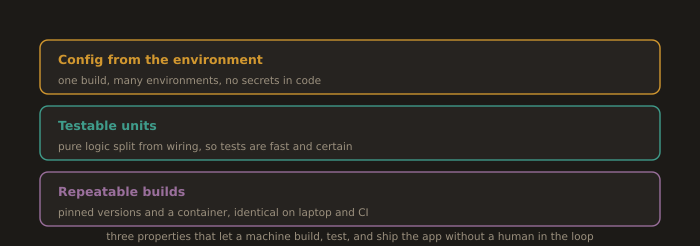

# Section 5.2: Delivery Friendly Applications and the Twelve Factor Model

## 1. What Makes an Application Friendly to Automated Delivery

**Fig. 14 · What makes an app friendly to delivery**



*Configuration from the environment, logic that is easy to test, and a build that reproduces exactly.*

Section 5.1 deployed servers. This section builds the **reference application** those servers will run and does so deliberately, because most delivery pain is designed into the application long before the pipeline is written. An application is "delivery friendly" when a machine, with no human in the loop, can configure it, test it, and build it identically every time. Three properties make this possible.

### 1.1 Environment Sourced Configuration

Configuration that varies between environments: database URLs, credentials, feature flags, the port to listen on must come from the environment, not from files baked into the code.

- **Why:** 

The same build artefact must run in development, staging, and production. If configuration is compiled in, each environment needs a different build, and "the thing you tested" is no longer "the thing you shipped."

- **How:** 

Read config from environment variables (or a secrets manager) at startup; commit a documented list of the variables, never their values; provide safe defaults only for genuinely non secret settings.

```python
# Good: configuration is read from the environment at startup
import os
DATABASE_URL = os.environ["DATABASE_URL"]          # required; fail fast if missing
PORT         = int(os.environ.get("PORT", "8000")) # non-secret default is acceptable
DEBUG        = os.environ.get("DEBUG", "false").lower() == "true"
```

The corollary is the twelve factor rule of thumb: could you open source the repository right now without leaking a single credential? If not, configuration is in the wrong place.

### 1.2 Testable Units

The application must be decomposed so that behaviour can be verified **without** standing up the whole system. That means business logic lives in small functions and classes with explicit inputs and outputs, separated from I/O (HTTP handlers, database calls, the filesystem). Dependencies are injected rather than reached for globally, so a test can substitute a fake.

- A pure function `calculate_total(items) > Decimal` is trivially testable.

- The same logic buried inside an HTTP handler that also reads the database and writes a response is not you can only test it by running a server and a database.

Testable units are what make the **test pyramid** in Section 5.3 possible; an application without them can only ever be tested end-to-end, slowly and flakily.

### 1.3 Repeatable Builds

Building the application twice from the same source must produce functionally identical artefacts, on any machine, with no manual steps.

- **Pin dependencies** to exact versions with a lockfile (`requirements.txt` + hashes, `package-lock.json`, `pom.xml` with fixed versions). "Latest" is not repeatable.

- **Isolate the build** from the host a container image or a clean virtual environment so a developer laptop and a CI runner produce the same result.

- **One command** builds everything: `make build`, `docker build`, or an equivalent. If the build lives only in someone's shell history, it is not repeatable.

Repeatable builds are the precondition for the pipeline caching in Section 5.4: you can only safely reuse a cached artefact if identical inputs are guaranteed to produce identical outputs.

---