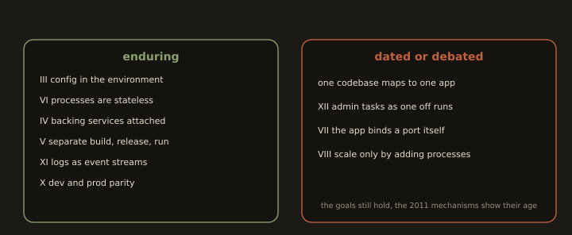

## 2. The Twelve Factor App: The Enduring and the Dated

**Fig. 15 · Twelve factor: what lasted, what dated**

*The goals of statelessness, config in the environment, and build release run separation endure; some of the original prescriptions do not.*

The **twelve factor methodology** (Heroku, 2011) codified how to build applications for automated delivery. More than a decade on, some factors are foundational and some reflect the platform of their era. A mature engineer knows which is which.

### 2.1 The Enduring Factors

These remain correct and underlie everything in this module:

- **III. Config in the environment**: 

Configuration from the environment, strictly separated from code (Section 1.1 above).

- **X. Dev/prod parity**: 

Keep environments as similar as possible so tests are predictive.

- **VI. Processes are stateless**: 

The app holds no sticky in-process state; session and cache state live in a backing store (this is what made stateless load balancing viable in Lab 5.1.B).

- **IV. Backing services are attached resources**: 

A database, cache, or queue is reached by a URL from config and can be swapped without code changes.

- **V. Strictly separate build, release, run**: 

A build stage produces an artefact, a release stage binds it to config, and the run stage executes it; releases are immutable and numbered.

- **XI. Logs as event streams**: 

Write to stdout/stderr and let the platform route logs; do not manage log files inside the app (note how the reference app below logs to stdout, while Nginx in Section 5.1 handled *its own* access logs at the edge).

### 2.2 The Dated (or Debated) Elements

These need reinterpretation in a container and Kubernetes centric world:

- **The "one codebase, one app" mapping** predates the modern monorepo, where many deployable services share a single repository. The principle (a codebase maps to a *release lineage*) survives; the strict one repo per app reading does not.

- **Factor XII, "run admin tasks as one off processes,"** assumed a Heroku style `run` command. Today the same intent is met by Kubernetes Jobs, init containers, or migration steps in the pipeline the *mechanism* is dated, the *idea* (admin tasks are first class, versioned, and repeatable) endures.

- **"Port binding" (VII)** assumed the app exports HTTP by binding a port directly. Behind a container orchestrator and a service mesh, port binding is mediated by the platform; the app still listens on a port from config (Section 1.1), but "self contained web server" is now the platform's job as much as the app's.

- **Concurrency via the process model (VIII)**: "scale out by adding processes" is still sound, but async runtimes and autoscaling controllers have made the picture richer than "add more unix processes."

The through line: twelve factor's *goals*: Statelessness, environment config, build/release/run separation, disposability are exactly the delivery friendly properties of Section 1. Its *prescriptions* sometimes show their 2011 origins.

---