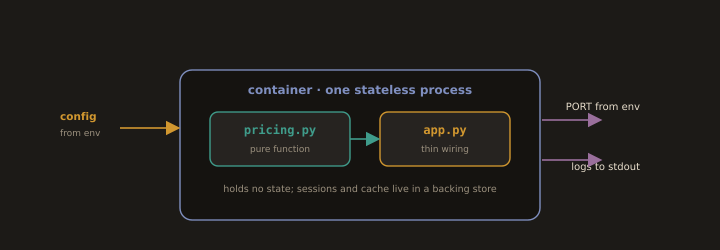

# Laboratory Exercise

---
## Lab 5.2: Build the Reference Application

**Fig. 16 · The reference application, built to ship**



*Pure pricing logic sits behind thin wiring that reads its config and port from the environment and logs to stdout, holding no state.*

Build a small, delivery friendly HTTP service that Sections 5.3 and 5.4 will test and ship. It has one non trivial piece of business logic (an order total calculation) deliberately separated from its HTTP layer, so it can be unit tested in isolation.

### Part 1: Project Layout

```
refapp/
├── refapp/
│   ├── __init__.py
│   ├── pricing.py        # pure business logic, no I/O
│   └── app.py            # HTTP layer (Flask), thin, delegates to pricing
├── tests/
│   ├── test_pricing.py   # unit tests (Section 5.3)
│   └── test_api.py       # integration tests (Section 5.3)
├── requirements.txt      # pinned dependencies, repeatable builds
├── Dockerfile            # isolated, repeatable build
└── Makefile              # one command each: build, test, run
```

### Part 2: The Testable Unit - `refapp/pricing.py`

```python
from decimal import Decimal, ROUND_HALF_UP

TAX_RATE = Decimal("0.13")   # a domain constant, not configuration

def line_total(unit_price: Decimal, quantity: int) -> Decimal:
    if quantity < 0:
        raise ValueError("quantity must not be negative")
    return (unit_price * quantity).quantize(Decimal("0.01"), ROUND_HALF_UP)

def order_total(items: list[tuple[Decimal, int]]) -> Decimal:
    """items = [(unit_price, quantity), ...] -> tax-inclusive total."""
    subtotal = sum((line_total(p, q) for p, q in items), Decimal("0"))
    tax = (subtotal * TAX_RATE).quantize(Decimal("0.01"), ROUND_HALF_UP)
    return subtotal + tax
```

Every function here has explicit inputs and outputs and touches no network, database, or filesystem. This is the "testable unit" of Section 1.2.

### Part 3: Environment Sourced Configuration - `refapp/app.py`

```python
import os
from decimal import Decimal
from flask import Flask, request, jsonify
from .pricing import order_total

def create_app() -> Flask:
    app = Flask(__name__)
    # Configuration comes from the environment, never hard-coded
    app.config["GREETING"] = os.environ.get("GREETING", "Reference App")
    app.config["PORT"]     = int(os.environ.get("PORT", "8000"))

    @app.get("/health")
    def health():
        return jsonify(status="ok", app=app.config["GREETING"])

    @app.post("/total")
    def total():
        payload = request.get_json(force=True)
        items = [(Decimal(str(i["price"])), int(i["qty"])) for i in payload["items"]]
        return jsonify(total=str(order_total(items)))

    return app

if __name__ == "__main__":
    app = create_app()
    app.run(host="0.0.0.0", port=app.config["PORT"])  # logs go to stdout
```

The HTTP layer is thin: it parses the request, calls `order_total`, and serialises the result. All logic worth testing lives in `pricing.py`.

### Part 4: Repeatable Build - pinned deps, Dockerfile, Makefile

```
# requirements.txt - exact versions only
Flask==3.0.3
gunicorn==22.0.0
pytest==8.2.0
pytest-split==0.11.0
```

```dockerfile
# Dockerfile — isolated build, identical on laptop and CI
FROM python:3.12-slim
WORKDIR /app
COPY requirements.txt .
RUN pip install --no-cache-dir -r requirements.txt
COPY . .
ENV PORT=8000
EXPOSE 8000
# Stateless process, config from env, port from env, logs to stdout
CMD ["gunicorn", "-b", "0.0.0.0:8000", "refapp.app:create_app()"]
```

```makefile
# Makefile — one command each
build:
	docker build -t refapp:local .

test:
	pytest -q

run:
	GREETING="Reference App" PORT=8000 python -m refapp.app
```

### Part 5: Verify the Delivery Friendly Properties

```bash
make build          # repeatable: same inputs -> same image
docker run --rm -e GREETING="Staging" -e PORT=8000 -p 8000:8000 refapp:local &
curl -s localhost:8000/health           # {"app":"Staging","status":"ok"}
curl -s -X POST localhost:8000/total \
     -H 'Content-Type: application/json' \
     -d '{"items":[{"price":"10.00","qty":2},{"price":"5.50","qty":1}]}'
# {"total":"28.82"}  ->  (20.00 + 5.50) = 25.50 subtotal + 13% tax 3.32 = 28.82
```

The **same image** ran as "Staging" purely by changing an environment variable — no rebuild. This image is what Section 5.4's pipeline will build once and promote across environments. In production it sits behind Nginx exactly as in Lab 5.1.B, with TLS terminated at the edge (Section 5.1 §5).

---
