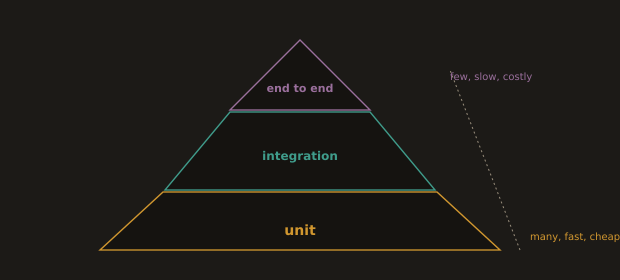

## 2. The Test Pyramid

**Fig. 17 · The test pyramid**



*Most tests are fast unit tests at the base, fewer integration tests sit above, and a thin layer of end to end tests caps it.*

The test pyramid describes the healthy *proportion* of tests by scope. Cost and speed rise as you move up; the number of tests should fall.

```
          /\        End to end        few, slow, brittle
         /  \       (full system)     high confidence, high cost
        /----\
       /      \     Integration       some, medium speed
      /        \    (app + real deps)
     /----------\
    /            \  Unit               many, fast, isolated
   /______________\ (pure logic)      cheap, precise failures
```

- **Unit tests** 

Exercise a single testable unit (e.g. `order_total`) with no I/O. They are milliseconds each; you can have thousands. When one fails it points at the exact function.

- **Integration tests** 

Exercise the app against real adjacent services a database in a container, the HTTP layer end to end within the service. Fewer, slower, and they catch wiring mistakes units cannot.

- **End to end tests** 

Drive the whole deployed system as a user would. They give the highest confidence but are slow and the most brittle, so keep them few and reserved for critical journeys.

The anti pattern is the **ice cream cone** many end to end tests, few units. It is slow, flaky, and gives vague failures. Effort belongs at the base.

---