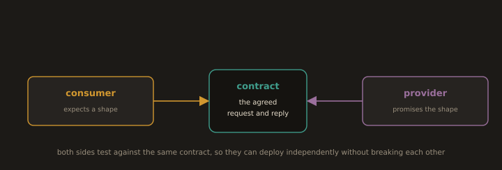

## 3. Contract Testing

**Fig. 18 · A contract keeps two services honest**

*Consumer and provider each verify against the same agreed contract, so either can deploy without waiting on the other.*

When services talk to each other, end to end tests across all of them are slow and fragile. **Contract testing** verifies each side against a shared, versioned **contract** (the expected request/response shape) *independently*:

- The **consumer** test asserts "I send this request and expect this response shape," producing a contract.

- The **provider** test replays that contract against the real provider and asserts it still honours it.

Neither test needs both services running at once, so they stay in the fast integration tier rather than the slow end to end tier. Contract testing is what lets independently deployed services evolve without a combinatorial explosion of cross service tests the provider learns it has broken a consumer *before* deploying, from its own pipeline. Tools such as Pact implement this consumer driven pattern.

---