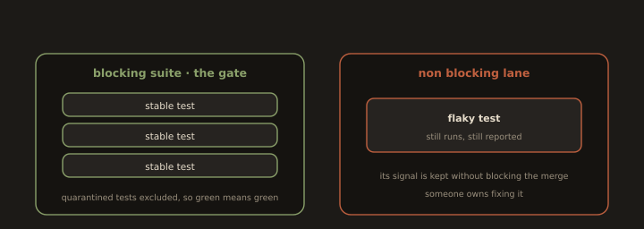

## 5. Quarantining a Flaky Test: an Engineering Decision

**Fig. 19 · Quarantine keeps the gate trustworthy**

*A flaky test moves out of the blocking suite so a pass still means something, but it keeps running in a lane so its signal is not lost.*

A **flaky test** Passes and fails on the same code without any change. Flakiness is corrosive: once developers see red builds that "just need a re-run," they start ignoring failures, and a genuine regression slips through behind the noise.

The disciplined response is to **quarantine** the test a deliberate, tracked decision, not a silent deletion:

1. **Detect** 

Flakiness (e.g. the test fails then passes on retry, or a flaky test detector flags it across runs).

2. **Quarantine:** 

Move it out of the blocking suite so it no longer fails the build, but keep running it in a non blocking lane so its signal isn't lost.

3. **Ticket it:** 

File a tracked issue with an owner and a deadline. Quarantine is a loan against reliability, not a graveyard.
 
4. **Fix the root cause** 

Usually a timing/ordering dependency, shared mutable state, or reliance on an external service then **return the test to the blocking suite**.

The trade off is explicit: quarantining trades a small, *known* loss of coverage for a large gain in signal quality, because a suite everyone trusts and heeds is worth more than a suite that is nominally complete but routinely ignored. What you must never do is leave a test quarantined and untracked that is how coverage quietly rots.

---
