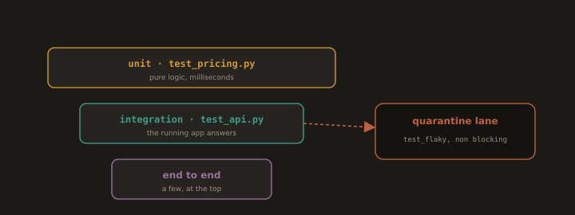

# Laboratory Exercise

---
## Lab 5.3: A Layered Test Suite for the Reference Application

**Fig. 20 · The reference app's layered suite**



*Fast unit tests at the base, an integration test that exercises the running app above, and the flaky test parked in its own lane.*

Add unit and integration tests to the `refapp` project from Lab 5.2, then wire in a flaky test example and quarantine it.

### Part 1: Unit Tests (the base) - `tests/test_pricing.py`
```python
from decimal import Decimal
import pytest
from refapp.pricing import line_total, order_total

def test_line_total_rounds_half_up():
    assert line_total(Decimal("1.005"), 1) == Decimal("1.01")

def test_order_total_applies_tax():
    # (10.00 * 2) + (5.50 * 1) = 25.50 subtotal; +13% tax = 28.82
    items = [(Decimal("10.00"), 2), (Decimal("5.50"), 1)]
    assert order_total(items) == Decimal("28.82")

def test_negative_quantity_rejected():
    with pytest.raises(ValueError):
        line_total(Decimal("10.00"), -1)
```

These run in milliseconds, need no server or database, and pinpoint the failing function. You can add dozens more cheaply - the wide base of the pyramid.

### Part 2: Integration Test (the middle) - `tests/test_api.py`
```python
import json
from refapp.app import create_app

def client():
    app = create_app()
    app.config.update(TESTING=True)
    return app.test_client()

def test_total_endpoint_returns_tax_inclusive_total():
    resp = client().post(
        "/total",
        data=json.dumps({"items": [{"price": "10.00", "qty": 2},
                                    {"price": "5.50", "qty": 1}]}),
        content_type="application/json",
    )
    assert resp.status_code == 200
    assert resp.get_json()["total"] == "28.82"

def test_health_reads_config_from_env(monkeypatch):
    monkeypatch.setenv("GREETING", "IntegrationEnv")
    resp = client().get("/health")
    assert resp.get_json()["app"] == "IntegrationEnv"   # config truly from env
```

This exercises the HTTP layer wired to the real logic — fewer of these than unit tests, and slightly slower.

### Part 3: Deterministic Test Data

Note that both files above **construct their own data inline** and rely on no shared, pre-seeded database, and the config test sets its environment explicitly with `monkeypatch` rather than depending on ambient state. That is what lets these tests run in any order and in parallel (Section 5.4).

### Part 4: Introduce, Detect, and Quarantine a Flaky Test

A test that depends on the wall clock is a classic flake. Add one to see the pattern, then quarantine it:

```python
# tests/test_flaky.py
import time
import pytest

@pytest.mark.quarantine          # tagged: runs in a non-blocking lane, not the gate
def test_timing_sensitive():
    start = time.time()
    time.sleep(0.01)
    # Flaky: on a loaded CI runner the elapsed time can exceed the bound
    assert time.time() - start < 0.02
```

Register the marker and exclude it from the blocking run in `pytest.ini`:

```ini
[pytest]
markers =
    quarantine: known-flaky tests; tracked in issue REF-142, excluded from the gate
```

```bash
# Blocking suite (the gate) — quarantined tests excluded, so it stays trustworthy
pytest -q -m "not quarantine"

# Non-blocking lane — quarantined tests still run so their signal is not lost
pytest -q -m "quarantine" || true
```

The flaky test no longer fails the build, but it is still tracked (issue `REF-142`) and still executed for visibility. The next step in a real project is to fix the timing dependency for example, inject a clock the test can control and move the test back under the gate.

---
