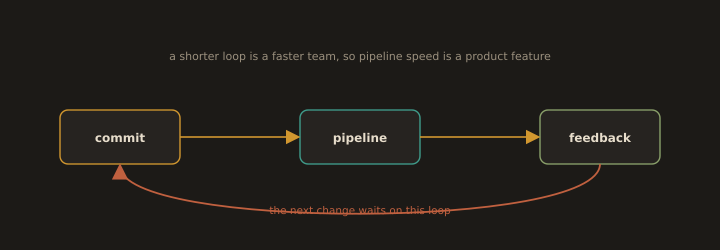

# Section 5.4: Pipeline Speed as a Product Feature

## 1. Speed Is a Feature, Not a Nicety

**Fig. 21 · Pipeline time is feedback time**

*Every change waits on the loop from commit to result, so shortening the pipeline is shortening how fast the team can move.*

The layered suite of Section 5.3 only helps if developers actually wait for it. A pipeline that takes forty minutes is a pipeline people route around - they merge on green-ish, batch changes, and stop trusting the gate. Fast feedback changes behaviour: small changes, merged often, verified while the context is still in the developer's head. So pipeline duration is treated as a **product feature** with a target (for example, "under ten minutes to first signal") and is measured over time like any other. Three levers deliver it: caching, parallelism, and selective scheduling.

---
