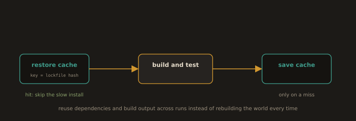

## 2. Caching

**Fig. 22 · Cache the work that does not change**

*Restore dependencies and build output by a content key, so an unchanged lockfile skips the slow install entirely.*

Most of a pipeline's time is spent redoing work whose inputs did not change. Caching reuses prior results keyed on their inputs.

- **Dependency caches.** Restore `pip`, `npm`, or Maven downloads keyed on the **lockfile hash**. The cache is reused only while dependencies are unchanged and rebuilt automatically when the lockfile changes. This is safe precisely because Section 5.2 made builds repeatable - identical inputs guarantee identical dependencies.

- **Build layer caches.** Docker layer caching reuses image layers whose instructions and inputs are unchanged. Ordering the `Dockerfile` so rarely-changed steps (installing dependencies) come *before* frequently changed steps (copying source) maximises cache hits which is exactly why the Lab 5.2 `Dockerfile` copies `requirements.txt` and installs *before* copying the application code.

- **The cache key discipline.** A cache is only correct if its key captures every input that affects the output. Too broad a key serves stale results; too narrow a key never hits. Key on content hashes, not on "latest."

---
