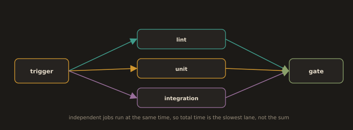

## 3. Parallelism

**Fig. 23 · Run independent jobs at once**

*Fan the work out into parallel lanes and fan back into one gate, so the wall clock is the slowest lane rather than the sum of all of them.*

Independent work should run at the same time rather than in sequence.

- **Parallel jobs.** Lint, unit tests, and a type check share no state and can run as three simultaneous jobs; total wall clock time becomes the slowest one, not their sum.

- **Test sharding.** A large unit suite is split across N runners (for example, by test file) and executed concurrently. This only works because Section 5.3's tests own their own data and share no state sharding a suite full of order dependent tests produces random failures.

- **Fan out / fan in.** Build once, then fan out to run many test shards against that single artefact, then fan in to a deploy step that runs only if every shard passed. The reference image is built one time and reused, never rebuilt per shard.

Parallelism has a floor: adding runners past the point where the longest single job dominates buys nothing, and it costs money. Parallelise until the critical path is a single irreducible job.

---
