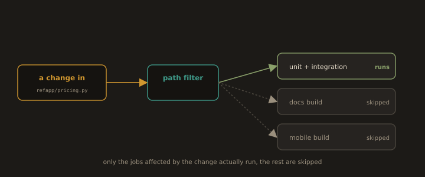

## 4. Selective Scheduling

**Fig. 24 · Run only what the change touched**

*A path filter looks at what changed and starts just the affected jobs, leaving the untouched ones skipped.*

The fastest work is the work you correctly skip. Selective scheduling runs only what a given change could affect.

- **Path based triggers.** 

A change touching only documentation need not run the full build and test pipeline; a change under `refapp/pricing.py` must. Pipelines can gate whole stages on which paths changed.

- **Affected target selection.** 

Build systems that understand the dependency graph (Bazel, Nx, Turborepo) compute the set of targets downstream of a change and test only those. In a monorepo this is the difference between testing one service and testing forty.

- **Test impact analysis.** 

More advanced setups map which tests exercise which code and, on a given change, run only the covering tests in the fast gate — deferring the full suite to a scheduled run.

The safeguard is honesty about the dependency graph: selective scheduling is only safe when "what this change affects" is computed correctly. When in doubt the system must fall back to running more, not less a fast pipeline that ships a regression is not fast, it is broken. A common, safe pattern is *selective on every push, exhaustive on merge to main and on a nightly schedule*.

---
