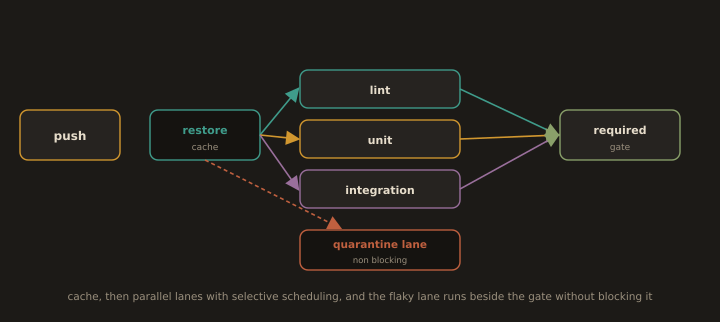

# Laboratory Exercise

---
## Lab 5.4: A Fast Pipeline for the Reference Application

**Fig. 25 · The fast pipeline, assembled**



*A cache feeds parallel lanes chosen by what changed, all feeding one required gate, while the flaky lane runs alongside without blocking the merge.*

Assemble a CI pipeline for `refapp` that applies all three levers, builds the image once, runs the layered suite from Section 5.3, and deploys the WAR-equivalent artefact to the environment stood up in Section 5.1. The example uses GitHub Actions syntax; the concepts map directly to GitLab CI, Jenkins, or any modern runner.

```yaml
# .github/workflows/refapp.yml
name: refapp

on:
  push:
    # Selective scheduling: skip the pipeline for docs-only changes
    paths-ignore: ["**.md", "docs/**"]

jobs:
  # ---- Parallel job 1: fast checks, with a dependency cache ----
  unit:
    runs-on: ubuntu-latest
    strategy:
      matrix:
        shard: [1, 2]          # parallelism: shard the unit suite across 2 runners
    steps:
      - uses: actions/checkout@v4
      - uses: actions/setup-python@v5
        with:
          python-version: "3.12"
          cache: "pip"          # caching: keyed on requirements.txt hash
      - run: pip install -r requirements.txt
      # Quarantined tests excluded from the gate (Section 5.3)
      - run: pytest -q -m "not quarantine" --splits 2 --group ${{ matrix.shard }}

  # ---- Parallel job 2: lint, runs at the same time as `unit` ----
  lint:
    runs-on: ubuntu-latest
    steps:
      - uses: actions/checkout@v4
      - uses: actions/setup-python@v5
        with: { python-version: "3.12", cache: "pip" }
      - run: pip install -r requirements.txt && python -m pyflakes refapp

  # ---- Build once; fan-in requires unit + lint to have passed ----
  build:
    needs: [unit, lint]
    runs-on: ubuntu-latest
    steps:
      - uses: actions/checkout@v4
      - uses: docker/setup-buildx-action@v3
      - uses: docker/build-push-action@v6
        with:
          context: .
          tags: refapp:${{ github.sha }}
          cache-from: type=gha       # build-layer cache (Section 2)
          cache-to: type=gha,mode=max

  # ---- Deploy the single artefact built above (only on main) ----
  deploy:
    needs: build
    if: github.ref == 'refs/heads/main'
    runs-on: ubuntu-latest
    steps:
      - run: |
          # Same Manager API call demonstrated in Lab 5.1.C, Part 8
          curl -u "$TOMCAT_USER:$TOMCAT_PASS" \
               -T build/refapp.war \
               "http://$TARGET:8080/manager/text/deploy?path=/refapp&update=true"
        env:
          TOMCAT_USER: ${{ secrets.TOMCAT_USER }}   # config + secrets from the environment
          TOMCAT_PASS: ${{ secrets.TOMCAT_PASS }}
          TARGET:      ${{ vars.DEPLOY_TARGET }}
```

What each lever contributes here: **caching** (`cache: pip`, `cache-from: gha`) skips re-downloading and re-building unchanged inputs; **parallelism** (`unit` and `lint` run together, `unit` shards across two runners); **selective scheduling** (`paths-ignore` skips docs-only pushes, `if: github.ref == 'refs/heads/main'` deploys only from main). The image is built exactly once in `build` and the deploy consumes that single artefact — the "build once, promote everywhere" principle from Section 5.2, closing the loop back to the servers configured in Section 5.1.

---
*End of Module 5: Web Servers, Applications, and Testing Strategy.*

*This module deployed web and application services (Section 5.1), built a delivery friendly reference application governed by externalised config, testable units, and repeatable builds (Section 5.2), placed it under a layered test suite (Section 5.3), and delivered it through a pipeline treated as a product feature (Section 5.4) fulfilling the module objective in support of CLO 5.*

---
